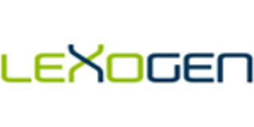
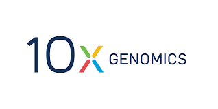

All documentation for the workshop is best viewed from the github.io pages

[Documentation](https://ucdavis-bioinformatics-training.github.io/ucdavis-bioinformatics-training_template/)

Bioinformatics: RNA-Seq Workshop @ UC Davis  
Aug. 19, 2019, 9 a.m. - Aug. 23, 2019, 4:30 p.m.  
Organizer - Bioinformatics Core  
Contact - UC Davis Bioinformatics Core, training.bioinformatics@ucdavis.edu

This workshop will include a rich collection of lectures and hands-on sessions, covering both theory and tools associated with command-line RNA-seq data analysis. Participants will explore experimental design, cost estimation, data generation, and analysis of RNA-Seq data generated on the Illumina sequencing platform. Participants will explore software and protocols, create and modify workflows, and diagnose/treat problematic data utilizing high performance computing services. Exercises will be performed with provided datasets, using command-line interaction.

A preliminary agenda for the week includes:

* Monday	Introduction to the command line, cluster resources, and the R programming language (or advanced computing topics)
* Tuesday	Introduction to sequence data and preprocessing
* Wednesday        	Mapping data to a genome and transcript expression quantification
* Thursday	Differential expression analysis
* Friday	Post differential expression analysis, including gene set enrichment analysis, Gene Ontology/Pathway analysis, Generation of figures and tables

Lectures throughout the week will include topics such as:

* Sequencing technologies
* What is Bioinformatics?
* Hardware and software considerations
* Experimental design and cost estimation
* TAG-Seq vs. mRNA-Seq

### Industry Sponsors

|:------|:------|------|
| Monday |  |  |  
| Monday Evening Social |   |    |  
| Tuesday |  |    |  
| Wednesday |  |    |  
| Thursday |  |    |  
| Friday |  |    |  

### FAQ

Who should attend? … Prior course participants have included faculty, post docs, grad students, staff, and industry researchers.

What are the prerequisites? … There are no prerequisites other than familiarity with general biological concepts and an enthusiasm for learning bioinformatics data analysis. Some familiarity with the command-line and R is desirable.  However, we will dedicate time on the first day to bringing everyone up-to-speed to be able to run the commands needed during this workshop.

What do I need to bring? … You will need to bring your own laptop to use, have a recent version of Java installed, and an application that will allow you to ssh into a server (e.g. Putty for windows, or iTerm for Apple) as well as the ability to connect to the internet via wifi. Computational exercises will be performed on a remote server. We can help with setup early on in the workshop. If your department does not allow you to install software on the laptop you’ll be bringing, please contact us ahead of time.

Can I bring my own data? … We will provide experimental datasets for use during the workshop, as this helps to keep the workshop moving. There will be time, however, to discuss your own datasets and how you might work with them outside of the workshop.

How much does it cost? … The registration fee is $1,500 for current students, postdocs, staff and faculty at UC campus' or UC National Labs (LBNL, LANL, LLNL), $1,750 for other academic or non-profit participants and $2,500 for other participants. We accept credit cards, as well as UC Davis recharge accounts, for payment.  Registration fees include light breakfast, lunch, and snacks, but do not include dinner, lodging or parking fees.

Where is the workshop? … It will be held in Davis and will run from 9:00am to 4:30pm on the dates indicated. The specific location will be provided at a later date.

How do I apply? … All registration is “first-come, first-served”. There is no application process.  So, sign up as soon as possible to ensure your place in the workshop.

Where can I find more information, including your policies?  ... Go to our website (bioinformatics.ucdavis.edu/training/) and check out our FAQ and Policies.

### Questions

If you have any questions, please don’t hesitate to contact us at training.bioinformatics@ucdavis.edu

### Register

https://registration.genomecenter.ucdavis.edu/events/RNASeq-workshop_Aug_2019/  

**Registration is closed for this event**
