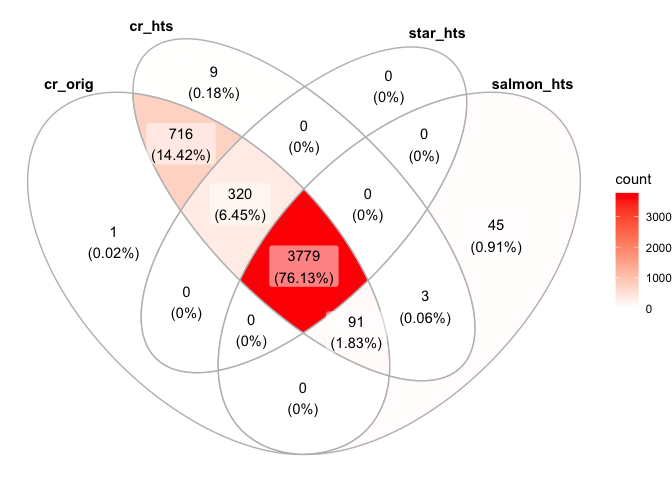
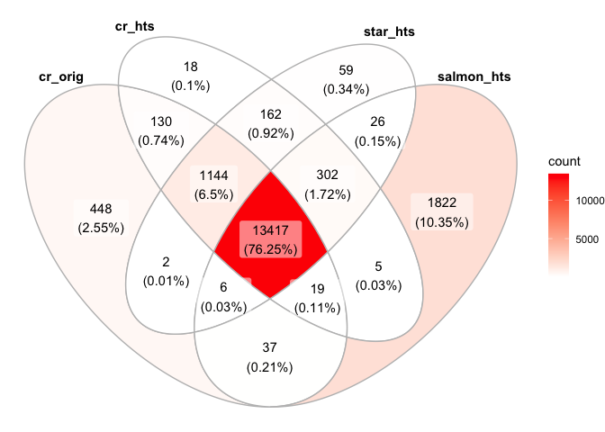
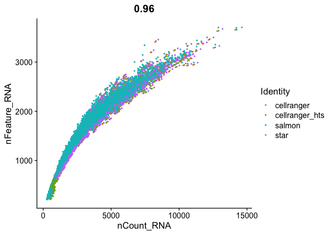
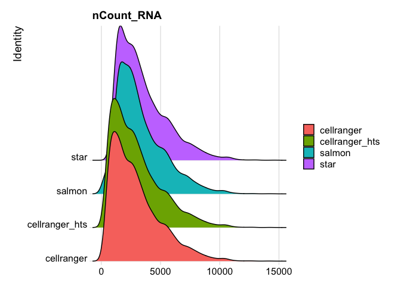
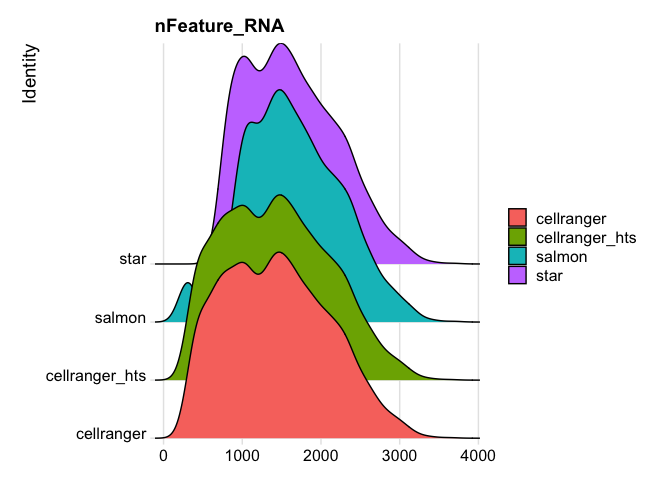
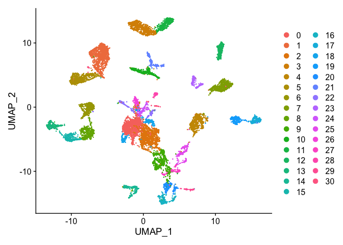
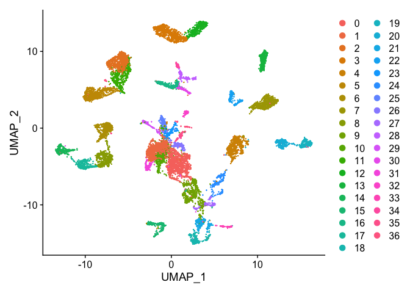

# Single Cell Analysis with Seurat and some custom code!

[Seurat](http://satijalab.org/seurat/) is a popular R package that is designed for QC, analysis, and exploration of single cell data. Seurat aims to enable users to identify and interpret sources of heterogeneity from single cell transcriptomic measurements, and to integrate diverse types of single cell data. Further, the authors provide several [tutorials](https://satijalab.org/seurat/vignettes.html) on their website.

We start with loading needed libraries for R

```r
library(Seurat)
library(tximport)
library(ggVennDiagram)
```

## Load the Expression Matrix Data and create the combined base Seurat object.

Seurat provides a function `Read10X` to read in 10X data folder. First we read in data from each individual sample folder. Then, we initialize the Seurat object (`CreateSeuratObject`) with the raw (non-normalized data). Keep all genes expressed in >= 3 cells. Keep all cells with at least 200 detected genes. Also extracting sample names, calculating and adding in the metadata mitochondrial percentage of each cell. Some QA/QC Finally, saving the raw Seurat object.

### A ens2sym.txt file

Reading in the salmon file, we will need to convert the ensembl ids to gene symbols. just like we did [here]  (https://ucdavis-bioinformatics-training.github.io/2020-Advanced_Single_Cell_RNA_Seq/data_reduction/scMapping) to create the txp2gene.txt file from biomart, we will want to do the same for the ens2sym.txt file. You will need 3 columns "Gene stable ID", "Gene stable ID version", and "Gene name". Your final file should look like this

<div class='r_output'>Gene stable ID	Gene stable ID version	Gene name
ENSMUSG00000064372	ENSMUSG00000064372.1	mt-Tp
ENSMUSG00000064371	ENSMUSG00000064371.1	mt-Tt
ENSMUSG00000064370	ENSMUSG00000064370.1	mt-Cytb
ENSMUSG00000064369	ENSMUSG00000064369.1	mt-Te
ENSMUSG00000064368	ENSMUSG00000064368.1	mt-Nd6
ENSMUSG00000064367	ENSMUSG00000064367.1	mt-Nd5
ENSMUSG00000064366	ENSMUSG00000064366.1	mt-Tl2
ENSMUSG00000064365	ENSMUSG00000064365.1	mt-Ts2
ENSMUSG00000064364	ENSMUSG00000064364.1	mt-Th
ENSMUSG00000064363	ENSMUSG00000064363.1	mt-Nd4
ENSMUSG00000065947	ENSMUSG00000065947.3	mt-Nd4l
ENSMUSG00000064361	ENSMUSG00000064361.1	mt-Tr
ENSMUSG00000064360	ENSMUSG00000064360.1	mt-Nd3
</div>

```r
## Cellranger
cellranger_orig <- Read10X_h5("Adv_comparison_outputs/654/outs/filtered_feature_bc_matrix.h5")
# If hdf5 isn't working read in from the mtx files
#cellranger_orig <- Read10X("Adv_comparison_outputs/654/outs/filtered_feature_bc_matrix")
s_cellranger_orig <- CreateSeuratObject(counts = cellranger_orig, min.cells = 3, min.features = 200, project = "cellranger")
s_cellranger_orig
```

<div class='r_output'> An object of class Seurat 
 15203 features across 4907 samples within 1 assay 
 Active assay: RNA (15203 features, 0 variable features)
</div>
```r
cellranger_htstream <- Read10X_h5("Adv_comparison_outputs/654_htstream/outs/filtered_feature_bc_matrix.h5")
s_cellranger_hts <- CreateSeuratObject(counts = cellranger_htstream, min.cells = 3, min.features = 200, project = "cellranger_hts")
s_cellranger_hts
```

<div class='r_output'> An object of class Seurat 
 15197 features across 4918 samples within 1 assay 
 Active assay: RNA (15197 features, 0 variable features)
</div>
```r
## STAR
star <- Read10X("Adv_comparison_outputs/654_htstream_star/outs/filtered_feature_bc_matrix")
s_star_hts <- CreateSeuratObject(counts = star, min.cells = 3, min.features = 200, project = "star")
s_star_hts
```

<div class='r_output'> An object of class Seurat 
 15118 features across 4099 samples within 1 assay 
 Active assay: RNA (15118 features, 0 variable features)
</div>
```r
## SALMON
txi <- tximport("Adv_comparison_outputs/654_htstream_salmon_decoys/alevin/quants_mat.gz", type="alevin")
```

<div class='r_output'> importing alevin data is much faster after installing `fishpond` (>= 1.2.0)
</div>
<div class='r_output'> reading in alevin gene-level counts across cells
</div>
```r
## salmon is in ensembl IDs, need to convert to gene symbol
head(rownames(txi$counts))
```

<div class='r_output'> [1] "ENSMUSG00000064370.1" "ENSMUSG00000064368.1" "ENSMUSG00000064367.1"
 [4] "ENSMUSG00000064363.1" "ENSMUSG00000065947.3" "ENSMUSG00000064360.1"
</div>
```r
ens2symbol <- read.table("ens2sym.txt",sep="\t",header=T,as.is=T)
map <- ens2symbol$Gene.name[match(rownames(txi$counts),ens2symbol$Gene.stable.ID.version)]

txi_counts <- txi$counts[-which(duplicated(map)),]
map <- map[-which(duplicated(map))]
rownames(txi_counts) <- map
dim(txi_counts)
```

<div class='r_output'> [1] 35805  3919
</div>
```r
s_salmon_hts <- CreateSeuratObject(counts = txi_counts , min.cells = 3, min.features = 200, project = "salmon")
s_salmon_hts
```

<div class='r_output'> An object of class Seurat 
 15634 features across 3918 samples within 1 assay 
 Active assay: RNA (15634 features, 0 variable features)
</div>
```r
# Need to Check Rows names/Col names before merge 

# they however have different looking cell ids, need to fix
head(colnames(s_cellranger_orig))
```

<div class='r_output'> [1] "AAACCTGAGATCACGG-1" "AAACCTGAGCATCATC-1" "AAACCTGAGCGCTCCA-1"
 [4] "AAACCTGAGTGGGATC-1" "AAACCTGCAGACAGGT-1" "AAACCTGCATCATCCC-1"
</div>
```r
head(colnames(s_star_hts))
```

<div class='r_output'> [1] "AAACCTGAGATCACGG" "AAACCTGAGCATCATC" "AAACCTGAGCGCTCCA" "AAACCTGAGTGGGATC"
 [5] "AAACCTGCAGACAGGT" "AAACCTGGTATAGGTA"
</div>
```r
head(colnames(s_salmon_hts))
```

<div class='r_output'> [1] "CGGACACCATTCACTT" "ACATACGAGAGTGAGA" "CTCACACAGAATTGTG" "CACACTCTCGGCCGAT"
 [5] "CACAGGCCAATCTGCA" "TACTCATCATAGGATA"
</div>
```r
s_cellranger_orig <- RenameCells(s_cellranger_orig, new.names = sapply(X = strsplit(colnames(s_cellranger_orig), split = "-"), FUN = "[", 1))

s_cellranger_hts <- RenameCells(s_cellranger_hts, new.names = sapply(X = strsplit(colnames(s_cellranger_hts), split = "-"), FUN = "[", 1))


## Merge the dataset
s_merged <- merge(s_cellranger_orig, y = c(s_cellranger_hts, s_star_hts, s_salmon_hts), add.cell.ids = c("cr.orig", "cr.hts", "star.hts", "salmon.hts"), project = "MapTest")
s_merged
```

<div class='r_output'> An object of class Seurat 
 17597 features across 17842 samples within 1 assay 
 Active assay: RNA (17597 features, 0 variable features)
</div>
```r
head(colnames(s_merged))
```

<div class='r_output'> [1] "cr.orig_AAACCTGAGATCACGG" "cr.orig_AAACCTGAGCATCATC"
 [3] "cr.orig_AAACCTGAGCGCTCCA" "cr.orig_AAACCTGAGTGGGATC"
 [5] "cr.orig_AAACCTGCAGACAGGT" "cr.orig_AAACCTGCATCATCCC"
</div>
```r
tail(colnames(s_merged))
```

<div class='r_output'> [1] "salmon.hts_TTGACTTAGCTTCGCG" "salmon.hts_AAAGTAGGTACGAAAT"
 [3] "salmon.hts_CTTTGCGAGGCGTACA" "salmon.hts_ACACCAAGTGTGACCC"
 [5] "salmon.hts_ACACTGATCGCCCTTA" "salmon.hts_ATCCGAAGTGCTGTAT"
</div>
```r
table(s_merged$orig.ident)
```

<div class='r_output'> 
     cellranger cellranger_hts         salmon           star 
           4907           4918           3918           4099
</div>
```r
table(table(sapply(X = strsplit(colnames(s_merged), split = "_"), FUN = "[", 2)))
```

<div class='r_output'> 
    1    2    3    4 
   55  719  411 3779
</div>
### The percentage of reads that map to the mitochondrial genome

* Low-quality / dying cells often exhibit extensive mitochondrial content
* We calculate mitochondrial QC metrics with the PercentageFeatureSet function, which calculates the percentage of counts originating from a set of features.
* We use the set of all genes, in mouse these genes can be identified as those that begin with 'mt', in human data they begin with MT.


```r
s_merged$percent.mito <- PercentageFeatureSet(s_merged, pattern = "^mt-")
```

### Lets spend a little time getting to know the Seurat object.

The Seurat object is the center of each single cell analysis. It stores __all__ information associated with the dataset, including data, annotations, analyses, etc. The R function slotNames can be used to view the slot names within an object.


```r
slotNames(s_merged)
```

<div class='r_output'>  [1] "assays"       "meta.data"    "active.assay" "active.ident" "graphs"      
  [6] "neighbors"    "reductions"   "project.name" "misc"         "version"     
 [11] "commands"     "tools"
</div>

```r
head(s_merged[[]])
```

<div class='r_output'>                          orig.ident nCount_RNA nFeature_RNA percent.mito
 cr.orig_AAACCTGAGATCACGG cellranger       2452         1326    7.4225122
 cr.orig_AAACCTGAGCATCATC cellranger       2655         1329    0.8286252
 cr.orig_AAACCTGAGCGCTCCA cellranger       2853         1529    3.7504381
 cr.orig_AAACCTGAGTGGGATC cellranger       3636         1912    0.5500550
 cr.orig_AAACCTGCAGACAGGT cellranger       1104          795    1.3586957
 cr.orig_AAACCTGCATCATCCC cellranger        514          412    5.8365759
</div>
```r
head(s_merged@meta.data)
```

<div class='r_output'>                          orig.ident nCount_RNA nFeature_RNA percent.mito
 cr.orig_AAACCTGAGATCACGG cellranger       2452         1326    7.4225122
 cr.orig_AAACCTGAGCATCATC cellranger       2655         1329    0.8286252
 cr.orig_AAACCTGAGCGCTCCA cellranger       2853         1529    3.7504381
 cr.orig_AAACCTGAGTGGGATC cellranger       3636         1912    0.5500550
 cr.orig_AAACCTGCAGACAGGT cellranger       1104          795    1.3586957
 cr.orig_AAACCTGCATCATCCC cellranger        514          412    5.8365759
</div>
#### Question(s)

1. What slots are empty, what slots have data?
2. What columns are available in meta.data?
3. Look up the help documentation for subset?


## Now lets do some basic comparisons. Do they share the same cellbarcodes?

```r
ggVennDiagram(list("cr_orig"=colnames(s_cellranger_orig),"cr_hts"=colnames(s_cellranger_hts), "star_hts"=colnames(s_star_hts), "salmon_hts"=colnames(s_salmon_hts)))
```

<!-- -->

```r
cr_orig_genes <- rowSums(as.matrix(GetAssayData(subset(s_merged, cells=colnames(s_merged)[s_merged$orig.ident=="cellranger"]))))
cr_hts_genes <- rowSums(as.matrix(GetAssayData(subset(s_merged, cells=colnames(s_merged)[s_merged$orig.ident=="cellranger_hts"]))))
star_hts_genes <- rowSums(as.matrix(GetAssayData(subset(s_merged, cells=colnames(s_merged)[s_merged$orig.ident=="star"]))))
salmon_hts_genes <- rowSums(as.matrix(GetAssayData(subset(s_merged, cells=colnames(s_merged)[s_merged$orig.ident=="salmon"]))))

minReads=0
ggVennDiagram(list("cr_orig"=names(cr_orig_genes[cr_orig_genes>minReads]),"cr_hts"=names(cr_hts_genes[cr_hts_genes>minReads]), "star_hts"=names(star_hts_genes[star_hts_genes>minReads]), "salmon_hts"=names(salmon_hts_genes[salmon_hts_genes>minReads])))
```

<!-- -->

```r
FeatureScatter(
  s_merged, "nCount_RNA", "nFeature_RNA",
  pt.size = 0.5)
```

<!-- -->

#### Question(s)

1. Spend a minute playing with minReads, see how the data changes.
2. What are the sum of UMIs for each?
3. Look up the help documentation for subset?


### Lets take a look at some other metadata


```r
RidgePlot(s_merged, features="nCount_RNA")
```

<div class='r_output'> Picking joint bandwidth of 335
</div>
<!-- -->

```r
RidgePlot(s_merged, features="nFeature_RNA")
```

<div class='r_output'> Picking joint bandwidth of 105
</div>
<!-- -->

```r
RidgePlot(s_merged, features="percent.mito")
```

<div class='r_output'> Picking joint bandwidth of 0.37
</div>
<!-- -->


```r
VlnPlot(
  s_merged,
  features = c("nFeature_RNA", "nCount_RNA","percent.mito"),
  ncol = 1, pt.size = 0.3)
```

<!-- -->


```r
s_merged <- NormalizeData(s_merged, normalization.method = "LogNormalize", scale.factor = 10000)
s_merged <- FindVariableFeatures(s_merged, selection.method = "vst", nfeatures = 2000)

all.genes <- rownames(s_merged)
s_merged <- ScaleData(s_merged, features = all.genes)
```

<div class='r_output'> Centering and scaling data matrix
</div>
```r
s_merged <- RunPCA(s_merged, features = VariableFeatures(object = s_merged))
```

<div class='r_output'> PC_ 1 
 Positive:  Adcyap1, Celf4, Gap43, Kit, Ngfr, Gal, Meg3, Fxyd7, Lynx1, Enah 
 	   Spock1, Pcp4, 6330403K07Rik, Mt1, Eno2, Syt2, Map2, Gpx3, Sv2b, S1pr3 
 	   Malat1, Fgf1, Dbpht2, Ptn, Cntn1, Scg2, Faim2, S100b, Npy1r, Stx1b 
 Negative:  Sncg, Ubb, Txn1, Fxyd2, Atp6v0b, Lxn, Sh3bgrl3, Rabac1, Dctn3, Pfn1 
 	   Ppia, Fez1, Ndufa11, Cisd1, Ndufa4, Atp6v1f, Atpif1, S100a10, S100a6, Psmb2 
 	   Psmb6, Tmem45b, Prdx2, Elob, Nme1, Gabarapl2, Cox6a1, Bex2, Pop5, Bex3 
 PC_ 2 
 Positive:  Cntn1, S100b, Nefh, Thy1, Cplx1, Tagln3, Hopx, Sv2b, Ntrk3, Lrrn1 
 	   Slc17a7, Nefm, Atp1b1, Atp2b2, Chchd10, Vsnl1, Nat8l, Nefl, Scn8a, Scn1a 
 	   Vamp1, Kcna2, Mcam, Scn1b, Endod1, Syt2, Lynx1, Sh3gl2, Scn4b, Cpne6 
 Negative:  Cd24a, Malat1, Tmem233, Dusp26, Mal2, Prkca, Cd9, Osmr, Tmem158, Nppb 
 	   Carhsp1, Ift122, Cd44, Sst, Arpc1b, Calca, Npy2r, Gna14, Atpaf2, Gm525 
 	   Gadd45g, Tac1, Bhlhe41, Cd82, Adk, Meg3, Gng2, Nts, Scg2, Sntb1 
 PC_ 3 
 Positive:  Gm28661, Gm10925, Rps7-ps3, Gm28437, Rpl10-ps3, Rpl9-ps6, Gm21981, Gm45234, Gm20390, Gm21988 
 	   Gm45713, Rps27rt, Gm10177, Gm10288, Gm10175, Uba52, Rnasek, Kxd1, Gm8430, Rpl10a-ps1 
 	   Nme2, Atp5o, Rpl17-ps3, Rps6-ps4, Gstp2, Gm12918, Gm29216, Rpl23a-ps3, Rpl27-ps3, Gm9843 
 Negative:  Aldoa, Malat1, Atp5o.1, Meg3, Minos1, Usmg5, H2afz, 2010107E04Rik, Aes, Sept7 
 	   Atp5f1, Fam103a1, Tusc5, Fam96b, March2, 2410015M20Rik, Tmem55b, 1500011K16Rik, AC160336.1, Hist1h2bc 
 	   1110008F13Rik, H2afj, 3632451O06Rik, H2afy, Pqlc1, March6, Tmem55a, Sssca1, 1700020I14Rik, Fam19a4 
 PC_ 4 
 Positive:  Tspan8, Jak1, Etv1, Resp18, Tmem233, Nppb, Adk, Sst, Skp1a, Scg2 
 	   Gm525, Osmr, Nts, Cystm1, Tesc, Npy2r, Nefh, Nsg1, S100b, Ift122 
 	   Map7d2, Thy1, Blvrb, Htr1f, Cd82, Prkca, Calm1, Ddah1, Atp1b1, Cysltr2 
 Negative:  Gm7271, P2ry1, Rarres1, Th, Fxyd6, Tafa4, Wfdc2, Id4, Gfra2, Zfp521 
 	   Iqsec2, Rgs5, Rgs10, Tox3, Kcnd3, Cdkn1a, Rasgrp1, Alcam, Pou4f2, C1ql4 
 	   Rprm, Synpr, D130079A08Rik, Piezo2, Spink2, Ceacam10, Camk2n1, Bok, Grik1, Ptpre 
 PC_ 5 
 Positive:  Basp1, Gm765, Prkar2b, Cd44, Rab27b, Calcb, Ctxn3, Lpar3, Ly86, Calca 
 	   Nefl, Aplp2, Mt3, Rgs7, Anks1b, Mrgprd, Nrn1l, Cd55, Nrn1, Gap43 
 	   Grik1, Serping1, Nmb, Klhl5, Rspo2, Spock3, Otoa, Ptprt, Synpr, S100a7l2 
 Negative:  Nppb, Sst, Gm525, Nts, Osmr, Hpcal1, Npy2r, Htr1f, Jak1, Cysltr2 
 	   Ptprk, Tesc, Il31ra, Resp18, Tspan8, Blvrb, Cmtm7, Ada, Etv1, Fam178b 
 	   Cavin1, Camk2n1, Gstt2, Nbl1, Pde4c, Sntb1, Rarres1, Lgals1, Ddah1, Gm7271
</div>
```r
use.pcs = 1:30
s_merged <- FindNeighbors(s_merged, dims = use.pcs)
```

<div class='r_output'> Computing nearest neighbor graph
</div>
<div class='r_output'> Computing SNN
</div>
```r
s_merged <- FindClusters(s_merged, resolution = c(0.5,0.75,1.0))
```

<div class='r_output'> Modularity Optimizer version 1.3.0 by Ludo Waltman and Nees Jan van Eck
 
 Number of nodes: 17842
 Number of edges: 691328
 
 Running Louvain algorithm...
 Maximum modularity in 10 random starts: 0.9579
 Number of communities: 31
 Elapsed time: 1 seconds
 Modularity Optimizer version 1.3.0 by Ludo Waltman and Nees Jan van Eck
 
 Number of nodes: 17842
 Number of edges: 691328
 
 Running Louvain algorithm...
 Maximum modularity in 10 random starts: 0.9465
 Number of communities: 33
 Elapsed time: 1 seconds
 Modularity Optimizer version 1.3.0 by Ludo Waltman and Nees Jan van Eck
 
 Number of nodes: 17842
 Number of edges: 691328
 
 Running Louvain algorithm...
 Maximum modularity in 10 random starts: 0.9364
 Number of communities: 37
 Elapsed time: 1 seconds
</div>
```r
s_merged <- RunTSNE(s_merged, dims = use.pcs)
s_merged <- RunUMAP(s_merged, dims = use.pcs)
```

<div class='r_output'> Warning: The default method for RunUMAP has changed from calling Python UMAP via reticulate to the R-native UWOT using the cosine metric
 To use Python UMAP via reticulate, set umap.method to 'umap-learn' and metric to 'correlation'
 This message will be shown once per session
</div>
<div class='r_output'> 19:04:18 UMAP embedding parameters a = 0.9922 b = 1.112
</div>
<div class='r_output'> 19:04:18 Read 17842 rows and found 30 numeric columns
</div>
<div class='r_output'> 19:04:18 Using Annoy for neighbor search, n_neighbors = 30
</div>
<div class='r_output'> 19:04:18 Building Annoy index with metric = cosine, n_trees = 50
</div>
<div class='r_output'> 0%   10   20   30   40   50   60   70   80   90   100%
</div>
<div class='r_output'> [----|----|----|----|----|----|----|----|----|----|
</div>
<div class='r_output'> **************************************************|
 19:04:21 Writing NN index file to temp file /var/folders/74/h45z17f14l9g34tmffgq9nkw0000gn/T//RtmpI9wDI8/file1555f1d37fc
 19:04:21 Searching Annoy index using 1 thread, search_k = 3000
 19:04:25 Annoy recall = 100%
 19:04:25 Commencing smooth kNN distance calibration using 1 thread
 19:04:26 Initializing from normalized Laplacian + noise
 19:04:27 Commencing optimization for 200 epochs, with 765114 positive edges
 19:04:35 Optimization finished
</div>
```r
DimPlot(s_merged, reduction = "tsne")
```

<!-- -->

```r
DimPlot(s_merged, reduction = "umap")
```

<!-- -->

```r
DimPlot(s_merged, group.by = "orig.ident", reduction = "umap")
```

<!-- -->

## Finally, save the original object, write out a tab-delimited table that could be read into excel, and view the object.

```r
## Original dataset in Seurat class, with no filtering
save(s_merged,file="mapping_comparison_object.RData")
```

## Session Information

```r
sessionInfo()
```

<div class='r_output'> R version 4.0.0 (2020-04-24)
 Platform: x86_64-apple-darwin17.0 (64-bit)
 Running under: macOS Catalina 10.15.4
 
 Matrix products: default
 BLAS:   /Library/Frameworks/R.framework/Versions/4.0/Resources/lib/libRblas.dylib
 LAPACK: /Library/Frameworks/R.framework/Versions/4.0/Resources/lib/libRlapack.dylib
 
 locale:
 [1] en_US.UTF-8/en_US.UTF-8/en_US.UTF-8/C/en_US.UTF-8/en_US.UTF-8
 
 attached base packages:
 [1] stats     graphics  grDevices datasets  utils     methods   base     
 
 other attached packages:
 [1] ggVennDiagram_0.3 tximport_1.16.0   Seurat_3.1.5     
 
 loaded via a namespace (and not attached):
   [1] nlme_3.1-148         tsne_0.1-3           sf_0.9-3            
   [4] bit64_0.9-7          RcppAnnoy_0.0.16     RColorBrewer_1.1-2  
   [7] httr_1.4.1           sctransform_0.2.1    tools_4.0.0         
  [10] R6_2.4.1             irlba_2.3.3          KernSmooth_2.23-17  
  [13] DBI_1.1.0            uwot_0.1.8           lazyeval_0.2.2      
  [16] colorspace_1.4-1     withr_2.2.0          tidyselect_1.1.0    
  [19] gridExtra_2.3        bit_1.1-15.2         compiler_4.0.0      
  [22] VennDiagram_1.6.20   formatR_1.7          hdf5r_1.3.2         
  [25] plotly_4.9.2.1       labeling_0.3         scales_1.1.1        
  [28] classInt_0.4-3       lmtest_0.9-37        ggridges_0.5.2      
  [31] pbapply_1.4-2        stringr_1.4.0        digest_0.6.25       
  [34] rmarkdown_2.1        pkgconfig_2.0.3      htmltools_0.4.0     
  [37] htmlwidgets_1.5.1    rlang_0.4.6          farver_2.0.3        
  [40] zoo_1.8-8            jsonlite_1.6.1       ica_1.0-2           
  [43] dplyr_0.8.5          magrittr_1.5         futile.logger_1.4.3 
  [46] patchwork_1.0.0      Matrix_1.2-18        Rcpp_1.0.4.6        
  [49] munsell_0.5.0        ape_5.3              reticulate_1.15     
  [52] lifecycle_0.2.0      stringi_1.4.6        yaml_2.2.1          
  [55] MASS_7.3-51.6        Rtsne_0.15           plyr_1.8.6          
  [58] grid_4.0.0           parallel_4.0.0       listenv_0.8.0       
  [61] ggrepel_0.8.2        crayon_1.3.4         lattice_0.20-41     
  [64] cowplot_1.0.0        splines_4.0.0        knitr_1.28          
  [67] pillar_1.4.4         igraph_1.2.5         future.apply_1.5.0  
  [70] reshape2_1.4.4       codetools_0.2-16     futile.options_1.0.1
  [73] leiden_0.3.3         glue_1.4.1           evaluate_0.14       
  [76] lambda.r_1.2.4       data.table_1.12.8    renv_0.10.0         
  [79] BiocManager_1.30.10  png_0.1-7            vctrs_0.3.0         
  [82] gtable_0.3.0         RANN_2.6.1           purrr_0.3.4         
  [85] tidyr_1.1.0          future_1.17.0        assertthat_0.2.1    
  [88] ggplot2_3.3.0        xfun_0.14            rsvd_1.0.3          
  [91] RSpectra_0.16-0      e1071_1.7-3          class_7.3-17        
  [94] survival_3.1-12      viridisLite_0.3.0    tibble_3.0.1        
  [97] units_0.6-6          cluster_2.1.0        globals_0.12.5      
 [100] fitdistrplus_1.1-1   ellipsis_0.3.1       ROCR_1.0-11
</div>
