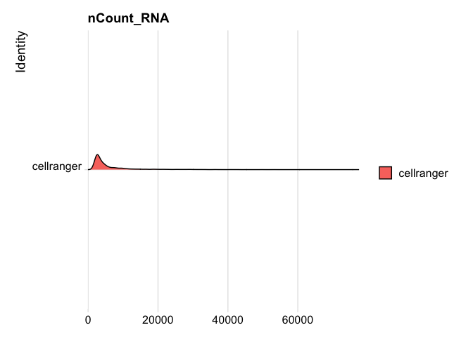
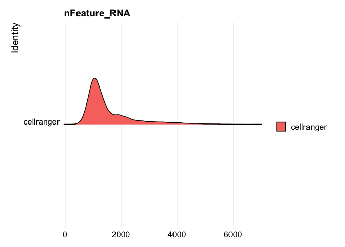
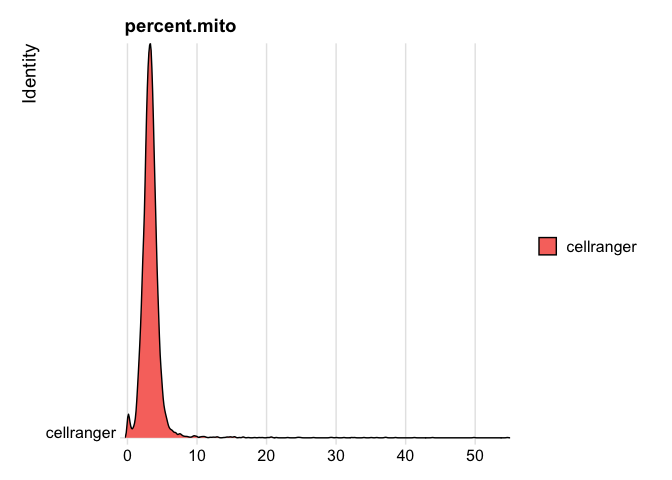
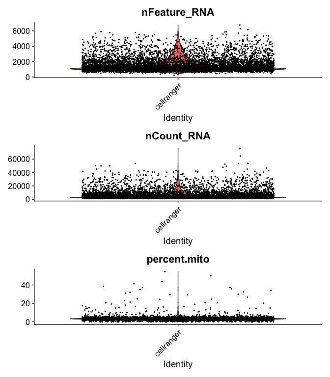
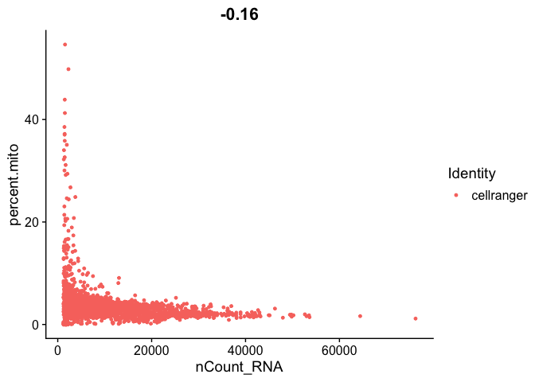
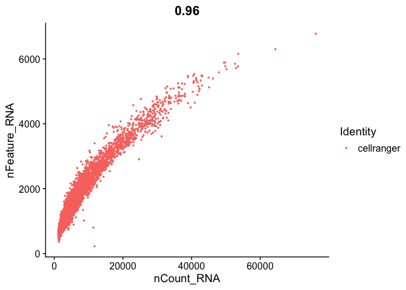
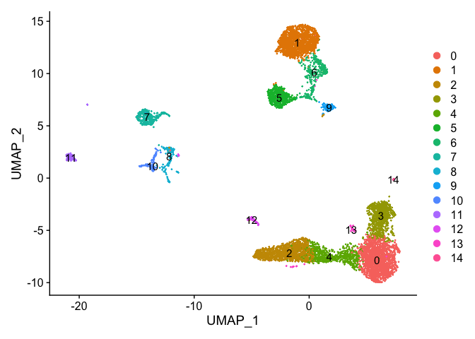
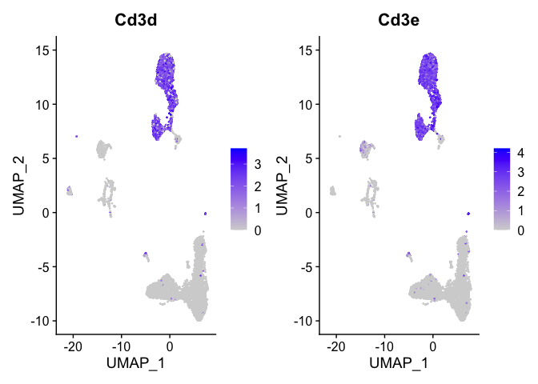
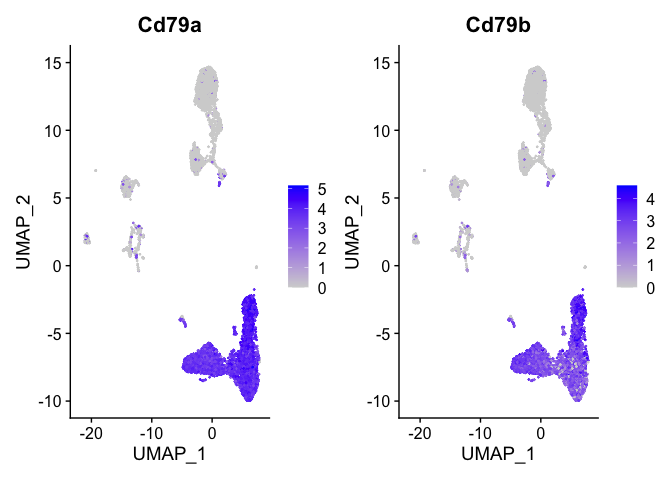
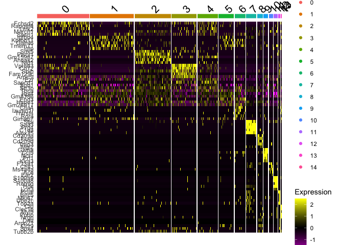

# Single Cell V(D)J Analysis with Seurat and some custom code!

[Seurat](http://satijalab.org/seurat/) is a popular R package that is designed for QC, analysis, and exploration of single cell data. Seurat aims to enable users to identify and interpret sources of heterogeneity from single cell transcriptomic measurements, and to integrate diverse types of single cell data. Further, the authors provide several [tutorials](https://satijalab.org/seurat/vignettes.html) on their website.

We start with loading needed libraries for R

```r
library(Seurat)
library(cowplot)
```

## First Download Example Data

```r
download.file("https://bioshare.bioinformatics.ucdavis.edu/bioshare/download/iimg5mz77whzzqc/vdj_v1_mm_balbc_pbmc.zip", "vdj_v1_mm_balbc_pbmc.zip")
```
## Load the Expression Matrix Data and create the combined base Seurat object.

Seurat provides a function `Read10X` to read in 10X data folder. First we read in data from each individual sample folder. Then, we initialize the Seurat object (`CreateSeuratObject`) with the raw (non-normalized data). Keep all genes expressed in >= 3 cells. Keep all cells with at least 200 detected genes. Also extracting sample names, calculating and adding in the metadata mitochondrial percentage of each cell. Some QA/QC Finally, saving the raw Seurat object.


```r
## Cellranger
balbc_pbmc <- Read10X_h5("vdj_v1_mm_balbc_pbmc/vdj_v1_mm_balbc_pbmc_5gex_filtered_feature_bc_matrix.h5")

s_balbc_pbmc <- CreateSeuratObject(counts = balbc_pbmc, min.cells = 3, min.features = 200, project = "cellranger")
```

### The percentage of reads that map to the mitochondrial genome

* Low-quality / dying cells often exhibit extensive mitochondrial content
* We calculate mitochondrial QC metrics with the PercentageFeatureSet function, which calculates the percentage of counts originating from a set of features.
* We use the set of all genes, in mouse these genes can be identified as those that begin with 'mt', in human data they begin with MT.


```r
s_balbc_pbmc$percent.mito <- PercentageFeatureSet(s_balbc_pbmc, pattern = "^mt-")
```

## Next lets add the T cell and B cell clonetype information

```r
add_clonotype <- function(tcr_prefix, seurat_obj, type="t"){
    tcr <- read.csv(paste(tcr_prefix,"filtered_contig_annotations.csv", sep=""))

    # Remove the -1 at the end of each barcode.
    # Subsets so only the first line of each barcode is kept,
    # as each entry for given barcode will have same clonotype.
    tcr <- tcr[!duplicated(tcr$barcode), ]

    # Only keep the barcode and clonotype columns. 
    # We'll get additional clonotype info from the clonotype table.
    tcr <- tcr[,c("barcode", "raw_clonotype_id")]
    names(tcr)[names(tcr) == "raw_clonotype_id"] <- "clonotype_id"

    # Clonotype-centric info.
    clono <- read.csv(paste(tcr_prefix,"clonotypes.csv", sep=""))

    # Slap the AA sequences onto our original table by clonotype_id.
    tcr <- merge(tcr, clono[, c("clonotype_id", "cdr3s_aa")])
    names(tcr)[names(tcr) == "cdr3s_aa"] <- "cdr3s_aa"

    # Reorder so barcodes are first column and set them as rownames.
    tcr <- tcr[, c(2,1,3)]
    rownames(tcr) <- tcr[,1]
    tcr[,1] <- NULL
    colnames(tcr) <- paste(type, colnames(tcr), sep="_")
    # Add to the Seurat object's metadata.
    clono_seurat <- AddMetaData(object=seurat_obj, metadata=tcr)
    return(clono_seurat)
}

s_balbc_pbmc <- add_clonotype("vdj_v1_mm_balbc_pbmc/vdj_v1_mm_balbc_pbmc_t_", s_balbc_pbmc, "t")
s_balbc_pbmc <- add_clonotype("vdj_v1_mm_balbc_pbmc/vdj_v1_mm_balbc_pbmc_b_", s_balbc_pbmc, "b")
head(s_balbc_pbmc[[]])
```

<div class='r_output'>                    orig.ident nCount_RNA nFeature_RNA percent.mito
 AAACCTGAGCAACGGT-1 cellranger       3456         1203     3.645833
 AAACCTGAGCAGCCTC-1 cellranger       7334         2333     3.108808
 AAACCTGAGTTAACGA-1 cellranger       2949         1144     2.577145
 AAACCTGCATCCGGGT-1 cellranger       3586         1017     3.485778
 AAACCTGCATCTACGA-1 cellranger       2659         1141     3.121474
 AAACCTGGTCTAACGT-1 cellranger       5266         1189     3.171288
                    t_clonotype_id                             t_cdr3s_aa
 AAACCTGAGCAACGGT-1           <NA>                                   <NA>
 AAACCTGAGCAGCCTC-1           <NA>                                   <NA>
 AAACCTGAGTTAACGA-1     clonotype4    TRA:CAARDTGYQNFYF;TRB:CASSIRVNTEVFF
 AAACCTGCATCCGGGT-1     clonotype5   TRA:CAAGGGNNKLTF;TRB:CASSLTGISNERLFF
 AAACCTGCATCTACGA-1           <NA>                                   <NA>
 AAACCTGGTCTAACGT-1     clonotype6 TRA:CAIDPPNVGDNSKLIW;TRB:CASSDDRVGEQYF
                    b_clonotype_id                            b_cdr3s_aa
 AAACCTGAGCAACGGT-1   clonotype149       IGH:CAKRLRSFDYW;IGK:CQQHYSTPLTF
 AAACCTGAGCAGCCTC-1           <NA>                                  <NA>
 AAACCTGAGTTAACGA-1           <NA>                                  <NA>
 AAACCTGCATCCGGGT-1           <NA>                                  <NA>
 AAACCTGCATCTACGA-1   clonotype151 IGH:CARWGGYGYDGGYFDYW;IGK:CGQSYSYPYTF
 AAACCTGGTCTAACGT-1           <NA>                                  <NA>
</div>
### Are there any T/B cells out there??

```r
table(!is.na(s_balbc_pbmc$t_clonotype_id),!is.na(s_balbc_pbmc$b_clonotype_id))
```

<div class='r_output'>        
         FALSE TRUE
   FALSE  1074 4488
   TRUE   2175  220
</div>
```r
s_balbc_pbmc <- subset(s_balbc_pbmc, cells = colnames(s_balbc_pbmc)[!(!is.na(s_balbc_pbmc$t_clonotype_id) &
                                 !is.na(s_balbc_pbmc$b_clonotype_id))])
s_balbc_pbmc
```

<div class='r_output'> An object of class Seurat 
 15975 features across 7737 samples within 1 assay 
 Active assay: RNA (15975 features, 0 variable features)
</div>
### Lets take a look at some other metadata


```r
RidgePlot(s_balbc_pbmc, features="nCount_RNA")
```

<div class='r_output'> Picking joint bandwidth of 439
</div>
<!-- -->

```r
RidgePlot(s_balbc_pbmc, features="nFeature_RNA")
```

<div class='r_output'> Picking joint bandwidth of 86.1
</div>
<!-- -->

```r
RidgePlot(s_balbc_pbmc, features="percent.mito")
```

<div class='r_output'> Picking joint bandwidth of 0.132
</div>
<!-- -->


```r
VlnPlot(
  s_balbc_pbmc,
  features = c("nFeature_RNA", "nCount_RNA","percent.mito"),
  ncol = 1, pt.size = 0.3)
```

<!-- -->


```r
FeatureScatter(s_balbc_pbmc, feature1 = "nCount_RNA", feature2 = "percent.mito")
```

<!-- -->

```r
FeatureScatter(s_balbc_pbmc, "nCount_RNA", "nFeature_RNA",pt.size = 0.5)
```

<!-- -->


```r
s_balbc_pbmc <- subset(s_balbc_pbmc, percent.mito <= 10)

s_balbc_pbmc <- subset(s_balbc_pbmc, nCount_RNA >= 500 & nCount_RNA <= 40000)

s_balbc_pbmc
```

<div class='r_output'> An object of class Seurat 
 15975 features across 7634 samples within 1 assay 
 Active assay: RNA (15975 features, 0 variable features)
</div>


```r
s_balbc_pbmc <- NormalizeData(s_balbc_pbmc, normalization.method = "LogNormalize", scale.factor = 10000)
s_balbc_pbmc <- FindVariableFeatures(s_balbc_pbmc, selection.method = "vst", nfeatures = 2000)

all.genes <- rownames(s_balbc_pbmc)
s_balbc_pbmc <- ScaleData(s_balbc_pbmc, features = all.genes)
```

<div class='r_output'> Centering and scaling data matrix
</div>
```r
s_balbc_pbmc <- RunPCA(s_balbc_pbmc, features = VariableFeatures(object = s_balbc_pbmc))
```

<div class='r_output'> PC_ 1 
 Positive:  Ighm, Igkc, Mzb1, H2-Eb1, H2-Aa, Cd74, H2-Ab1, Trbc2, Ms4a4b, Cd72 
 	   Gm30211, Tcf7, Vpreb3, Il7r, Ly6d, Hmgb2, Thy1, Iglc1, Ass1, Rrad 
 	   Dapl1, AW112010, Trbc1, Cd8b1, Sh2d1a, Itm2a, Hs3st1, Fam129c, Ctsw, Gata3 
 Negative:  Fn1, Emilin2, Lyz2, Cxcl2, App, Fcgr3, Ccl6, Sdc3, Wfdc17, Itgam 
 	   Ltc4s, Lrp1, Alox5ap, Mt1, Csf1r, Cd14, Cxcl1, Ptgs1, Ifitm3, Ier3 
 	   Plxdc2, Ccl9, Ccl24, Cfp, Trf, Fgfr1, Ednrb, S100a1, Ifitm2, Gda 
 PC_ 2 
 Positive:  Prg4, Cd5l, Alox15, Ptgis, Selp, Ltbp1, Saa3, Garnl3, Pmp22, C1qc 
 	   C1qa, C1qb, Ednrb, C4b, Tgfb2, Fcna, Icam2, Itga6, Adgre1, Serpinb2 
 	   Gm16104, Bcam, Serpine1, Flnb, Timd4, Padi4, F10, Gm10369, Gata6, Emilin1 
 Negative:  Il1b, Lst1, Gm5150, Sirpb1c, Ltb4r1, Ccr2, Cd300c2, Clec4a2, Csf3r, S100a9 
 	   Mmp9, Fam129a, Hp, Il1r2, Cxcr2, S100a8, Cass4, Clec4b1, Plbd1, Clec4a3 
 	   Fgr, Jaml, Ptafr, Msrb1, Tmem176b, Cd300lf, Clec4a1, Tnip3, Gcnt2, Bcl2a1a 
 PC_ 3 
 Positive:  S100a9, S100a8, Csf3r, Cxcr2, Hdc, Hp, Retnlg, Il1r2, Cd33, Gcnt2 
 	   Slfn4, Mmp9, Slfn1, Tnfaip2, Trem1, Arg2, Slc40a1, Lst1, Trem3, Cd300lf 
 	   F630028O10Rik, Pygl, Ccr1, Lrg1, Selplg, Clec4d, Stfa2l1, Rnf149, Ifitm1, Gm5150 
 Negative:  Cd74, H2-Eb1, H2-Aa, H2-Ab1, Slamf9, Crip1, Rassf4, Capg, Ighm, Pld4 
 	   Plac8, Mrc1, Mzb1, Clec4b1, Tubb6, Tnip3, Ctss, Fcrls, Tmem176b, Ahnak 
 	   Tmem176a, Igkc, S100a4, Tppp3, Zbtb32, Ctsz, Ccr2, Cysltr1, Hopx, Batf3 
 PC_ 4 
 Positive:  Cd74, Ighm, H2-Aa, Igkc, H2-Eb1, Mzb1, H2-Ab1, Plac8, Iglc1, Aldh2 
 	   Ly6e, Capg, Cst3, Cyp4f18, Gm30211, Ctsz, Ly6d, Spi1, S100a6, Zbtb32 
 	   Ctss, Cyba, Rassf4, Plaur, Pld4, Ncf4, Sox5, Atf3, Vpreb3, S100a8 
 Negative:  Ms4a4b, Trbc2, Thy1, Tcf7, Il7r, Dok2, Fxyd5, Ctsw, Nkg7, Rgs10 
 	   Il2rb, Npc2, Selplg, AW112010, Klk8, Sh2d1a, Id2, Trbc1, Ccl5, Ramp1 
 	   Cd7, Ccr2, Cd8b1, Gata3, Klrd1, Lcp2, Ppp1r15a, Dapl1, Igfbp4, Cd226 
 PC_ 5 
 Positive:  Pclaf, Birc5, Mki67, Spc24, Cdk1, Cdca3, Ube2c, Nusap1, Ccna2, Cenpm 
 	   Tpx2, Ccnb2, Rrm2, Pbk, Tyms, Cdca8, Cenpf, Ckap2l, Kif11, Tk1 
 	   Clspn, Uhrf1, Top2a, Esco2, Bub1, Kif15, Cks1b, Shcbp1, Bub1b, Prc1 
 Negative:  Pid1, Krt80, Lyz1, Retnla, Clec4a1, Ifitm6, Ccr2, Gm21188, Gm36161, Plcb1 
 	   Abca9, Kazald1, Tmem176b, Tmem176a, Pltp, Il6, Gm41307, Kank3, Clec4a3, Fcrls 
 	   Ltb4r1, Clec4b1, Ccl9, Mrc1, Ms4a8a, Ecm1, Mcub, Tifab, Dapk1, Fcgrt
</div>
```r
use.pcs = 1:30
s_balbc_pbmc <- FindNeighbors(s_balbc_pbmc, dims = use.pcs)
```

<div class='r_output'> Computing nearest neighbor graph
</div>
<div class='r_output'> Computing SNN
</div>
```r
s_balbc_pbmc <- FindClusters(s_balbc_pbmc, resolution = c(0.5))
```

<div class='r_output'> Modularity Optimizer version 1.3.0 by Ludo Waltman and Nees Jan van Eck
 
 Number of nodes: 7634
 Number of edges: 332010
 
 Running Louvain algorithm...
 Maximum modularity in 10 random starts: 0.9037
 Number of communities: 15
 Elapsed time: 0 seconds
</div>
```r
s_balbc_pbmc <- RunUMAP(s_balbc_pbmc, dims = use.pcs)
```

<div class='r_output'> Warning: The default method for RunUMAP has changed from calling Python UMAP via reticulate to the R-native UWOT using the cosine metric
 To use Python UMAP via reticulate, set umap.method to 'umap-learn' and metric to 'correlation'
 This message will be shown once per session
</div>
<div class='r_output'> 06:16:08 UMAP embedding parameters a = 0.9922 b = 1.112
</div>
<div class='r_output'> 06:16:09 Read 7634 rows and found 30 numeric columns
</div>
<div class='r_output'> 06:16:09 Using Annoy for neighbor search, n_neighbors = 30
</div>
<div class='r_output'> 06:16:09 Building Annoy index with metric = cosine, n_trees = 50
</div>
<div class='r_output'> 0%   10   20   30   40   50   60   70   80   90   100%
</div>
<div class='r_output'> [----|----|----|----|----|----|----|----|----|----|
</div>
<div class='r_output'> **************************************************|
 06:16:10 Writing NN index file to temp file /var/folders/74/h45z17f14l9g34tmffgq9nkw0000gn/T//Rtmpt2Uwt8/file6b3f4c622d23
 06:16:10 Searching Annoy index using 1 thread, search_k = 3000
 06:16:12 Annoy recall = 100%
 06:16:12 Commencing smooth kNN distance calibration using 1 thread
 06:16:13 Initializing from normalized Laplacian + noise
 06:16:13 Commencing optimization for 500 epochs, with 340584 positive edges
 06:16:23 Optimization finished
</div>
```r
DimPlot(s_balbc_pbmc, reduction = "umap", label = TRUE)
```

<!-- -->

Lets look at T-cell and B-cell markers

```r
t_cell_markers <- c("Cd3d","Cd3e")
FeaturePlot(s_balbc_pbmc, features = t_cell_markers)
```

<!-- -->

```r
table(!is.na(s_balbc_pbmc$t_clonotype_id),s_balbc_pbmc$seurat_clusters)
```

<div class='r_output'>        
            0    1    2    3    4    5    6    7    8    9   10   11   12   13
   FALSE 1678   82 1174  807  656   47   37  326  176  149  132  125   44   35
   TRUE     1 1337    0    0    0  455  312    6    9    5    2    8   13    6
        
           14
   FALSE    1
   TRUE    11
</div>
```r
t_cells <- c("1","5","6")
```
Lets look at T-cell and B-cell markers

```r
t_cell_markers <- c("Cd3d","Cd3e")
FeaturePlot(s_balbc_pbmc, features = t_cell_markers)
```

<!-- -->

```r
table(!is.na(s_balbc_pbmc$t_clonotype_id),s_balbc_pbmc$seurat_clusters)
```

<div class='r_output'>        
            0    1    2    3    4    5    6    7    8    9   10   11   12   13
   FALSE 1678   82 1174  807  656   47   37  326  176  149  132  125   44   35
   TRUE     1 1337    0    0    0  455  312    6    9    5    2    8   13    6
        
           14
   FALSE    1
   TRUE    11
</div>
```r
t_cells <- c("1","5","6")
```


```r
b_cell_markers <- c("Cd79a","Cd79b")
FeaturePlot(s_balbc_pbmc, features = b_cell_markers)
```

<!-- -->

```r
table(!is.na(s_balbc_pbmc$b_clonotype_id),s_balbc_pbmc$seurat_clusters)
```

<div class='r_output'>        
            0    1    2    3    4    5    6    7    8    9   10   11   12   13
   FALSE   21 1417    1    4    2  501  347  306  161  138  122  116   21    7
   TRUE  1658    2 1173  803  654    1    2   26   24   16   12   17   36   34
        
           14
   FALSE   12
   TRUE     0
</div>
```r
b_cells <- c("0","2","3","4","12","13")
```


```r
markers_all = FindAllMarkers(s_balbc_pbmc,genes.use = VariableFeatures(s_balbc_pbmc),
    only.pos = TRUE, 
    min.pct = 0.25, 
    thresh.use = 0.25)
```

<div class='r_output'> Calculating cluster 0
</div>
<div class='r_output'> For a more efficient implementation of the Wilcoxon Rank Sum Test,
 (default method for FindMarkers) please install the limma package
 --------------------------------------------
 install.packages('BiocManager')
 BiocManager::install('limma')
 --------------------------------------------
 After installation of limma, Seurat will automatically use the more 
 efficient implementation (no further action necessary).
 This message will be shown once per session
</div>
<div class='r_output'> Calculating cluster 1
</div>
<div class='r_output'> Calculating cluster 2
</div>
<div class='r_output'> Calculating cluster 3
</div>
<div class='r_output'> Calculating cluster 4
</div>
<div class='r_output'> Calculating cluster 5
</div>
<div class='r_output'> Calculating cluster 6
</div>
<div class='r_output'> Calculating cluster 7
</div>
<div class='r_output'> Calculating cluster 8
</div>
<div class='r_output'> Calculating cluster 9
</div>
<div class='r_output'> Calculating cluster 10
</div>
<div class='r_output'> Calculating cluster 11
</div>
<div class='r_output'> Calculating cluster 12
</div>
<div class='r_output'> Calculating cluster 13
</div>
<div class='r_output'> Calculating cluster 14
</div>
```r
dim(markers_all)
```

<div class='r_output'> [1] 6198    7
</div>
```r
head(markers_all)
```

<div class='r_output'>        p_val avg_logFC pct.1 pct.2 p_val_adj cluster   gene
 Fcer2a     0  1.499593 0.733 0.134         0       0 Fcer2a
 H2-Ab1     0  1.269301 0.996 0.512         0       0 H2-Ab1
 Ighd       0  1.260133 0.638 0.148         0       0   Ighd
 H2-Aa      0  1.248650 0.999 0.515         0       0  H2-Aa
 Mef2c      0  1.171142 0.822 0.425         0       0  Mef2c
 H2-Eb1     0  1.141545 0.998 0.493         0       0 H2-Eb1
</div>
```r
table(table(markers_all$gene))
```

<div class='r_output'> 
    1    2    3    4    5    6    7    8 
 1580  690  467  271  108   23    5    5
</div>
```r
markers_all_single <- markers_all[markers_all$gene %in% names(table(markers_all$gene))[table(markers_all$gene) == 1],]

dim(markers_all_single)
```

<div class='r_output'> [1] 1580    7
</div>
```r
table(table(markers_all_single$gene))
```

<div class='r_output'> 
    1 
 1580
</div>
```r
table(markers_all_single$cluster)
```

<div class='r_output'> 
   0   1   2   3   4   5   6   7   8   9  10  11  12  13  14 
  16  26  42 150  13  26  28 266 107 117 154 126 321  21 167
</div>
```r
head(markers_all_single)
```

<div class='r_output'>                 p_val avg_logFC pct.1 pct.2     p_val_adj cluster    gene
 Fau     3.721948e-265 0.2935728 0.999 1.000 5.945811e-261       0     Fau
 Fchsd2  3.324596e-229 1.0350500 0.532 0.201 5.311043e-225       0  Fchsd2
 Rapgef4 8.954634e-106 0.6736929 0.304 0.109 1.430503e-101       0 Rapgef4
 Lrrk2    1.155542e-77 0.5921848 0.267 0.106  1.845978e-73       0   Lrrk2
 Pde4b    1.102262e-62 0.4857542 0.681 0.634  1.760863e-58       0   Pde4b
 March1   7.301719e-58 0.6131182 0.320 0.181  1.166450e-53       0  March1
</div>
Plot a heatmap of genes by cluster for the top 5 marker genes per cluster

```r
library(dplyr)
```

<div class='r_output'> 
 Attaching package: 'dplyr'
</div>
<div class='r_output'> The following objects are masked from 'package:stats':
 
     filter, lag
</div>
<div class='r_output'> The following objects are masked from 'package:base':
 
     intersect, setdiff, setequal, union
</div>
```r
top5 <- markers_all_single %>% group_by(cluster) %>% top_n(5, avg_logFC)
dim(top5)
```

<div class='r_output'> [1] 75  7
</div>
```r
DoHeatmap(
    object = s_balbc_pbmc, 
    features = top5$gene
) 
```

<!-- -->

## Finally, save the object

```r
## Original dataset in Seurat class, with no filtering
save(s_balbc_pbmc,file="VDJ_object.RData")
```

## Session Information

```r
sessionInfo()
```

<div class='r_output'> R version 4.0.0 (2020-04-24)
 Platform: x86_64-apple-darwin17.0 (64-bit)
 Running under: macOS Catalina 10.15.4
 
 Matrix products: default
 BLAS:   /Library/Frameworks/R.framework/Versions/4.0/Resources/lib/libRblas.dylib
 LAPACK: /Library/Frameworks/R.framework/Versions/4.0/Resources/lib/libRlapack.dylib
 
 locale:
 [1] en_US.UTF-8/en_US.UTF-8/en_US.UTF-8/C/en_US.UTF-8/en_US.UTF-8
 
 attached base packages:
 [1] stats     graphics  grDevices datasets  utils     methods   base     
 
 other attached packages:
 [1] dplyr_0.8.5   cowplot_1.0.0 Seurat_3.1.5 
 
 loaded via a namespace (and not attached):
  [1] httr_1.4.1         tidyr_1.1.0        bit64_0.9-7        hdf5r_1.3.2       
  [5] jsonlite_1.6.1     viridisLite_0.3.0  splines_4.0.0      leiden_0.3.3      
  [9] assertthat_0.2.1   renv_0.10.0        yaml_2.2.1         ggrepel_0.8.2     
 [13] globals_0.12.5     pillar_1.4.4       lattice_0.20-41    glue_1.4.1        
 [17] reticulate_1.16    digest_0.6.25      RColorBrewer_1.1-2 colorspace_1.4-1  
 [21] htmltools_0.4.0    Matrix_1.2-18      plyr_1.8.6         pkgconfig_2.0.3   
 [25] tsne_0.1-3         listenv_0.8.0      purrr_0.3.4        patchwork_1.0.0   
 [29] scales_1.1.1       RANN_2.6.1         RSpectra_0.16-0    Rtsne_0.15        
 [33] tibble_3.0.1       farver_2.0.3       ggplot2_3.3.0      ellipsis_0.3.1    
 [37] withr_2.2.0        ROCR_1.0-11        pbapply_1.4-2      lazyeval_0.2.2    
 [41] survival_3.1-12    magrittr_1.5       crayon_1.3.4       evaluate_0.14     
 [45] future_1.17.0      nlme_3.1-148       MASS_7.3-51.6      ica_1.0-2         
 [49] tools_4.0.0        fitdistrplus_1.1-1 data.table_1.12.8  lifecycle_0.2.0   
 [53] stringr_1.4.0      plotly_4.9.2.1     munsell_0.5.0      cluster_2.1.0     
 [57] irlba_2.3.3        compiler_4.0.0     rsvd_1.0.3         rlang_0.4.6       
 [61] grid_4.0.0         ggridges_0.5.2     RcppAnnoy_0.0.16   htmlwidgets_1.5.1 
 [65] igraph_1.2.5       labeling_0.3       rmarkdown_2.1      gtable_0.3.0      
 [69] codetools_0.2-16   reshape2_1.4.4     R6_2.4.1           gridExtra_2.3     
 [73] zoo_1.8-8          knitr_1.28         bit_1.1-15.2       uwot_0.1.8        
 [77] future.apply_1.5.0 KernSmooth_2.23-17 ape_5.3            stringi_1.4.6     
 [81] parallel_4.0.0     Rcpp_1.0.4.6       vctrs_0.3.0        sctransform_0.2.1 
 [85] png_0.1-7          tidyselect_1.1.0   xfun_0.14          lmtest_0.9-37
</div>
