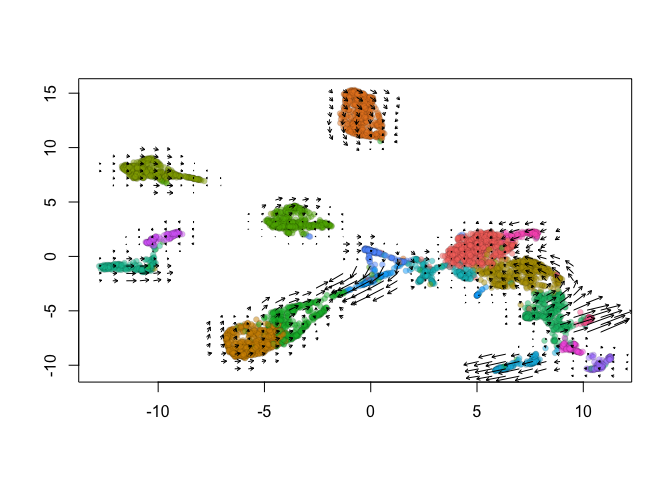

# Velocyto Analysis merging out Seurat analysis with the Velocyto results

We start with loading needed libraries for R

```r
library(Seurat)
library(velocyto.R)
## install SeuratWrappers
#install.packages("devtools")
#library(devtools)
#devtools::install_github('satijalab/seurat-wrappers')
library(SeuratWrappers)
```

## First Download Example Data

```r
download.file("https://bioshare.bioinformatics.ucdavis.edu/bioshare/download/iimg5mz77whzzqc/654.loom", "654.loom")
```


#RUN Velocity

```r
loom.data <- ReadVelocity(file = "654.loom")
s_cellranger_orig <- as.Seurat(x = loom.data)
```

<div class='r_output'> Warning: Non-unique features (rownames) present in the input matrix, making
 unique
</div>
```r
DefaultAssay(object = s_cellranger_orig) <- "spliced"
```


```r
s_cellranger_orig <- NormalizeData(s_cellranger_orig, verbose = FALSE)
s_cellranger_orig <- FindVariableFeatures(s_cellranger_orig,selection.method = "vst", nfeatures = 2000, verbose = FALSE)
s_cellranger_orig <- ScaleData(s_cellranger_orig, verbose = FALSE)
s_cellranger_orig <- RunPCA(object = s_cellranger_orig, verbose = FALSE)
s_cellranger_orig <- FindNeighbors(object = s_cellranger_orig, dims = 1:30)
```

<div class='r_output'> Computing nearest neighbor graph
</div>
<div class='r_output'> Computing SNN
</div>
```r
s_cellranger_orig <- FindClusters(object = s_cellranger_orig)
```

<div class='r_output'> Modularity Optimizer version 1.3.0 by Ludo Waltman and Nees Jan van Eck
 
 Number of nodes: 4912
 Number of edges: 191723
 
 Running Louvain algorithm...
 Maximum modularity in 10 random starts: 0.9027
 Number of communities: 18
 Elapsed time: 0 seconds
</div>
```r
s_cellranger_orig <- RunUMAP(object = s_cellranger_orig, dims = 1:30)
```

<div class='r_output'> Warning: The default method for RunUMAP has changed from calling Python UMAP via reticulate to the R-native UWOT using the cosine metric
 To use Python UMAP via reticulate, set umap.method to 'umap-learn' and metric to 'correlation'
 This message will be shown once per session
</div>
<div class='r_output'> 12:26:37 UMAP embedding parameters a = 0.9922 b = 1.112
</div>
<div class='r_output'> 12:26:37 Read 4912 rows and found 30 numeric columns
</div>
<div class='r_output'> 12:26:37 Using Annoy for neighbor search, n_neighbors = 30
</div>
<div class='r_output'> 12:26:37 Building Annoy index with metric = cosine, n_trees = 50
</div>
<div class='r_output'> 0%   10   20   30   40   50   60   70   80   90   100%
</div>
<div class='r_output'> [----|----|----|----|----|----|----|----|----|----|
</div>
<div class='r_output'> **************************************************|
 12:26:38 Writing NN index file to temp file /var/folders/74/h45z17f14l9g34tmffgq9nkw0000gn/T//RtmpMwEScx/filea0242ed86e75
 12:26:38 Searching Annoy index using 1 thread, search_k = 3000
 12:26:39 Annoy recall = 100%
 12:26:39 Commencing smooth kNN distance calibration using 1 thread
 12:26:40 Initializing from normalized Laplacian + noise
 12:26:40 Commencing optimization for 500 epochs, with 210556 positive edges
 12:26:46 Optimization finished
</div>


```r
s_cellranger_orig <- RunVelocity(object = s_cellranger_orig, deltaT = 1, kCells = 25, fit.quantile = 0.02)
```

<div class='r_output'> Filtering genes in the spliced matrix
</div>
<div class='r_output'> Filtering genes in the unspliced matrix
</div>
<div class='r_output'> Calculating embedding distance matrix
</div>
```r
ident.colors <- (scales::hue_pal())(n = length(x = levels(x = s_cellranger_orig)))

names(x = ident.colors) <- levels(x = s_cellranger_orig)

cell.colors <- ident.colors[Idents(object = s_cellranger_orig)]

names(x = cell.colors) <- colnames(x = s_cellranger_orig)

show.velocity.on.embedding.cor(emb = Embeddings(object = s_cellranger_orig, reduction = "umap"), vel = Tool(object = s_cellranger_orig, 
    slot = "RunVelocity"), n = 200, scale = "sqrt", cell.colors = ac(x = cell.colors, alpha = 0.5), 
    cex = 0.8, arrow.scale = 3, show.grid.flow = TRUE, min.grid.cell.mass = 0.5, grid.n = 40, arrow.lwd = 1, 
    do.par = FALSE, cell.border.alpha = 0.1)
```

<!-- -->

<div class='r_output'> delta projections ... sqrt knn ... transition probs ... done
 calculating arrows ... done
 grid estimates ... grid.sd= 0.4640639  min.arrow.size= 0.009281278  max.grid.arrow.length= 0.04106169  done
</div>
## Finally, save the object


```r
## Original dataset in Seurat class, with no filtering
save(s_cellranger_orig,file="Velocyto_object.RData")
```

## Session Information

```r
sessionInfo()
```

<div class='r_output'> R version 4.0.0 (2020-04-24)
 Platform: x86_64-apple-darwin17.0 (64-bit)
 Running under: macOS Catalina 10.15.4
 
 Matrix products: default
 BLAS:   /Library/Frameworks/R.framework/Versions/4.0/Resources/lib/libRblas.dylib
 LAPACK: /Library/Frameworks/R.framework/Versions/4.0/Resources/lib/libRlapack.dylib
 
 locale:
 [1] en_US.UTF-8/en_US.UTF-8/en_US.UTF-8/C/en_US.UTF-8/en_US.UTF-8
 
 attached base packages:
 [1] stats     graphics  grDevices datasets  utils     methods   base     
 
 other attached packages:
 [1] SeuratWrappers_0.1.0 velocyto.R_0.6       Matrix_1.2-18       
 [4] Seurat_3.1.5        
 
 loaded via a namespace (and not attached):
  [1] nlme_3.1-148        tsne_0.1-3          bit64_0.9-7        
  [4] RcppAnnoy_0.0.16    RColorBrewer_1.1-2  httr_1.4.1         
  [7] sctransform_0.2.1   tools_4.0.0         R6_2.4.1           
 [10] irlba_2.3.3         KernSmooth_2.23-17  uwot_0.1.8         
 [13] lazyeval_0.2.2      BiocGenerics_0.34.0 mgcv_1.8-31        
 [16] colorspace_1.4-1    tidyselect_1.1.0    gridExtra_2.3      
 [19] bit_1.1-15.2        compiler_4.0.0      Biobase_2.48.0     
 [22] hdf5r_1.3.2         plotly_4.9.2.1      scales_1.1.1       
 [25] lmtest_0.9-37       ggridges_0.5.2      pbapply_1.4-2      
 [28] stringr_1.4.0       digest_0.6.25       rmarkdown_2.1      
 [31] pkgconfig_2.0.3     htmltools_0.4.0     htmlwidgets_1.5.1  
 [34] rlang_0.4.6         farver_2.0.3        zoo_1.8-8          
 [37] jsonlite_1.6.1      ica_1.0-2           dplyr_0.8.5        
 [40] magrittr_1.5        patchwork_1.0.0     Rcpp_1.0.4.6       
 [43] munsell_0.5.0       ape_5.3             reticulate_1.16    
 [46] lifecycle_0.2.0     stringi_1.4.6       yaml_2.2.1         
 [49] MASS_7.3-51.6       Rtsne_0.15          plyr_1.8.6         
 [52] grid_4.0.0          parallel_4.0.0      listenv_0.8.0      
 [55] ggrepel_0.8.2       crayon_1.3.4        lattice_0.20-41    
 [58] cowplot_1.0.0       splines_4.0.0       knitr_1.28         
 [61] pillar_1.4.4        igraph_1.2.5        future.apply_1.5.0 
 [64] reshape2_1.4.4      codetools_0.2-16    leiden_0.3.3       
 [67] glue_1.4.1          evaluate_0.14       pcaMethods_1.80.0  
 [70] data.table_1.12.8   remotes_2.1.1       renv_0.10.0        
 [73] BiocManager_1.30.10 png_0.1-7           vctrs_0.3.0        
 [76] gtable_0.3.0        RANN_2.6.1          purrr_0.3.4        
 [79] tidyr_1.1.0         future_1.17.0       assertthat_0.2.1   
 [82] ggplot2_3.3.0       xfun_0.14           rsvd_1.0.3         
 [85] RSpectra_0.16-0     survival_3.1-12     viridisLite_0.3.0  
 [88] tibble_3.0.1        cluster_2.1.0       globals_0.12.5     
 [91] fitdistrplus_1.1-1  ellipsis_0.3.1      ROCR_1.0-11
</div>
