To download the Monocle R Markdown document, run:

```r
download.file("https://github.com/ucdavis-bioinformatics-training/2020-Advanced_Single_Cell_RNA_Seq/raw/master/data_analysis/adv_scrnaseq_monocle.Rmd", "adv_scrnaseq_monocle.Rmd")
```

# About Monocle

[Monocle](http://cole-trapnell-lab.github.io/monocle-release/), from the Trapnell Lab, is a piece of the TopHat suite that performs differential expression, trajectory, and pseudotime analyses on single cell RNA-Seq data. A very comprehensive [tutorial](http://cole-trapnell-lab.github.io/monocle-release/docs/#recommended-analysis-protocol) can be found on the Trapnell lab website. We will be using Monocle3, which is still in the beta phase of its development.


```r
library(monocle3, warn.conflicts = FALSE, quietly = TRUE)

library(dplyr, warn.conflicts = FALSE, quietly = TRUE)

download.file("https://github.com/ucdavis-bioinformatics-training/2020-Advanced_Single_Cell_RNA_Seq/raw/master/datasets/monocle3_expression_matrix.rds", "monocle3_expression_matrix.rds")
download.file("https://github.com/ucdavis-bioinformatics-training/2020-Advanced_Single_Cell_RNA_Seq/raw/master/datasets/monocle3_cell_metadata.rds", "monocle3_cell_metadata.rds")
download.file("https://github.com/ucdavis-bioinformatics-training/2020-Advanced_Single_Cell_RNA_Seq/blob/master/datasets/monocle3_gene_metadata.rds?raw=true", "monocle3_gene_metadata.rds")
```

# Setting up monocle3 cell_data_set object

The Bioinformatics Core generally uses Seurat for single cell analysis. In future versions of monocle, direct import from Seurat objects will be supported. We imported data from a Seurat object as three separate objects: an expression matrix, a phenotype data table, and a feature data table.

In order to create the monocle3 `cell_data_set` object, the expression matrix column names must be identical to the row names of the phenotype data table (cell names), and the expression matrix row names must be identical to the feature data table (gene identifiers).


```r
expression_matrix <- readRDS("monocle3_expression_matrix.rds")
cell_metadata <- readRDS("monocle3_cell_metadata.rds")
gene_metadata <- readRDS("monocle3_gene_metadata.rds")

identical(rownames(cell_metadata), colnames(expression_matrix))
```

```
## [1] TRUE
```

```r
identical(rownames(expression_matrix), gene_metadata$gene_short_name)
```

```
## [1] TRUE
```

```r
cds <- new_cell_data_set(expression_matrix,
                         cell_metadata = cell_metadata,
                         gene_metadata = gene_metadata)
```

# Dimension reduction in monocle3

Before doing UMAP and TSNE plots, we will pre-process the data. This step normalizes the data by log and size factor and calculates PCA for dimension reduction. 


```r
cds <- preprocess_cds(cds, num_dim = 25)
plot_pc_variance_explained(cds)
```

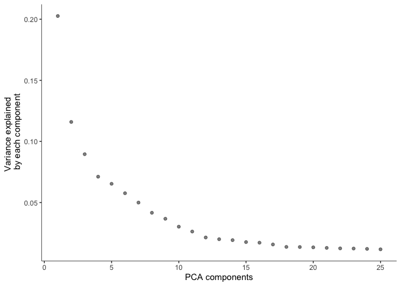<!-- -->

```r
#saveRDS(cds, "monocle3_cds_preprocessed.rds")
```

The pre-processed data can then be used to perform UMAP and tSNE.

## UMAP


```r
cds <- reduce_dimension(cds, preprocess_method = "PCA",
                        reduction_method = "UMAP")
plot_cells(cds, reduction_method = "UMAP",
           color_cells_by = "orig.ident",
           show_trajectory_graph = FALSE)
```

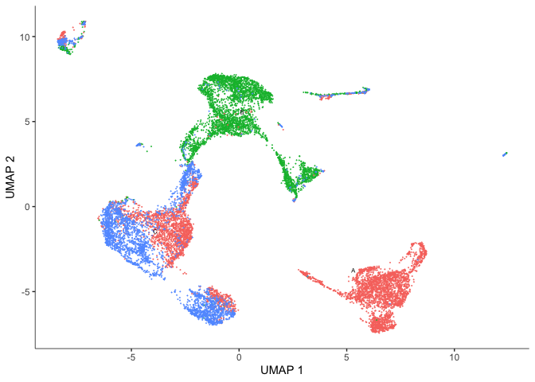<!-- -->

```r
plot_cells(cds, reduction_method = "UMAP", color_cells_by = "res.0.3",
           show_trajectory_graph = FALSE)
```

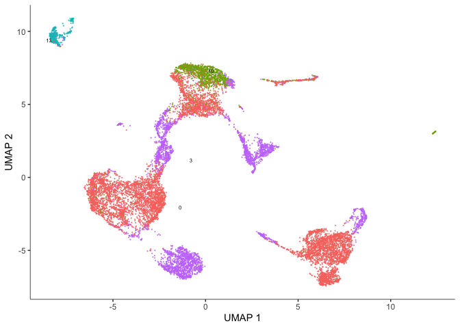<!-- -->

## TSNE


```r
cds <- reduce_dimension(cds, preprocess_method = "PCA",
                        reduction_method="tSNE")
plot_cells(cds, reduction_method="tSNE",
           color_cells_by = "res.0.3",
           show_trajectory_graph = FALSE)
```

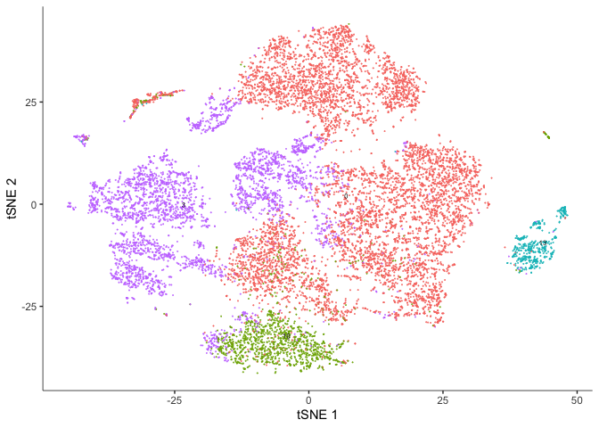<!-- -->

```r
plot_cells(cds, reduction_method="tSNE",
           color_cells_by = "orig.ident",
           show_trajectory_graph = FALSE)
```

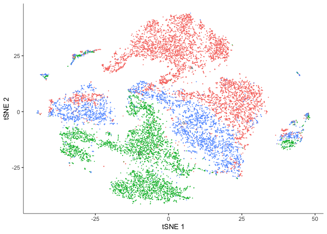<!-- -->


```r
#saveRDS(cds, "monocle3_cds_dimensionreduced.rds")
```

# Clustering cells in monocle3

Monocle groups cells into clusters using community detection methods in the function `cluster_cells()`. Explore the options. Do they impact the number of clusters? The number of partitions?


```r
cds <- cluster_cells(cds, resolution=1e-5)
plot_cells(cds, show_trajectory_graph = FALSE)
```

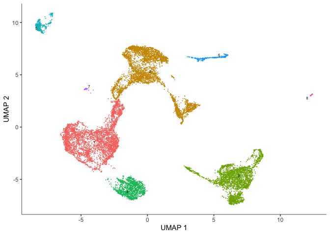<!-- -->

```r
plot_cells(cds, color_cells_by = "partition",
           group_cells_by = "partition",
           show_trajectory_graph = FALSE)
```

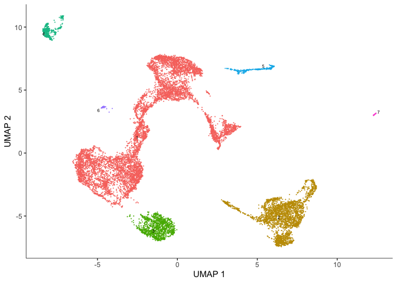<!-- -->

## Identify and plot marker genes for each cluster

Top markers identifies genes that are most specifically expressed in each group of cells. In this case, we are grouping cells by their monocle3 cluster. When `marker_sig_test = "TRUE"`, monocle3 will perform a significance test on the discriminative power of each marker. This may be slow, so we have dedicated several cores to help speed up the process. You may set this number depending on the specifications of your computer. The reference set for the significance test is randomly selected.


```r
marker_test_res <- top_markers(cds,
                               group_cells_by="cluster",
                               reduction_method = "UMAP",
                               marker_sig_test = TRUE,
                               reference_cells=1000,
                               cores=8)
```


```r
head(arrange(marker_test_res, cell_group))
```

```
##   gene_id gene_short_name cell_group marker_score mean_expression
## 1  Fcgr2b          Fcgr2b          1    0.2167942        7.533416
## 2    Bmp2            Bmp2          1    0.1955812        5.155748
## 3    Jak1            Jak1          1    0.2085653        4.511409
## 4   Plpp3           Plpp3          1    0.1998788        5.391522
## 5  Cyp4b1          Cyp4b1          1    0.2017869        2.569341
## 6 Tinagl1         Tinagl1          1    0.2016101        3.983920
##   fraction_expressing specificity  pseudo_R2 marker_test_p_value
## 1           0.9585125   0.2261778 0.08033903        4.266703e-64
## 2           0.8889451   0.2200150 0.04740117        2.242639e-38
## 3           0.9481407   0.2199729 0.05041897        1.002907e-40
## 4           0.9415634   0.2122839 0.04307151        5.244136e-35
## 5           0.7998988   0.2522655 0.04514662        1.274362e-36
## 6           0.9466228   0.2129783 0.04348808        2.486754e-35
##   marker_test_q_value
## 1        4.629543e-59
## 2        2.433354e-33
## 3        1.088195e-35
## 4        5.690097e-30
## 5        1.382734e-31
## 6        2.698228e-30
```

```r
anyDuplicated(marker_test_res$gene_id)
```

```
## [1] 10
```

```r
length(which(duplicated(marker_test_res$gene_id)))
```

```
## [1] 10
```

```r
duplicate_markers <- names(which(table(marker_test_res$gene_id) > 1))
unique_markers <- marker_test_res[!(marker_test_res$gene_id %in% duplicate_markers),]
head(arrange(unique_markers, cell_group))
```

```
##   gene_id gene_short_name cell_group marker_score mean_expression
## 1    Jak1            Jak1          1    0.2085653        4.511409
## 2  Cyp4b1          Cyp4b1          1    0.2017869        2.569341
## 3 Tinagl1         Tinagl1          1    0.2016101        3.983920
## 4    Cd36            Cd36          1    0.2107328        3.496489
## 5  Igfbp7          Igfbp7          1    0.2045558       27.030995
## 6    Aqp1            Aqp1          1    0.2131211       11.528844
##   fraction_expressing specificity  pseudo_R2 marker_test_p_value
## 1           0.9481407   0.2199729 0.05041897        1.002907e-40
## 2           0.7998988   0.2522655 0.04514662        1.274362e-36
## 3           0.9466228   0.2129783 0.04348808        2.486754e-35
## 4           0.9124715   0.2309472 0.08696809        2.693602e-69
## 5           1.0000000   0.2045558 0.09453964        3.025786e-75
## 6           0.9984822   0.2134451 0.11258281        1.804873e-89
##   marker_test_q_value
## 1        1.088195e-35
## 2        1.382734e-31
## 3        2.698228e-30
## 4        2.922666e-64
## 5        3.283099e-70
## 6        1.958360e-84
```

There are too many markers to look at all at once. Let's limit the number of markers to display on a plot. The plot produced here displays expression level (color) and percentage of cells in which the marker is expressed for each cluster.


```r
top_specific_markers <- unique_markers %>%
  filter(fraction_expressing >= 0.10) %>%
  group_by(cell_group) %>%
  arrange(desc(specificity), .by_group = TRUE) %>%
  dplyr::slice(1:3) %>%
  pull(gene_id)

plot_genes_by_group(cds,
                    top_specific_markers,
                    group_cells_by="cluster",
                    ordering_type="cluster_row_col",
                    max.size=3)
```

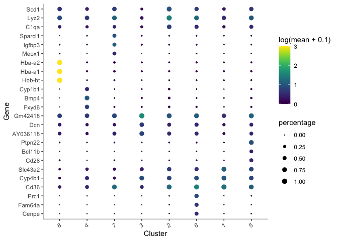<!-- -->

We can also plot the expression of a user-defined list of markers (or genes of interest).


```r
markers <- c("Ehd3", "Sdc1", "Fmo2", "Cd3g", "Ccna2", "Hbb-bt")
plot_cells(cds, genes = markers)
```

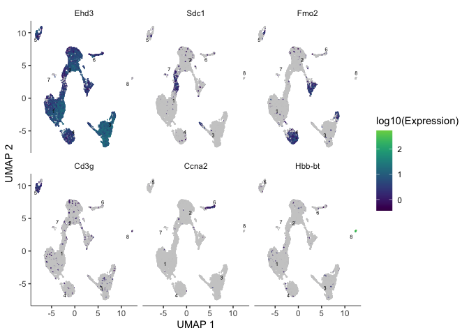<!-- -->

# Trajectory analysis

In a dataset like this one, cells were not harvested in a time series, but may not have all been at the same developmental stage. Monocle offers trajectory analysis to model the relationships between groups of cells as a trajectory og gene expression changes. The first step in trajectory analysis is the `learn_graph()` function.


After learning the graph, monocle can plot add the trajectory graph to the cell plot.


```r
plot_cells(cds,
           color_cells_by = "cluster",
           label_groups_by_cluster=FALSE,
           label_leaves=FALSE,
           label_branch_points=FALSE)
```

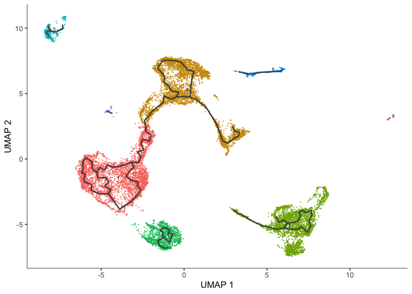<!-- -->

```r
#saveRDS(cds, "monocle3_cds_learngraph.rds")
```

Not all of our trajectories are connected. In fact, only clusters that belong to the same partition are connected by a trajectory.

# Color cells by pseudotime

We can set the root to any one of our clusters by selecting the cells in that cluster to use as the root in the function `order_cells`. All cells that cannot be reached from a trajectory with our selected root will be gray, which represents "infinite" pseudotime. Explore each of the trajectories by 


```r
root5 <- order_cells(cds, root_cells = colnames(cds[,clusters(cds) == 5]))
plot_cells(root5,
           color_cells_by = "pseudotime",
           group_cells_by = "cluster",
           label_cell_groups = FALSE,
           label_groups_by_cluster=FALSE,
           label_leaves=FALSE,
           label_branch_points=FALSE,
           label_roots = FALSE,
           trajectory_graph_color = "grey60")
```

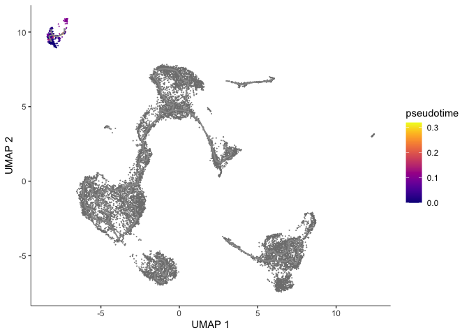<!-- -->

# Identify genes that change as a function of pseudotime

Monocle's `graph_test()` function detects genes that vary over a trajectory. This may run very slowly. For me, it took roughly 12 minutes. Adjust the number of cores as needed.


```r
cds_graph_test_results <- graph_test(cds,
                                     neighbor_graph = "principal_graph",
                                     cores = 4)
```

The output of this function is a table. We can look at the expression of someof these genes overlaid on the trajectory plot.


```r
head(cds_graph_test_results)
pr_deg_ids <- row.names(subset(cds_graph_test_results, q_value < 0.05))
plot_cells(cds, genes = head(pr_deg_ids),
           show_trajectory_graph = FALSE,
           label_cell_groups = FALSE,
           label_leaves = FALSE)
```

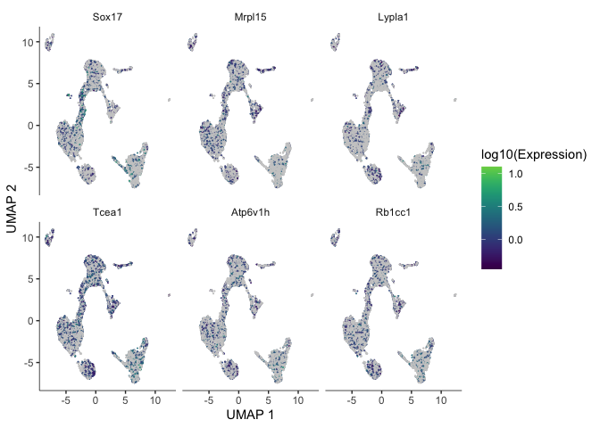<!-- -->

We can also calculate modules of co-expressed genes, which we can display as a heatmap or superimpose expression of module genes on the trajectory graph.


```r
# gene modules by cell type
gene_modules <- find_gene_modules(cds[pr_deg_ids,],
                                    resolution=c(10^seq(-6,-1)))

cell_groups <- tibble::tibble(cell=row.names(colData(cds)),
                             cell_group=colData(cds)$orig.ident)
agg_mat <- aggregate_gene_expression(cds, gene_modules, cell_groups)
row.names(agg_mat) <- paste0("Module ", row.names(agg_mat))

pheatmap::pheatmap(agg_mat,
                   scale="column", clustering_method="ward.D2")
```

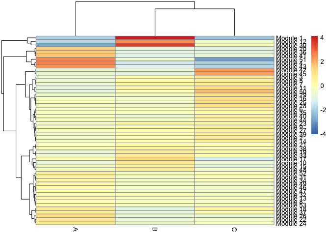<!-- -->

```r
# gene modules by cluster
cluster_groups <- tibble::tibble(cell=row.names(colData(cds)),
                             cluster_group=cds@clusters$UMAP[[2]])
agg_mat2 <- aggregate_gene_expression(cds, gene_modules, cluster_groups)
row.names(agg_mat) <- paste0("Module ", row.names(agg_mat))

pheatmap::pheatmap(agg_mat2,
                   scale="column", clustering_method="ward.D2")
```

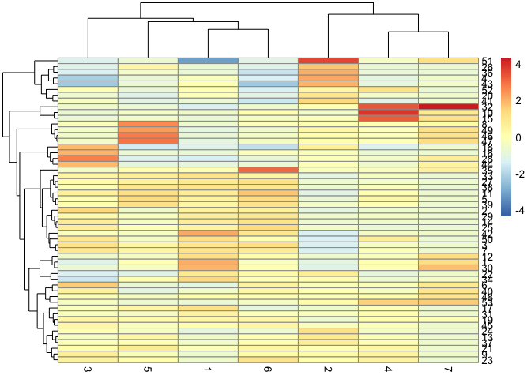<!-- -->

```r
gm <- gene_modules[which(gene_modules$module %in% c(6, 32)),]
plot_cells(cds,
           genes=gm,
           label_cell_groups=FALSE,
           show_trajectory_graph=TRUE,
           label_branch_points = FALSE,
           label_roots = FALSE,
           label_leaves = FALSE,
           trajectory_graph_color = "grey60")
```

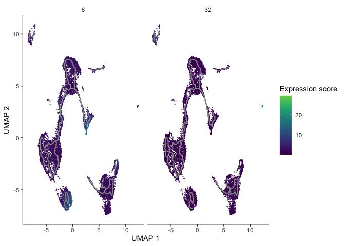<!-- -->

# R session information

```r
sessionInfo()
```

```
## R version 4.0.0 (2020-04-24)
## Platform: x86_64-apple-darwin17.0 (64-bit)
## Running under: macOS Catalina 10.15.4
## 
## Matrix products: default
## BLAS:   /Library/Frameworks/R.framework/Versions/4.0/Resources/lib/libRblas.dylib
## LAPACK: /Library/Frameworks/R.framework/Versions/4.0/Resources/lib/libRlapack.dylib
## 
## locale:
## [1] en_US.UTF-8/en_US.UTF-8/en_US.UTF-8/C/en_US.UTF-8/en_US.UTF-8
## 
## attached base packages:
## [1] stats4    parallel  stats     graphics  grDevices utils     datasets 
## [8] methods   base     
## 
## other attached packages:
##  [1] dplyr_0.8.5                 monocle3_0.2.1             
##  [3] SingleCellExperiment_1.10.1 SummarizedExperiment_1.18.1
##  [5] DelayedArray_0.14.0         matrixStats_0.56.0         
##  [7] GenomicRanges_1.40.0        GenomeInfoDb_1.24.0        
##  [9] IRanges_2.22.2              S4Vectors_0.26.1           
## [11] Biobase_2.48.0              BiocGenerics_0.34.0        
## 
## loaded via a namespace (and not attached):
##  [1] nlme_3.1-148              bitops_1.0-6             
##  [3] sf_0.9-3                  gmodels_2.18.1           
##  [5] RcppAnnoy_0.0.16          RColorBrewer_1.1-2       
##  [7] tools_4.0.0               R6_2.4.1                 
##  [9] irlba_2.3.3               KernSmooth_2.23-17       
## [11] spData_0.3.5              uwot_0.1.8               
## [13] DBI_1.1.0                 colorspace_1.4-1         
## [15] raster_3.1-5              sp_1.4-2                 
## [17] tidyselect_1.1.0          gridExtra_2.3            
## [19] compiler_4.0.0            expm_0.999-4             
## [21] labeling_0.3              slam_0.1-47              
## [23] scales_1.1.1              classInt_0.4-3           
## [25] proxy_0.4-24              stringr_1.4.0            
## [27] digest_0.6.25             rmarkdown_2.1            
## [29] XVector_0.28.0            RhpcBLASctl_0.20-137     
## [31] pkgconfig_2.0.3           htmltools_0.4.0          
## [33] rlang_0.4.6               DelayedMatrixStats_1.10.0
## [35] farver_2.0.3              gtools_3.8.2             
## [37] spdep_1.1-3               RCurl_1.98-1.2           
## [39] magrittr_1.5              GenomeInfoDbData_1.2.3   
## [41] Matrix_1.2-18             Rcpp_1.0.4.6             
## [43] munsell_0.5.0             viridis_0.5.1            
## [45] lifecycle_0.2.0           stringi_1.4.6            
## [47] yaml_2.2.1                MASS_7.3-51.6            
## [49] zlibbioc_1.34.0           Rtsne_0.15               
## [51] plyr_1.8.6                grid_4.0.0               
## [53] gdata_2.18.0              ggrepel_0.8.2            
## [55] crayon_1.3.4              deldir_0.1-25            
## [57] lattice_0.20-41           splines_4.0.0            
## [59] knitr_1.28                pillar_1.4.4             
## [61] igraph_1.2.5              boot_1.3-25              
## [63] reshape2_1.4.4            codetools_0.2-16         
## [65] LearnBayes_2.15.1         glue_1.4.1               
## [67] evaluate_0.14             leidenbase_0.1.0         
## [69] vctrs_0.3.0               gtable_0.3.0             
## [71] grr_0.9.5                 RANN_2.6.1               
## [73] purrr_0.3.4               tidyr_1.1.0              
## [75] assertthat_0.2.1          ggplot2_3.3.0            
## [77] xfun_0.14                 e1071_1.7-3              
## [79] RSpectra_0.16-0           coda_0.19-3              
## [81] class_7.3-17              viridisLite_0.3.0        
## [83] tibble_3.0.1              pheatmap_1.0.12          
## [85] pbmcapply_1.5.0           Matrix.utils_0.9.8       
## [87] units_0.6-6               ellipsis_0.3.1
```
