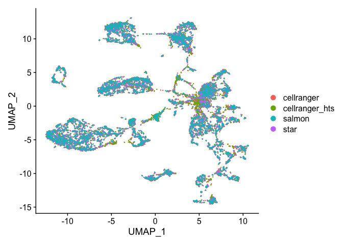
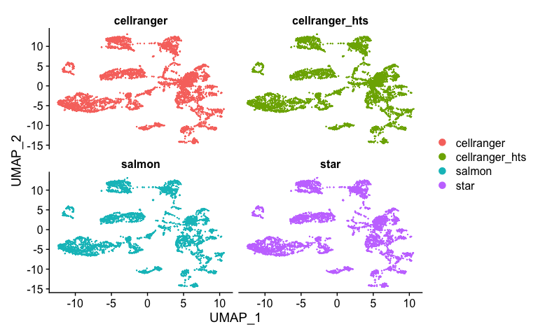
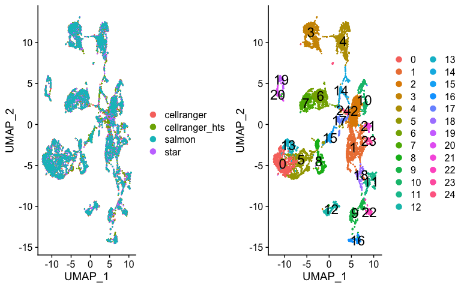
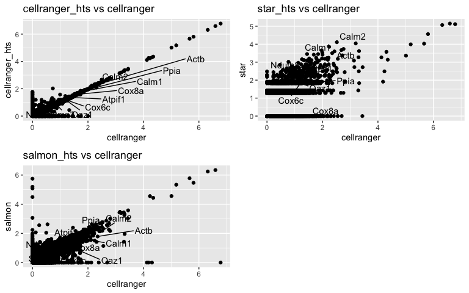

In this section, we will learn how to take two separate datasets and "integrate" them, so that cells of the same type (across datasets) roughly fall into the same region of the tsne or umap plot (instead of separating by dataset first).

Integration is typically done in a few different scenarios, e.g., 

* if you collect data from across multiple conditions/days/batches/experiments/etc. and you want to remove these technical confounders.
* if you are doing a case/control study and you want to identify which cells match across condition.
* you have performed an experiment sequencing cells from a tissue (e.g. lung epithelium) and you want to label the cells by cell type, but you don't have marker genes available, however, you do have access to a database of annotated cells that you could map onto your dataset (example a cell atlas).


## We start with loading needed libraries for R

```r
library(Seurat)
library(tximport)
library(ggplot2)
library(ggVennDiagram)
library(cowplot)
```


## Lets read the data back in and create a list of each dataset rather than merge like we did in Mapping_Comparisons

```r
## Cellranger
cellranger_orig <- Read10X_h5("Adv_comparison_outputs/654/outs/filtered_feature_bc_matrix.h5")
# If hdf5 isn't working read in from the mtx files
#cellranger_orig <- Read10X("Adv_comparison_outputs/654/outs/filtered_feature_bc_matrix")
s_cellranger_orig <- CreateSeuratObject(counts = cellranger_orig, min.cells = 3, min.features = 200, project = "cellranger")
s_cellranger_orig
```

<div class='r_output'> An object of class Seurat 
 15203 features across 4907 samples within 1 assay 
 Active assay: RNA (15203 features, 0 variable features)
</div>
```r
cellranger_htstream <- Read10X_h5("Adv_comparison_outputs/654_htstream/outs/filtered_feature_bc_matrix.h5")
s_cellranger_hts <- CreateSeuratObject(counts = cellranger_htstream, min.cells = 3, min.features = 200, project = "cellranger_hts")
s_cellranger_hts
```

<div class='r_output'> An object of class Seurat 
 15197 features across 4918 samples within 1 assay 
 Active assay: RNA (15197 features, 0 variable features)
</div>
```r
## STAR
star <- Read10X("Adv_comparison_outputs/654_htstream_star/outs/filtered_feature_bc_matrix")
s_star_hts <- CreateSeuratObject(counts = star, min.cells = 3, min.features = 200, project = "star")
s_star_hts
```

<div class='r_output'> An object of class Seurat 
 15118 features across 4099 samples within 1 assay 
 Active assay: RNA (15118 features, 0 variable features)
</div>
```r
## SALMON
txi <- tximport("Adv_comparison_outputs/654_htstream_salmon_decoys/alevin/quants_mat.gz", type="alevin")
```

<div class='r_output'> importing alevin data is much faster after installing `fishpond` (>= 1.2.0)
</div>
<div class='r_output'> reading in alevin gene-level counts across cells
</div>
```r
## salmon is in ensembl IDs, need to convert to gene symbol
head(rownames(txi$counts))
```

<div class='r_output'> [1] "ENSMUSG00000064370.1" "ENSMUSG00000064368.1" "ENSMUSG00000064367.1"
 [4] "ENSMUSG00000064363.1" "ENSMUSG00000065947.3" "ENSMUSG00000064360.1"
</div>
```r
ens2symbol <- read.table("ens2sym.txt",sep="\t",header=T,as.is=T)
map <- ens2symbol$Gene.name[match(rownames(txi$counts),ens2symbol$Gene.stable.ID.version)]

txi_counts <- txi$counts[-which(duplicated(map)),]
map <- map[-which(duplicated(map))]
rownames(txi_counts) <- map
dim(txi_counts)
```

<div class='r_output'> [1] 35805  3919
</div>
```r
s_salmon_hts <- CreateSeuratObject(counts = txi_counts , min.cells = 3, min.features = 200, project = "salmon")
s_salmon_hts
```

<div class='r_output'> An object of class Seurat 
 15634 features across 3918 samples within 1 assay 
 Active assay: RNA (15634 features, 0 variable features)
</div>
```r
# Need to Check Col names before merge 

# they however have different looking cell ids, need to fix
head(colnames(s_cellranger_orig))
```

<div class='r_output'> [1] "AAACCTGAGATCACGG-1" "AAACCTGAGCATCATC-1" "AAACCTGAGCGCTCCA-1"
 [4] "AAACCTGAGTGGGATC-1" "AAACCTGCAGACAGGT-1" "AAACCTGCATCATCCC-1"
</div>
```r
head(colnames(s_star_hts))
```

<div class='r_output'> [1] "AAACCTGAGATCACGG" "AAACCTGAGCATCATC" "AAACCTGAGCGCTCCA" "AAACCTGAGTGGGATC"
 [5] "AAACCTGCAGACAGGT" "AAACCTGGTATAGGTA"
</div>
```r
head(colnames(s_salmon_hts))
```

<div class='r_output'> [1] "CGGACACCATTCACTT" "ACATACGAGAGTGAGA" "CTCACACAGAATTGTG" "CACACTCTCGGCCGAT"
 [5] "CACAGGCCAATCTGCA" "TACTCATCATAGGATA"
</div>
```r
s_cellranger_orig <- RenameCells(s_cellranger_orig, new.names = sapply(X = strsplit(colnames(s_cellranger_orig), split = "-"), FUN = "[", 1))

s_cellranger_hts <- RenameCells(s_cellranger_hts, new.names = sapply(X = strsplit(colnames(s_cellranger_hts), split = "-"), FUN = "[", 1))
```

Instead of merging the datasets (column binding the cells). This time we are going to make an R list

```r
s_list = list(s_cellranger_orig, s_cellranger_hts, s_star_hts, s_salmon_hts)
```


## using the Standare Seurat technique

### Normalization and Variable Features
Before we identify integration sites and find anchors, First perform normalzation and identify variable features for each


```r
s_standard = s_list
for (i in 1:length(s_standard)) {
    s_standard[[i]] <- NormalizeData(s_standard[[i]], verbose = FALSE)
    s_standard[[i]] <- FindVariableFeatures(s_standard[[i]], selection.method = "vst", nfeatures = 2000, verbose = FALSE)
}
```

### Identify "anchors"

Next, we identify anchors using the FindIntegrationAnchors function, which takes a list of Seurat objects as input.


```r
?FindIntegrationAnchors
```

We use all default parameters here for identifying anchors, including the ‘dimensionality’ of the dataset (30)


```r
s.anchors_standard <- FindIntegrationAnchors(object.list = s_standard, dims = 1:30)
```

<div class='r_output'> Warning in CheckDuplicateCellNames(object.list = object.list): Some cell names
 are duplicated across objects provided. Renaming to enforce unique cell names.
</div>
<div class='r_output'> Computing 2000 integration features
</div>
<div class='r_output'> Scaling features for provided objects
</div>
<div class='r_output'> Finding all pairwise anchors
</div>
<div class='r_output'> Running CCA
</div>
<div class='r_output'> Merging objects
</div>
<div class='r_output'> Finding neighborhoods
</div>
<div class='r_output'> Finding anchors
</div>
<div class='r_output'> 	Found 13730 anchors
</div>
<div class='r_output'> Filtering anchors
</div>
<div class='r_output'> 	Retained 10677 anchors
</div>
<div class='r_output'> Extracting within-dataset neighbors
</div>
<div class='r_output'> Running CCA
</div>
<div class='r_output'> Merging objects
</div>
<div class='r_output'> Finding neighborhoods
</div>
<div class='r_output'> Finding anchors
</div>
<div class='r_output'> 	Found 12422 anchors
</div>
<div class='r_output'> Filtering anchors
</div>
<div class='r_output'> 	Retained 9785 anchors
</div>
<div class='r_output'> Extracting within-dataset neighbors
</div>
<div class='r_output'> Running CCA
</div>
<div class='r_output'> Merging objects
</div>
<div class='r_output'> Finding neighborhoods
</div>
<div class='r_output'> Finding anchors
</div>
<div class='r_output'> 	Found 12447 anchors
</div>
<div class='r_output'> Filtering anchors
</div>
<div class='r_output'> 	Retained 9857 anchors
</div>
<div class='r_output'> Extracting within-dataset neighbors
</div>
<div class='r_output'> Running CCA
</div>
<div class='r_output'> Merging objects
</div>
<div class='r_output'> Finding neighborhoods
</div>
<div class='r_output'> Finding anchors
</div>
<div class='r_output'> 	Found 11951 anchors
</div>
<div class='r_output'> Filtering anchors
</div>
<div class='r_output'> 	Retained 9582 anchors
</div>
<div class='r_output'> Extracting within-dataset neighbors
</div>
<div class='r_output'> Running CCA
</div>
<div class='r_output'> Merging objects
</div>
<div class='r_output'> Finding neighborhoods
</div>
<div class='r_output'> Finding anchors
</div>
<div class='r_output'> 	Found 11865 anchors
</div>
<div class='r_output'> Filtering anchors
</div>
<div class='r_output'> 	Retained 9548 anchors
</div>
<div class='r_output'> Extracting within-dataset neighbors
</div>
<div class='r_output'> Running CCA
</div>
<div class='r_output'> Merging objects
</div>
<div class='r_output'> Finding neighborhoods
</div>
<div class='r_output'> Finding anchors
</div>
<div class='r_output'> 	Found 11628 anchors
</div>
<div class='r_output'> Filtering anchors
</div>
<div class='r_output'> 	Retained 9192 anchors
</div>
<div class='r_output'> Extracting within-dataset neighbors
</div>
```r
s.integrated_standard <- IntegrateData(anchorset = s.anchors_standard, dims = 1:30)
```

<div class='r_output'> Merging dataset 4 into 1
</div>
<div class='r_output'> Extracting anchors for merged samples
</div>
<div class='r_output'> Finding integration vectors
</div>
<div class='r_output'> Finding integration vector weights
</div>
<div class='r_output'> Integrating data
</div>
<div class='r_output'> Merging dataset 3 into 2
</div>
<div class='r_output'> Extracting anchors for merged samples
</div>
<div class='r_output'> Finding integration vectors
</div>
<div class='r_output'> Finding integration vector weights
</div>
<div class='r_output'> Integrating data
</div>
<div class='r_output'> Merging dataset 1 4 into 2 3
</div>
<div class='r_output'> Extracting anchors for merged samples
</div>
<div class='r_output'> Finding integration vectors
</div>
<div class='r_output'> Finding integration vector weights
</div>
<div class='r_output'> Integrating data
</div>
<div class='r_output'> Warning: Adding a command log without an assay associated with it
</div>

### The returned object

will contain a new Assay, which holds an integrated (or ‘batch-corrected’) expression matrix for all cells, enabling them to be jointly analyzed.


```r
s.integrated_standard
```

<div class='r_output'> An object of class Seurat 
 19597 features across 17842 samples within 2 assays 
 Active assay: integrated (2000 features, 2000 variable features)
  1 other assay present: RNA
</div>
```r
DefaultAssay(object = s.integrated_standard) <- "RNA"
s.integrated_standard
```

<div class='r_output'> An object of class Seurat 
 19597 features across 17842 samples within 2 assays 
 Active assay: RNA (17597 features, 0 variable features)
  1 other assay present: integrated
</div>
```r
DefaultAssay(object = s.integrated_standard) <- "integrated"
s.integrated_standard
```

<div class='r_output'> An object of class Seurat 
 19597 features across 17842 samples within 2 assays 
 Active assay: integrated (2000 features, 2000 variable features)
  1 other assay present: RNA
</div>

### Now visualize after anchoring and integration

# Run the standard workflow for visualization and clustering


```r
s.integrated_standard <- ScaleData(s.integrated_standard, verbose = FALSE)
s.integrated_standard <- RunPCA(s.integrated_standard, npcs = 30, verbose = FALSE)
s.integrated_standard <- RunUMAP(s.integrated_standard, reduction = "pca", dims = 1:30)
```

<div class='r_output'> Warning: The default method for RunUMAP has changed from calling Python UMAP via reticulate to the R-native UWOT using the cosine metric
 To use Python UMAP via reticulate, set umap.method to 'umap-learn' and metric to 'correlation'
 This message will be shown once per session
</div>
<div class='r_output'> 07:27:59 UMAP embedding parameters a = 0.9922 b = 1.112
</div>
<div class='r_output'> 07:27:59 Read 17842 rows and found 30 numeric columns
</div>
<div class='r_output'> 07:27:59 Using Annoy for neighbor search, n_neighbors = 30
</div>
<div class='r_output'> 07:27:59 Building Annoy index with metric = cosine, n_trees = 50
</div>
<div class='r_output'> 0%   10   20   30   40   50   60   70   80   90   100%
</div>
<div class='r_output'> [----|----|----|----|----|----|----|----|----|----|
</div>
<div class='r_output'> **************************************************|
 07:28:02 Writing NN index file to temp file /var/folders/74/h45z17f14l9g34tmffgq9nkw0000gn/T//RtmpjoDPLs/file172534f1f53cb
 07:28:02 Searching Annoy index using 1 thread, search_k = 3000
 07:28:08 Annoy recall = 100%
 07:28:08 Commencing smooth kNN distance calibration using 1 thread
 07:28:09 Initializing from normalized Laplacian + noise
 07:28:11 Commencing optimization for 200 epochs, with 795910 positive edges
 07:28:19 Optimization finished
</div>
```r
DimPlot(s.integrated_standard, reduction = "umap")
```

<!-- -->


### Excersise

Check the help of FindIntegrationAnchors. What happens when you change dims (try varying this parameter over a broad range, for example between 10 and 50), k.anchor, k.filter and k.score?

|-------|-------|
|:------|:------|
|dims | Which dimensions to use from the CCA to specify the neighbor search space |
|k.anchor	| How many neighbors (k) to use when picking anchors |
| k.filter	| How many neighbors (k) to use when filtering anchors |
| k.score	| How many neighbors (k) to use when scoring anchors |

Example
<div class='r_output'>s.anchors_standard <- FindIntegrationAnchors(object.list = s_standard, dims = 1:2)
</div>
### Now lets look closer

Splitting by prepocessing type

```r
DimPlot(s.integrated_standard, reduction = "umap", split.by = "orig.ident", ncol=2)
```

<!-- -->

### We can conduct more analysis, perform clustering

```r
s.integrated_standard <- FindNeighbors(s.integrated_standard, reduction = "pca", dims = 1:30)
```

<div class='r_output'> Computing nearest neighbor graph
</div>
<div class='r_output'> Computing SNN
</div>
```r
s.integrated_standard <- FindClusters(s.integrated_standard, resolution = 0.5)
```

<div class='r_output'> Modularity Optimizer version 1.3.0 by Ludo Waltman and Nees Jan van Eck
 
 Number of nodes: 17842
 Number of edges: 761977
 
 Running Louvain algorithm...
 Maximum modularity in 10 random starts: 0.9468
 Number of communities: 25
 Elapsed time: 2 seconds
</div>
```r
p1 <- DimPlot(s.integrated_standard, reduction = "umap", group.by = "orig.ident")
p2 <- DimPlot(s.integrated_standard, reduction = "umap", label = TRUE, label.size = 6)
```

<div class='r_output'> Warning: Using `as.character()` on a quosure is deprecated as of rlang 0.3.0.
 Please use `as_label()` or `as_name()` instead.
 This warning is displayed once per session.
</div>
```r
plot_grid(p1, p2)
```

<!-- -->

## Now lets look at cluster representation per dataset

```r
t <- table(s.integrated_standard$integrated_snn_res.0.5, s.integrated_standard$orig.ident)
t
```

<div class='r_output'>     
      cellranger cellranger_hts salmon star
   0         430            431    430  430
   1         446            451    361  395
   2         527            535    245  335
   3         426            428    379  398
   4         407            405    348  367
   5         338            336    279  294
   6         325            325    261  287
   7         224            224    217  220
   8         202            203    181  187
   9         166            167    119  135
   10        158            160    119  132
   11        148            149    119  131
   12        141            142    121  131
   13        107            107    104  106
   14        142            141     51   49
   15        122            126    127    3
   16        102            101     80   90
   17        111            110     54   66
   18         77             76     70   75
   19         55             55     51   51
   20         52             52     51   53
   21         63             59     38   43
   22         51             51     48   50
   23         50             47     46   48
   24         37             37     19   23
</div>
```r
round(sweep(t,MARGIN=2, STATS=colSums(t), FUN = "/")*100,1)
```

<div class='r_output'>     
      cellranger cellranger_hts salmon star
   0         8.8            8.8   11.0 10.5
   1         9.1            9.2    9.2  9.6
   2        10.7           10.9    6.3  8.2
   3         8.7            8.7    9.7  9.7
   4         8.3            8.2    8.9  9.0
   5         6.9            6.8    7.1  7.2
   6         6.6            6.6    6.7  7.0
   7         4.6            4.6    5.5  5.4
   8         4.1            4.1    4.6  4.6
   9         3.4            3.4    3.0  3.3
   10        3.2            3.3    3.0  3.2
   11        3.0            3.0    3.0  3.2
   12        2.9            2.9    3.1  3.2
   13        2.2            2.2    2.7  2.6
   14        2.9            2.9    1.3  1.2
   15        2.5            2.6    3.2  0.1
   16        2.1            2.1    2.0  2.2
   17        2.3            2.2    1.4  1.6
   18        1.6            1.5    1.8  1.8
   19        1.1            1.1    1.3  1.2
   20        1.1            1.1    1.3  1.3
   21        1.3            1.2    1.0  1.0
   22        1.0            1.0    1.2  1.2
   23        1.0            1.0    1.2  1.2
   24        0.8            0.8    0.5  0.6
</div>### Lets Zero in on cluster 15 some more


```r
markers = FindMarkers(s.integrated_standard, ident.1="15")
top10 <- rownames(markers)[1:10]
head(markers)
```

<div class='r_output'>               p_val avg_logFC pct.1 pct.2     p_val_adj
 Calm1 1.926295e-180 -1.889314 0.550 0.984 3.852590e-177
 Cox8a 3.445073e-164 -1.700591 0.444 0.969 6.890145e-161
 Ppia  1.860959e-161 -1.804402 0.648 0.980 3.721918e-158
 Cox6c 1.457237e-152 -1.679867 0.323 0.935 2.914474e-149
 Actb  7.767536e-152 -1.964185 0.624 0.991 1.553507e-148
 Stmn3 1.262762e-151 -1.806284 0.468 0.922 2.525524e-148
</div>
```r
cluster15 <- subset(s.integrated_standard, idents = "15")
Idents(cluster15) <- "orig.ident"
avg.cell.exp <- log1p(AverageExpression(cluster15, verbose = FALSE)$RNA)
avg.cell.exp$gene <- rownames(avg.cell.exp)

head(avg.cell.exp)
```

<div class='r_output'>        cellranger cellranger_hts     star    salmon   gene
 Xkr4    0.0000000     0.00000000 0.000000 0.0000000   Xkr4
 Sox17   0.1443089     0.13880722 0.000000 0.1805196  Sox17
 Mrpl15  0.0000000     0.00000000 0.000000 0.0000000 Mrpl15
 Lypla1  0.5149806     0.50052080 1.280963 0.5133444 Lypla1
 Tcea1   0.1020398     0.09822009 0.000000 0.3844843  Tcea1
 Rgs20   0.0000000     0.00000000 0.000000 0.0000000  Rgs20
</div>
```r
p1 <- ggplot(avg.cell.exp, aes(cellranger, cellranger_hts)) + geom_point() + ggtitle("cellranger_hts vs cellranger")
p1 <- LabelPoints(plot = p1, points = top10, repel = TRUE)
```

<div class='r_output'> When using repel, set xnudge and ynudge to 0 for optimal results
</div>
```r
p2 <- ggplot(avg.cell.exp, aes(cellranger, star)) + geom_point() + ggtitle("star_hts vs cellranger")
p2 <- LabelPoints(plot = p2, points = top10, repel = TRUE)
```

<div class='r_output'> When using repel, set xnudge and ynudge to 0 for optimal results
</div>
```r
p3 <- ggplot(avg.cell.exp, aes(cellranger, salmon)) + geom_point() + ggtitle("salmon_hts vs cellranger")
p3 <- LabelPoints(plot = p3, points = top10, repel = TRUE)
```

<div class='r_output'> When using repel, set xnudge and ynudge to 0 for optimal results
</div>
```r
plot_grid(p1,p2,p3, ncol = 2)
```

<!-- -->

### Possible continued analysis

We know the majority of 'cells' are in common between the datasets, so how is the cell barcode representation in each cluster. So for this cluster 15, what is the overlap in cells for cellranger/salmon/star if those cells are present in star, where did they go? Which cluster can they be found in.

**How I would go about doing this**
Get the superset of cell barcode from all 4 methods for cluster 15. Then extract these cells from the whole dataset (subset) and table the occurace of this subset of cells [superset of those found in 15], sample by cluster like we did above.

**ALSO**

Salmon had a few 'unique' cells, where did these go?


### More reading

For a larger list of alignment methods, as well as an evaluation of them, see Gerald Quons paper, ["scAlign: a tool for alignment, integration, and rare cell identification from scRNA-seq data"](https://genomebiology.biomedcentral.com/articles/10.1186/s13059-019-1766-4)


## Using SCTransform (Not Evaluated because it takes **a really long time**)


```r
s_sct <- s_list
for (i in 1:length(s_sct)) {
    s_sct[[i]] <- SCTransform(s_sct[[i]], verbose = FALSE)
}
```


```r
s_features_sct <- SelectIntegrationFeatures(object.list = s_sct, nfeatures = 2000)

s_sct <- PrepSCTIntegration(object.list = s_sct, anchor.features = s_features, 
    verbose = FALSE)
```

### Identify anchors and integrate the datasets. 

Commands are identical to the standard workflow, but make sure to set normalization.method = 'SCT':


```r
s_anchors_sct <- FindIntegrationAnchors(object.list = s_sct, normalization.method = "SCT",  anchor.features = s_features, verbose = FALSE)
s_integrated_sct <- IntegrateData(anchorset = s_anchors_sct, normalization.method = "SCT", verbose = FALSE)
```

### Now visualize after anchoring and integration

However, do not sun ScaleData, SCTransform does this step

```r
s.integrated_sct <- RunPCA(s.integrated_sct, npcs = 30, verbose = FALSE)
s.integrated_sct <- RunUMAP(s.integrated_sct, reduction = "pca", dims = 1:30)
DimPlot(s.integrated_sct, reduction = "umap")
```

**Rest is the same**

### More reading on SCTransform

[Normalization and variance stabilization of single-cell RNA-seq data using
regularized negative binomial regression](https://www.biorxiv.org/content/10.1101/576827v2)


## Finally, save the original object, write out a tab-delimited table that could be read into excel, and view the object.

```r
## anchored dataset in Seurat class
save(s.integrated_standard,file="anchored_object.RData")
```

## Session Information

```r
sessionInfo()
```

<div class='r_output'> R version 4.0.0 (2020-04-24)
 Platform: x86_64-apple-darwin17.0 (64-bit)
 Running under: macOS Catalina 10.15.4
 
 Matrix products: default
 BLAS:   /Library/Frameworks/R.framework/Versions/4.0/Resources/lib/libRblas.dylib
 LAPACK: /Library/Frameworks/R.framework/Versions/4.0/Resources/lib/libRlapack.dylib
 
 locale:
 [1] en_US.UTF-8/en_US.UTF-8/en_US.UTF-8/C/en_US.UTF-8/en_US.UTF-8
 
 attached base packages:
 [1] stats     graphics  grDevices datasets  utils     methods   base     
 
 other attached packages:
 [1] cowplot_1.0.0     ggVennDiagram_0.3 ggplot2_3.3.0     tximport_1.16.0  
 [5] Seurat_3.1.5     
 
 loaded via a namespace (and not attached):
   [1] nlme_3.1-148         tsne_0.1-3           sf_0.9-3            
   [4] bit64_0.9-7          RcppAnnoy_0.0.16     RColorBrewer_1.1-2  
   [7] httr_1.4.1           sctransform_0.2.1    tools_4.0.0         
  [10] R6_2.4.1             irlba_2.3.3          KernSmooth_2.23-17  
  [13] DBI_1.1.0            uwot_0.1.8           lazyeval_0.2.2      
  [16] colorspace_1.4-1     withr_2.2.0          tidyselect_1.1.0    
  [19] gridExtra_2.3        bit_1.1-15.2         compiler_4.0.0      
  [22] VennDiagram_1.6.20   formatR_1.7          hdf5r_1.3.2         
  [25] plotly_4.9.2.1       labeling_0.3         scales_1.1.1        
  [28] classInt_0.4-3       lmtest_0.9-37        ggridges_0.5.2      
  [31] pbapply_1.4-2        stringr_1.4.0        digest_0.6.25       
  [34] rmarkdown_2.1        pkgconfig_2.0.3      htmltools_0.4.0     
  [37] limma_3.44.1         htmlwidgets_1.5.1    rlang_0.4.6         
  [40] farver_2.0.3         zoo_1.8-8            jsonlite_1.6.1      
  [43] ica_1.0-2            dplyr_0.8.5          magrittr_1.5        
  [46] futile.logger_1.4.3  patchwork_1.0.0      Matrix_1.2-18       
  [49] Rcpp_1.0.4.6         munsell_0.5.0        ape_5.3             
  [52] reticulate_1.15      lifecycle_0.2.0      stringi_1.4.6       
  [55] yaml_2.2.1           MASS_7.3-51.6        Rtsne_0.15          
  [58] plyr_1.8.6           grid_4.0.0           parallel_4.0.0      
  [61] listenv_0.8.0        ggrepel_0.8.2        crayon_1.3.4        
  [64] lattice_0.20-41      splines_4.0.0        knitr_1.28          
  [67] pillar_1.4.4         igraph_1.2.5         future.apply_1.5.0  
  [70] reshape2_1.4.4       codetools_0.2-16     futile.options_1.0.1
  [73] leiden_0.3.3         glue_1.4.1           evaluate_0.14       
  [76] lambda.r_1.2.4       data.table_1.12.8    renv_0.10.0         
  [79] BiocManager_1.30.10  png_0.1-7            vctrs_0.3.0         
  [82] gtable_0.3.0         RANN_2.6.1           purrr_0.3.4         
  [85] tidyr_1.1.0          future_1.17.0        assertthat_0.2.1    
  [88] xfun_0.14            rsvd_1.0.3           RSpectra_0.16-0     
  [91] e1071_1.7-3          class_7.3-17         survival_3.1-12     
  [94] viridisLite_0.3.0    tibble_3.0.1         units_0.6-6         
  [97] cluster_2.1.0        globals_0.12.5       fitdistrplus_1.1-1  
 [100] ellipsis_0.3.1       ROCR_1.0-11
</div>

