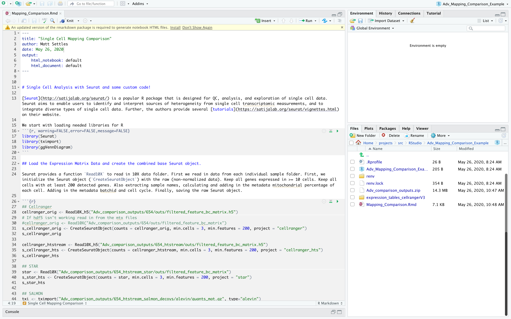

### Create a new RStudio project

Open RStudio and create a new project, for more info see (Using-Projects)[https://support.rstudio.com/hc/en-us/articles/200526207-Using-Projects]

* File > New Project > New Directory > New Project (name the new directory, Ex. Adv_Mapping_Comparison) and check "use packrat with this project", or "use renv with this project" if your using the devel version.

Learn more about (renv)[https://rstudio.github.io/renv/articles/renv.html]

Set some options and make sure the packages Seurat, sva, ggplot2, dplyr, limma, topGO, WGCNA are installed (if not install it), and then load them and verify they all loaded correctly.

In the R console run the following commands
```r
# For Markdown
packages <- c('highr', 'knitr', 'markdown', 'rmarkdown', 'tinytex', 'xfun')
if (!any(rownames(installed.packages()) %in% packages)){
  if (!requireNamespace("BiocManager", quietly = TRUE))
      install.packages("BiocManager")
  BiocManager::install(packages)
}

if (!any(rownames(installed.packages()) == "Seurat")){
  if (!requireNamespace("BiocManager", quietly = TRUE))
      install.packages("BiocManager")
  BiocManager::install("Seurat")
}
library(Seurat)

if (!any(rownames(installed.packages()) == "hdf5r")){
  if (!requireNamespace("BiocManager", quietly = TRUE))
      install.packages("BiocManager")
  BiocManager::install("hdf5r")
}
library(hdf5r)

if (!any(rownames(installed.packages()) == "tximport")){
  if (!requireNamespace("BiocManager", quietly = TRUE))
      install.packages("BiocManager")
  BiocManager::install("tximport")
}
library(tximport)

if (!any(rownames(installed.packages()) == "ggVennDiagram")){
  if (!requireNamespace("BiocManager", quietly = TRUE))
      install.packages("BiocManager")
  BiocManager::install("ggVennDiagram")
}
library(ggVennDiagram)

if (!any(rownames(installed.packages()) == "devtools")){
  if (!requireNamespace("BiocManager", quietly = TRUE))
      install.packages("BiocManager")
  BiocManager::install("devtools")
}
library(devtools)

BiocManager::install(c("Biobase", "SingleCellExperiment", "batchelor", "BiocGenerics", "DelayedArray", "DelayedMatrixStats", "limma", "S4Vectors", "SummarizedExperiment", "pcaMethods"))

## Possible you may have to install Rtools if the below fails
## http://jtleek.com/modules/01_DataScientistToolbox/02_10_rtools/#1
devtools::install_github('cole-trapnell-lab/leidenbase')
devtools::install_github('cole-trapnell-lab/monocle3')
library(monocle3)

devtools::install_github("velocyto-team/velocyto.R")
library(velocyto.R)

if (!any(rownames(installed.packages()) == "biomaRt")){
  if (!requireNamespace("BiocManager", quietly = TRUE))
      install.packages("BiocManager")
  BiocManager::install("biomaRt")
}
library(biomaRt)

if (!any(rownames(installed.packages()) == "sva")){
  if (!requireNamespace("BiocManager", quietly = TRUE))
      install.packages("BiocManager")
  BiocManager::install("sva")
}
library(sva)

if (!any(rownames(installed.packages()) == "scran")){
  if (!requireNamespace("BiocManager", quietly = TRUE))
      install.packages("BiocManager")
  BiocManager::install("scran")
}
library(scran)

if (!any(rownames(installed.packages()) == "limma")){
  if (!requireNamespace("BiocManager", quietly = TRUE))
      install.packages("BiocManager")
  BiocManager::install("limma")
}
library(limma)

sessionInfo()
```

Lets spend a minute looking at the reports and the data


### Download the data for the workshop, extract it.

In the R console run the following command.
```r
download.file("https://bioshare.bioinformatics.ucdavis.edu/bioshare/download/iimg5mz77whzzqc/expression_tables_cellrangerV3.zip", "Adv_comparison_outputs.zip")
```
Then uncompress the zip File, into the project folder

### Download the template Markdown workshop document PART1 and open it.

In the R console run the following command
```r
download.file("https://raw.githubusercontent.com/ucdavis-bioinformatics-training/2020-Advanced_Single_Cell_RNA_Seq/master/data_analysis/Mapping_Comparison.Rmd", "Mapping_Comparison.Rmd")
```

### Edit the file YAML portion

The top YAML (YAML ain't markup language) portion of the doc tells RStudio how to parse the document.

<pre><code>---
title: "Single Cell Mapping Comparison"
author: your_name
date: current_date
output:
    html_notebook: default
    html_document: default
---</code></pre>


Your RStudio should look something like this


