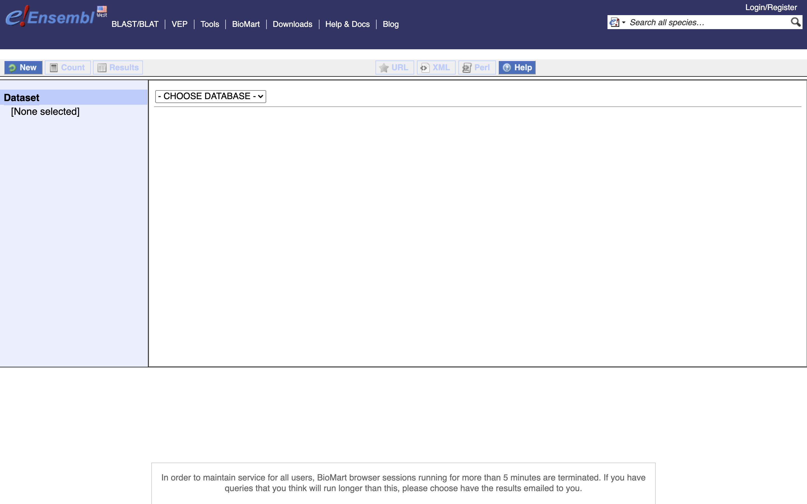
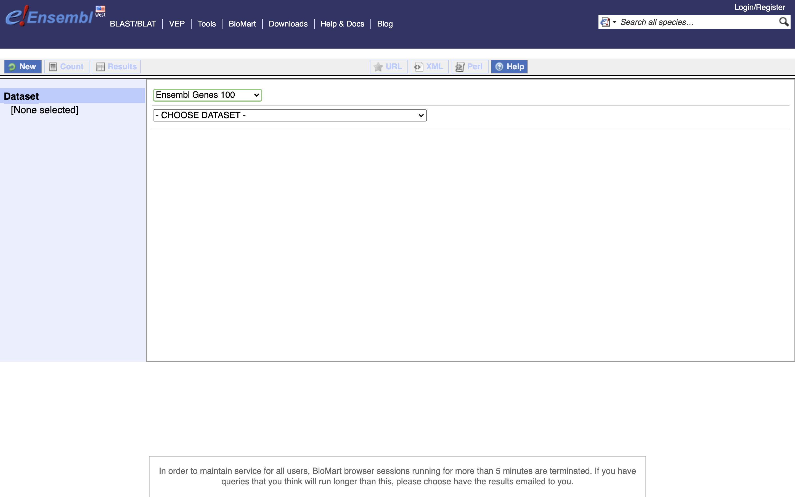
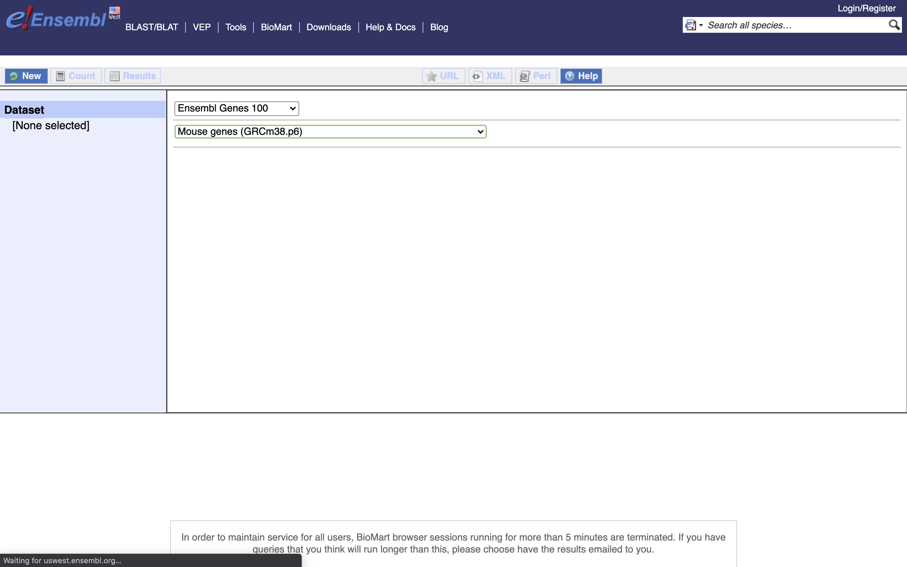
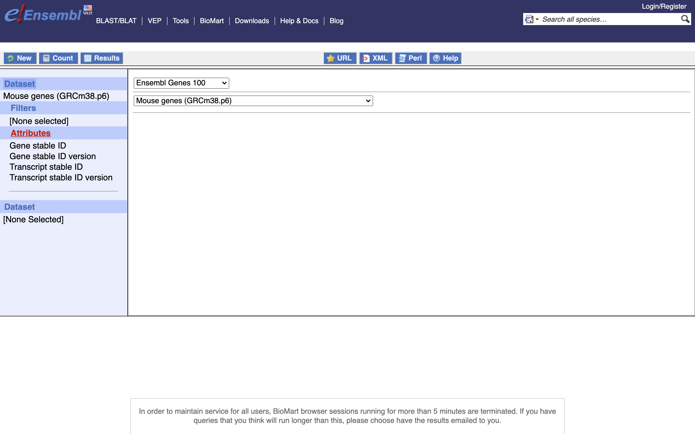
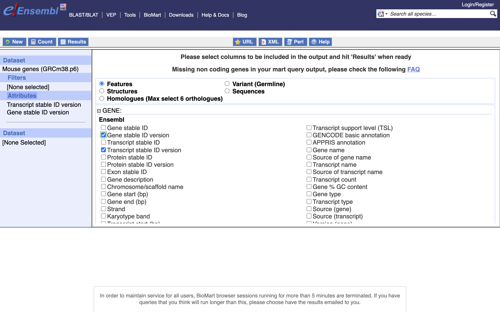
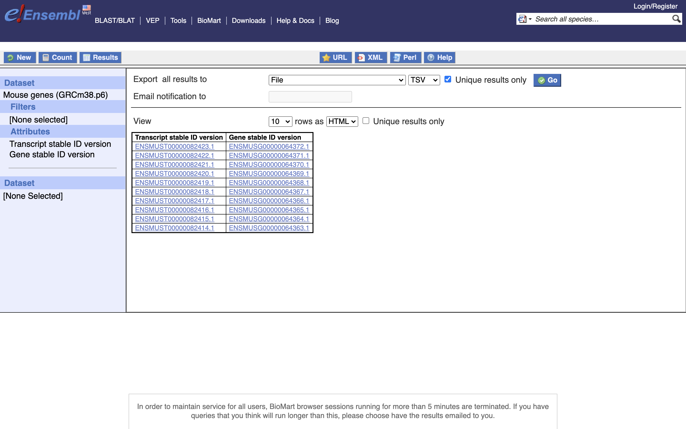

Login to tadpole and navigate to your directory on the share space.

```bash
cd /share/workshop/adv_scrna/$USER

srun -t 1-00:00:00 -c 4 -n 1 --mem 16000 --partition production --account adv_scrna_workshop --reservation adv_scrna_workshop  --pty /bin/bash
```

This assumes you've first complete this [page](scrna_htstream.md)

# Generating Gene Expression Matrices


Unfortunately, Cellranger expects a very specific filename format, the bcl2fasq output, so we need to rename the htstream output files.

```bash
mv /share/workshop/adv_scrna/msettles/scrnaseq_processing/01-HTStream/654_small_htstream/654_small_htstream_R1.fastq.gz  /share/workshop/adv_scrna/msettles/scrnaseq_processing/01-HTStream/654_small_htstream/654_small_htstream_S1_L001_R1_001.fastq.gz
mv /share/workshop/adv_scrna/msettles/scrnaseq_processing/01-HTStream/654_small_htstream/654_small_htstream_R2.fastq.gz  /share/workshop/adv_scrna/msettles/scrnaseq_processing/01-HTStream/654_small_htstream/654_small_htstream_S1_L001_R2_001.fastq.gz
```

### For the sake of time (building references can take hours) we are going to link a finished references, but when time allows

```bash
cd /share/workshop/adv_scrna/$USER/scrnaseq_processing
ln -s /share/biocore/workshops/2020_scRNAseq/Reference .
```

### When time allows, lets buld a reference for Mouse base on Ensembl release-100

First lets setup a References folder for our experiment.
```bash
mkdir /share/workshop/adv_scrna/$USER/scrnaseq_processing/reference
cd /share/workshop/adv_scrna/$USER/scrnaseq_processing/reference
```

We'll need to download and extract a number of reference files.
```bash
wget ftp://ftp.ensembl.org/pub/release-100/fasta/mus_musculus/dna/Mus_musculus.GRCm38.dna.primary_assembly.fa.gz
wget ftp://ftp.ensembl.org/pub/release-100/gtf/mus_musculus/Mus_musculus.GRCm38.100.gtf.gz
ftp://ftp.ensembl.org/pub/release-100/fasta/mus_musculus/cdna/Mus_musculus.GRCm38.cdna.all.fa.gz
gunzip Mus_musculus.GRCm38.100.gtf.gz
gunzip Mus_musculus.GRCm38.dna.primary_assembly.fa.gz
gunzip Mus_musculus.GRCm38.cdna.all.fa.gz
```

## 10X Genomics - cellranger

Description of cellranger can be found [here](https://support.10xgenomics.com/single-cell-gene-expression/software/pipelines/latest/what-is-cell-ranger)

10X Genomics cellranger uses the [STAR](https://github.com/alexdobin/STAR) aligner under the hood to map reads to a genome after first preprocessing them (extracting cell and UMI sequences).

cellranger version 3 has many sub-applications

1. cellranger mkfastq

2. cellranger count
3. cellranger aggr
4. cellranger reanalyze
5. cellranger mat2csv

6. cellranger mkgtf
7. cellranger mkref

8. cellranger vdj

9. cellranger mkvdjref

10. cellranger testrun
11. cellranger upload
12. cellranger sitecheck

### Building indexes for cellranger (takes a long time)
10X Genomics provides pre-built references for human and mouse genomes to use with Cell Ranger. Researchers can make custom reference genomes for additional species or add custom marker genes of interest to the reference, e.g. GFP. The following tutorial outlines the steps to build a custom reference using the cellranger mkref pipeline.

```bash
cd /share/workshop/adv_scrna/$USER/scrnaseq_processing/reference

module load cellranger/3.1.0

cellranger mkgtf Mus_musculus.GRCm38.100.gtf Mus_musculus.GRCm38.100.filtered.gtf \
   --attribute=gene_biotype:protein_coding \
   --attribute=gene_biotype:lincRNA \
   --attribute=gene_biotype:antisense \
   --attribute=gene_biotype:IG_LV_gene \
   --attribute=gene_biotype:IG_V_gene \
   --attribute=gene_biotype:IG_V_pseudogene \
   --attribute=gene_biotype:IG_D_gene \
   --attribute=gene_biotype:IG_J_gene \
   --attribute=gene_biotype:IG_J_pseudogene \
   --attribute=gene_biotype:IG_C_gene \
   --attribute=gene_biotype:IG_C_pseudogene \
   --attribute=gene_biotype:TR_V_gene \
   --attribute=gene_biotype:TR_V_pseudogene \
   --attribute=gene_biotype:TR_D_gene \
   --attribute=gene_biotype:TR_J_gene \
   --attribute=gene_biotype:TR_J_pseudogene \
   --attribute=gene_biotype:TR_C_gene

cellranger mkref \
   --genome=GRCm38.cellranger \
   --fasta=Mus_musculus.GRCm38.dna.primary_assembly.fa \
   --genes=Mus_musculus.GRCm38.100.filtered.gtf \
   --ref-version=3.1.0
```

### Counting (expression matrix) with cellranger

#### Cell barcode and UMI filtering

* Cell barcodes
	* Must be on static list of known cell barcode sequences
	* May be 1 mismatch away from the list if the mismatch occurs at a low- quality position (the barcode is then corrected).

* UMIs (Unique Molecular Index)
	* Must not be a homopolymer, e.g. AAAAAAAAAA
	* Must not contain N
	* Must not contain bases with base quality < 10
	*	UMIs that are 1 mismatch away from a higher-count UMI are corrected to that UMI if they share a cell barcode and gene.

#### Genome Alignment
cellranger uses an aligner called STAR, which performs splicing-aware alignment of reads to the genome. cellranger uses the transcript annotation GTF to bucket the reads into exonic, intronic, and intergenic, and by whether the reads align (confidently) to the genome. A read is exonic if at least 50% of it intersects an exon, intronic if it is non-exonic and intersects an intron, and intergenic otherwise.

#### MAPQ adjustment
For reads that align to a single exonic locus but also align to 1 or more non-exonic loci, the exonic locus is prioritized and the read is considered to be confidently mapped to the exonic locus with MAPQ 255.

#### Transcriptome Alignment
cellranger further aligns exonic reads to annotated transcripts, looking for compatibility. A read that is compatible with the exons of an annotated transcript, and aligned to the same strand, is considered mapped to the transcriptome. If the read is compatible with a single gene annotation, it is considered uniquely (confidently) mapped to the transcriptome. Only reads that are confidently mapped to the transcriptome are used for UMI counting.

### UMI Counting

* Using only the confidently mapped reads with valid barcodes and UMIs,
	* Correct the UMIs
		UMIs are corrected to more abundant UMIs that are one mismatch away in sequence (hamming distance = 1).
	* Record which reads are duplicates of the same RNA molecule (PCR duplicates)
	* Count only the unique UMIs as unique RNA molecules
	* These UMI counts form an unfiltered gene-barcode matrix.

### Filtering cells (the 10x way)

cellranger 3.0 introduces and improved cell-calling algorithm that is better able to identify populations of low RNA content cells, especially when low RNA content cells are mixed into a population of high RNA content cells. For example, tumor samples often contain large tumor cells mixed with smaller tumor infiltrating lymphocytes (TIL) and researchers may be particularly interested in the TIL population. The new algorithm is based on the EmptyDrops method (Lun et al., 2018).

The algorithm has two key steps:

1. It uses a cutoff based on total UMI counts of each barcode to identify cells. This step identifies the primary mode of high RNA content cells.
2. Then the algorithm uses the RNA profile of each remaining barcode to determine if it is an “empty" or a cell containing partition. This second step captures low RNA content cells whose total UMI counts may be similar to empty GEMs.

In the first step, the original cellranger cell calling algorithm is used to identify the primary mode of high RNA content cells, using a cutoff based on the total UMI count for each barcode. cellranger takes as input the expected number of recovered cells, N (see --expect-cells). Let m be the 99th percentile of the top N barcodes by total UMI counts. All barcodes whose total UMI counts exceed m/10 are called as cells in the first pass.

In the second step, a set of barcodes with low UMI counts that likely represent ‘empty’ GEM partitions is selected. A model of the RNA profile of selected barcodes is created. This model, called the background model, is a multinomial distribution over genes. It uses Simple Good-Turing smoothing to provide a non-zero model estimate for genes that were not observed in the representative empty GEM set. Finally, the RNA profile of each barcode not called as a cell in the first step is compared to the background model. Barcodes whose RNA profile strongly disagrees with the background model are added to the set of positive cell calls. This second step identifies cells that are clearly distinguishable from the profile of empty GEMs, even though they may have much lower RNA content than the largest cells in the experiment.

Below is an example of a challenging cell-calling scenario where 300 high RNA content 293T cells are mixed with 2000 low RNA content PBMC cells. On the left is the cell calling result with the cell calling algorithm prior to cellranger 3.0 and on the right is the current cellranger 3.0 result. You can see that low RNA content cells are successfully identified by the new algorithm.

<p float="center">
  
  
</p>

#### Matrix output

| Type			| Description |
|:----- 		|:------ |
| Raw	| gene-barcode matrices	Contains every barcode from fixed list of known-good barcode sequences. This includes background and non-cellular barcodes. |
| Filtered		| gene-barcode matrices	Contains only detected cellular barcodes. |

With 3 files needed to completely describe each gene x cell matrix

- matrix.mtx.gz
- features.tsv.gz
- barcode.tsv.gz

**OR** a single HDF5 (Hierarchical Data Format). A HDF5 Feature Barcode Matrix Format file for each raw and filtered datasets is also provided.

#### Bam output

10x Chromium cellular and molecular barcode information for each read is stored as TAG fields:

| Tag	| Type	| Description
|:----- |:------ |:----- |
| CB	| Z		| Chromium cellular barcode sequence that is error-corrected and confirmed against a list of known-good barcode sequences. |
| CR	| Z		| Chromium cellular barcode sequence as reported by the sequencer. |
| CY	| Z		| Chromium cellular barcode read quality. Phred scores as reported by sequencer. |
| UB	| Z		| Chromium molecular barcode sequence that is error-corrected among other molecular barcodes with the same cellular barcode and gene alignment. |
| UR	| Z		| Chromium molecular barcode sequence as reported by the sequencer. |
| UY	| Z		| Chromium molecular barcode read quality. Phred scores as reported by sequencer. |
| BC	| Z		| Sample index read. |
| QT	| Z		| Sample index read quality. Phred scores as reported by sequencer. |
| TR	| Z		| Trimmed sequence. For the Single Cell 3' v1 chemistry, this is trailing sequence following the UMI on Read 2. For the Single Cell 3' v2 chemistry, this is trailing sequence following the cell and molecular barcodes on Read 1. |
| TQ	| Z		| Trimmed sequence quality. Phred scores as reported by the sequencer. No longer present in V3 |

The following TAG fields are present if a read maps to the genome __and__ overlaps an exon by at least one base pair. A read may align to multiple transcripts and genes, but it is only considered confidently mapped to the transcriptome it if mapped to a single gene.

| Tag	| Type	| Description
|:----- |:------ |:----- |
| TX	| Z		| Semicolon-separated list of transcripts that are compatible with this alignment. Transcripts are specified with the transcript_id key in the reference GTF attribute column. The format of each entry is [transcript_id],[strand][pos],[cigar], where strand is either + or -, pos is the alignment offset in transcript coordinates, and cigar is the CIGAR string in transcript coordinates. |
| AN	| Z		| Same as the TX tag, but for reads that are aligned to the antisense strand of annotated transcripts. V3 ONLY. |
| GX	| Z		| Semicolon-separated list of gene IDs that are compatible with this alignment. Gene IDs are specified with the gene_id key in the reference GTF attribute column. |
| GN	| Z		| Semicolon-separated list of gene names that are compatible with this alignment. Gene names are specified with gene_name key in the reference GTF attribute column. |
| MM	| i		| Set to 1 if the genome-aligner (STAR) originally gave a MAPQ < 255 (it multi-mapped to the genome) and cellranger changed it to 255 because the read overlapped exactly one gene. |
| RE	| A		| Single character indicating the region type of this alignment (E = exonic, N = intronic, I = intergenic). |

The following are feature barcoding TAG fields which are not aligned to the genome, but processed by the Feature Barcodng read processor. The BAM file will contain unaligned records for these reads, with the following tags representing the Feature Barcode sequence extracted from the read, and the feature reference it was matched to, if any. The BAM read sequence will contain all the bases outside of the cell barcode and UMI regions. V3 ONLY.

| Tag	| Type	| Description
|:----- |:------ |:----- |
| fb	| Z		| Chromium Feature Barcode sequence that is error-corrected and confirmed against known features barcode sequences from the feature reference. |
| fr	| Z		| Chromium Feature Barcode sequence as reported by the sequencer. |
| fq	| Z		| Chromium Feature Barcode read quality. Phred scores as reported by sequencer. |
| fx	| Z		| Feature identifier matched to this Feature Barcode read. Specified in the id column of the feature reference. |

#### An example read

Cell Ranger Version 3
		J00113:284:HG27NBBXX:8:2202:16741:8594	1040	1	4491502	255	101M	*	0	0	ACTGGACAGTGATTGTGGGGAGCAAGTCCCTCAAGGCATTTAAAACAAAAATCTCGTGTAGCCCCTCAACTGTTCAAGTGGCAGACAAAATAAATTACCAT	-A-AAJJJFAFA-F<<<JFFJFA-AF)JFFAJJFJAFFA7<JFFJA<JJFA<F<JFJJFAJAJFJFFJFJJJJJJJFJJJJJJFJFJFAFJFJJJJF<<<A	NH:i:1	HI:i:1	AS:i:99	nM:i:0	TX:Z:ENSMUST00000027035,+2455,101M;ENSMUST00000192650,+3029,101M;ENSMUST00000195555,+1624,101M	GX:Z:ENSMUSG00000025902	GN:Z:Sox17	fx:Z:ENSMUSG00000025902	RE:A:E	li:i:0	BC:Z:CAGCATCA	QT:Z:AAFFFFJJ	CR:Z:CAAGATCTCGCAAACT	CY:Z:AAFFFJJJJJJJJJJJ	CB:Z:CAAGATCTCGCAAACT-1	UR:Z:GCCGAGACCT	UY:Z:JJJJJJJJJJ	UB:Z:GCCGAGACCT	xf:i:17RG:Z:654:0:1:HG27NBBXX:8

#### 10X genomics sample report

Summary of the alignment and assignment of reads to cells and genes are present in the metrics_summary.csv.

| Metric	| Description |
|:----- 		|:------ |
| Estimated Number of Cells	| The number of barcodes associated with cell-containing partitions, estimated from the barcode UMI count distribution. |
| Mean Reads per Cell	| The total number of sequenced reads divided by the estimated number of cells. |
| Median Genes per Cell	| The median number of genes detected (with nonzero UMI counts) across all cell-associated barcodes. |
| Number of Reads	| Total number of sequenced reads. |
| Valid Barcodes	| Fraction of reads with cell-barcodes that match the whitelist. |
| Reads Mapped to Genome | Fraction of reads that mapped to the genome.|
| Reads Mapped Confidently to Genome | Reads Mapped Confidently to Genome. |
| Reads Mapped Confidently to Transcriptome	| Fraction of reads that mapped to a unique gene in the transcriptome with a high mapping quality score as reported by the aligner. |
| Reads Mapped Confidently to Exonic Regions	| Fraction of reads that mapped to the exonic regions of the genome with a high mapping quality score as reported by the aligner. |
| Reads Mapped Confidently to Intronic Regions	| Fraction of reads that mapped to the intronic regions of the genome with a high mapping quality score as reported by the aligner. |
| Reads Mapped Confidently to Intergenic Regions	| Fraction of reads that mapped to the intergenic regions of the genome with a high mapping quality score as reported by the aligner. |
| Reads Mapped Antisense to Gene | Fraction of reads confidently mapped to the transcriptome, but on the opposite strand of their annotated gene. A read is counted as antisense if it has any alignments that are consistent with an exon of a transcript but antisense to it, and has no sense alignments. |
| Sequencing Saturation	| The fraction of reads originating from an already-observed UMI. This is a function of library complexity and sequencing depth. More specifically, this is the fraction of confidently mapped, valid cell-barcode, valid UMI reads that had a non-unique (cell-barcode, UMI, gene). This metric was called "cDNA PCR Duplication" in versions of cellranger prior to 1.2. |
| Q30 Bases in Barcode	| Fraction of bases with Q-score at least 30 in the cell barcode sequences. This is the i7 index (I1) read for the Single Cell 3' v1 chemistry and the R1 read for the Single Cell 3' v2 chemistry. |
| Q30 Bases in RNA Read	| Fraction of bases with Q-score at least 30 in the RNA read sequences. This is Illumina R1 for the Single Cell 3' v1 chemistry and Illumina R2 for the Single Cell 3' v2 chemistry. |
| Q30 Bases in Sample Index	| Fraction of bases with Q-score at least 30 in the sample index sequences. This is the i5 index (I2) read for the Single Cell 3' v1 chemistry and the i7 index (I1) read for the Single Cell 3' v2 chemistry. |
| Q30 Bases in UMI	| Fraction of bases with Q-score at least 30 in the UMI sequences. This is the R2 read for the Single Cell 3' v1 chemistry and the R1 read for the Single Cell 3' v2 chemistry. |
| Fraction Reads in Cells	| The fraction of cell-barcoded, confidently mapped reads with cell-associated barcodes. |
| Total Genes Detected	| The number of genes with at least one UMI count in any cell. |
| Median UMI Counts per Cell	| The median number of total UMI counts across all cell-associated barcodes. |

### 10X genomics html reports

Cell ranger does produce a pretty html report with the same statistics and some "analysis".

### Exercises

1. Log into tadpole with the username/password given

    ```bash
    # working folder
    cd /share/workshop/adv_scrna/$USER/scrnaseq_processing
    ```

2. Load the module for cellranger and review cellranger's sub-applications and help docs

3. Review the [cellranger.counts_orig.sh](https://raw.githubusercontent.com/ucdavis-bioinformatics-training/2020-Advanced_Single_Cell_RNA_Seq/master/software_scripts/scripts/cellranger.counts_orig.sh) script to map the original fastq files.

4. Copy contents of the script to your the working folder and run it.

5. Review the [cellranger.counts.sh](https://raw.githubusercontent.com/ucdavis-bioinformatics-training/2020-Advanced_Single_Cell_RNA_Seq/master/software_scripts/scripts/cellranger.counts.sh)  script to map the HTStream preprocessed fastq files.

6. Copy contents of the script to your the working folder and run it.

## Mapping with Star Solo

[STARsolo](https://github.com/alexdobin/STAR/blob/2.7.3a/docs/STARsolo.md) is a turnkey solution for analyzing droplet single cell RNA sequencing data (e.g. 10X Genomics Chromium System) built directly into STAR code. STARsolo inputs the raw FASTQ reads files, and performs the following operations

error correction and demultiplexing of cell barcodes using user-input whitelist
mapping the reads to the reference genome using the standard STAR spliced read alignment algorithm
error correction and collapsing (deduplication) of Unique Molecular Identifiers (UMIa)
quantification of per-cell gene expression by counting the number of reads per gene
quantification of other transcriptomic features: splice junctions; pre-mRNA; spliced/unspliced reads similar to Velocyto
STARsolo output is designed to be a drop-in replacement for 10X CellRanger gene quantification output. It follows CellRanger logic for cell barcode whitelisting and UMI deduplication, and produces nearly identical gene counts in the same format. At the same time STARsolo is ~10 times faster than the CellRanger.

### Indexing for STAR (takes a long time)

```bash
cd /share/workshop/adv_scrna/$USER/scrnaseq_processing/reference
module load star/2.7.3a
mkdir GRCm38.star
STAR --runThreadN 4 --runMode genomeGenerate --genomeDir GRCm38.star --genomeFastaFiles Mus_musculus.GRCm38.dna.primary_assembly.fa --sjdbGTFfile Mus_musculus.GRCm38.100.filtered.gtf --sjdbOverhang 100
```

### Mapping with Star

Fist Star needs the 10X genomics barcodes whitelist, which can be found [here](https://kb.10xgenomics.com/hc/en-us/articles/115004506263-What-is-a-barcode-whitelist-)
```bash
wget -O /share/workshop/adv_scrna/$USER/scrnaseq_processing/resources/737K-august-2016.txt https://raw.githubusercontent.com/ucdavis-bioinformatics-training/2020-Advanced_Single_Cell_RNA_Seq/master/datasets/737K-august-2016.txt
```

### Exercises

1. Log into tadpole with the username/password given

    ```bash
    # working folder
    cd /share/workshop/adv_scrna/$USER/scrnaseq_processing
    ```

2. Load the module for star and review stars help docs

3. Review the [star.counts.sh](https://raw.githubusercontent.com/ucdavis-bioinformatics-training/2020-Advanced_Single_Cell_RNA_Seq/master/software_scripts/scripts/star.counts.sh) script to map the HTStream preprocessed fastq files.

4. Copy contents of the script to your the working folder and run it.

## Mapping  with Salmon Alevin

[Alevin](https://salmon.readthedocs.io/en/latest/alevin.html) is a tool — integrated with the salmon software — that introduces a family of algorithms for quantification and analysis of 3’ tagged-end single-cell sequencing data. Currently alevin supports the following two major droplet based single-cell protocols:

* Drop-seq
* 10x-Chromium v1/2/3

Alevin works under the same indexing scheme (as salmon) for the reference, and consumes the set of FASTA/Q files(s) containing the Cellular Barcode(CB) + Unique Molecule identifier (UMI) in one read file and the read sequence in the other. Given just the transcriptome and the raw read files, alevin generates a cell-by-gene count matrix (in a fraction of the time compared to other tools).

Alevin works in two phases. In the first phase it quickly parses the read file containing the CB and UMI information to generate the frequency distribution of all the observed CBs, and creates a lightweight data-structure for fast-look up and correction of the CB. In the second round, alevin utilizes the read-sequences contained in the files to map the reads to the transcriptome, identify potential PCR/sequencing errors in the UMIs, and performs hybrid de-duplication while accounting for UMI collisions. Finally, a post-abundance estimation CB whitelisting procedure is done and a cell-by-gene count matrix is generated.

### First lets install and build the newest version of salmon (takes a while)

```bash
cd /share/workshop/adv_scrna/$USER
module load cmake

wget https://github.com/COMBINE-lab/salmon/archive/v1.2.1.tar.gz
tar xzvf v1.2.1.tar.gz
cd salmon-1.2.1/

mkdir build
cd  build/

cmake -DFETCH_BOOST=TRUE -DCMAKE_INSTALL_PREFIX=/share/workshop/adv_scrna/$USER/salmon-1.2.1 ..
make
make test
make install
export PATH=/share/workshop/adv_scrna/$USER/salmon-1.2.1/build/src/:$PATH
```
**OR**

link against my Copy
```bash
ln -s /share/biocore/workshops/2020_scRNAseq/salmon /share/workshop/adv_scrna/$USER/.
export PATH=/share/biocore/workshops/2020_scRNAseq/salmon/build/src/:$PATH
```

### Indexing for Salmon (takes a long time)

```bash
cd /share/workshop/adv_scrna/$USER/scrnaseq_processing/reference

## Create the genomic decoys
grep ">" Mus_musculus.GRCm38.dna.primary_assembly.fa | cut -d " " -f 1 > decoys.txt
sed -i.bak -e 's/>//g' decoys.txt

cat Mus_musculus.GRCm38.cdna.all.fa Mus_musculus.GRCm38.dna.primary_assembly.fa > gentrome.fa

salmon index -p 4 -t gentrome.fa.gz -d decoys.txt -i GRCm38.salmon_decoys
```

### Mapping with Salmon

Fist Salmon needs a transcript to gene mapping database, we can get this from Biomart.
*1.) First, go to Biomart



*2.) for CHOOSE DATASET Select Ensembl Genes 100



*3.) for CHOOSE DATASET Select Mouse Genes (GRCm38.p6)



*4.) Select Attributes



*5.) Enable "Transcript Stable ID Version" and "Gene Stable ID Version", **NOTE** Transcript needs to be before Gene in the list on the left



*6.) Select Unique Results onlY, TSV, and **GO**



Save this file to your computer, remove the first line (the header) and rename it to 'txp2gene.tsv', then move to the server into the folder ""/share/workshop/adv_scrna/$USER/scrnaseq_processing/resources"

**OR** Use mine

```bash
wget -O /share/workshop/adv_scrna/$USER/scrnaseq_processing/resources/txp2gene.tsv https://raw.githubusercontent.com/ucdavis-bioinformatics-training/2020-Advanced_Single_Cell_RNA_Seq/master/datasets/txp2gene.tsv
```

### Exercises

1. Log into tadpole with the username/password given

    ```bash
    # working folder
    cd /share/workshop/adv_scrna/$USER/scrnaseq_processing
    ```

2. Set the $PATH for the Salmon executable and review salmons help docs

3. Review the [salmon.counts.sh](https://raw.githubusercontent.com/ucdavis-bioinformatics-training/2020-Advanced_Single_Cell_RNA_Seq/master/software_scripts/scripts/salmon.counts.sh) script to map the HTStream preprocessed fastq files.

4. Copy contents of the script to your the working folder and run it.
