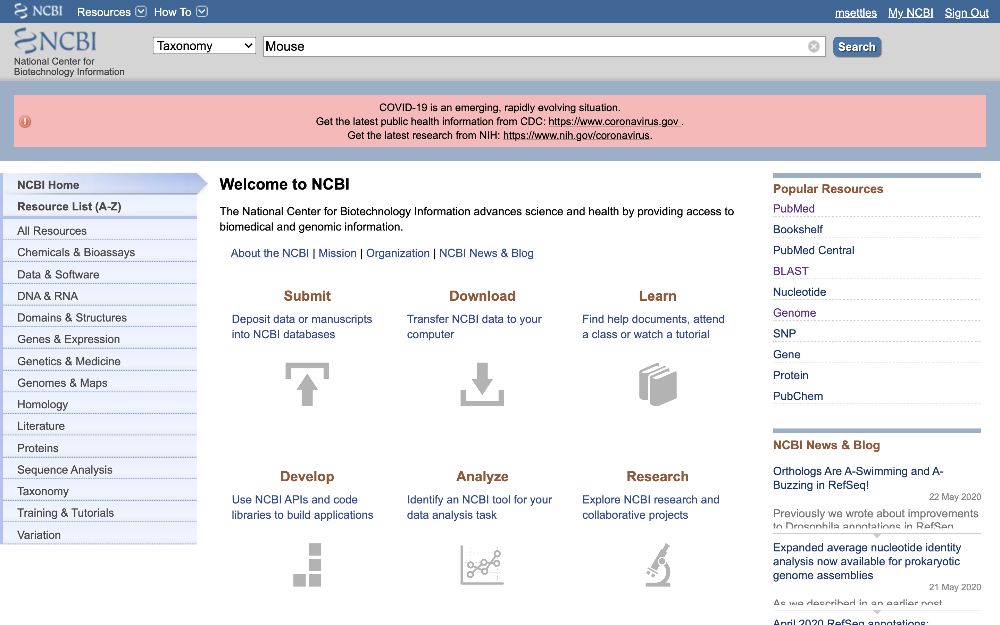
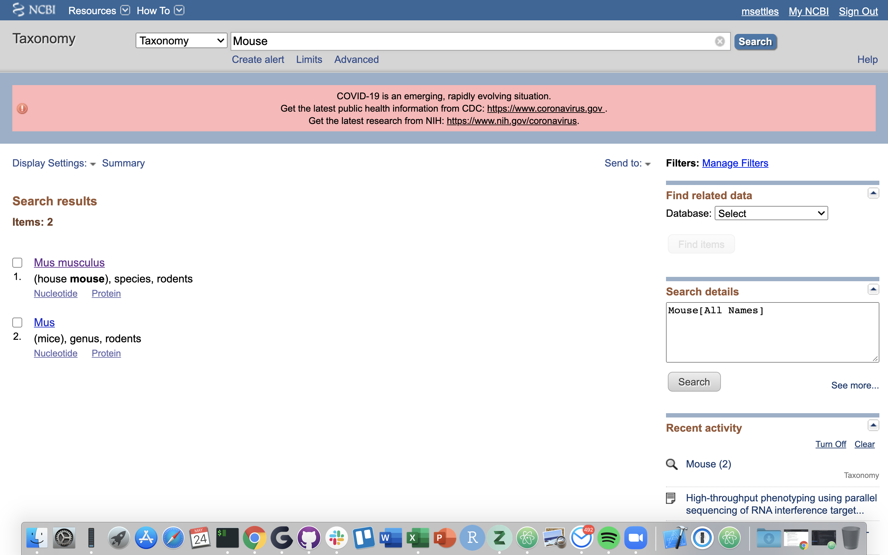
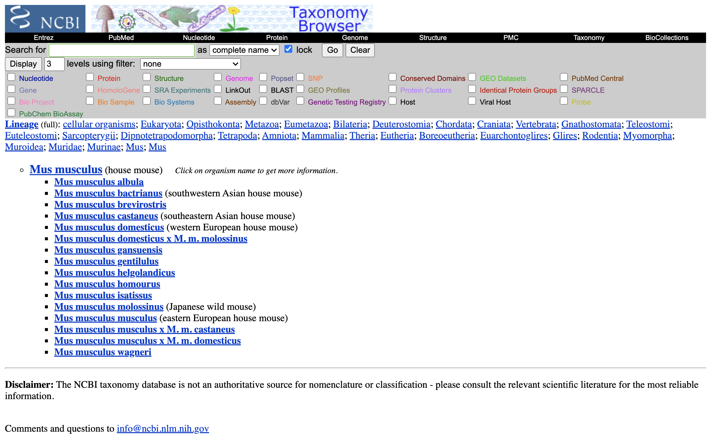
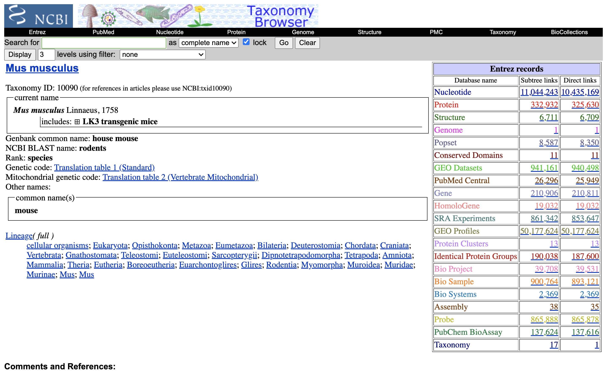
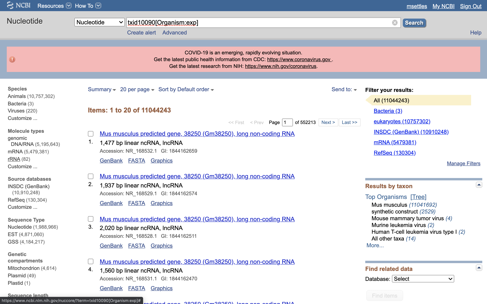
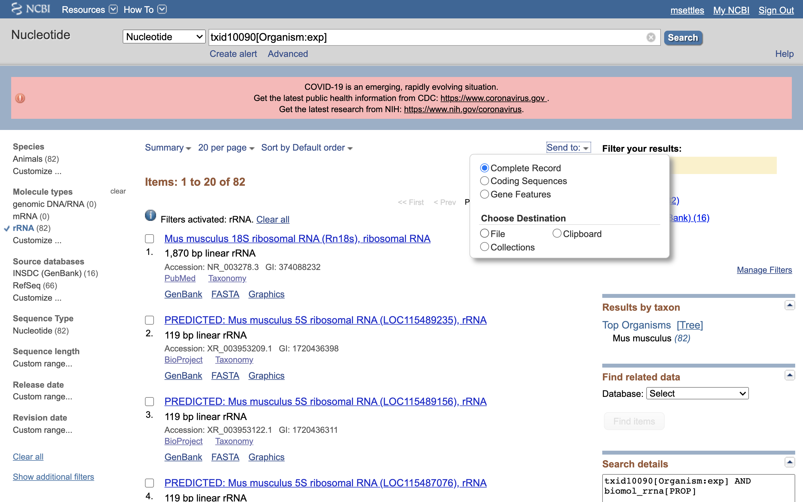
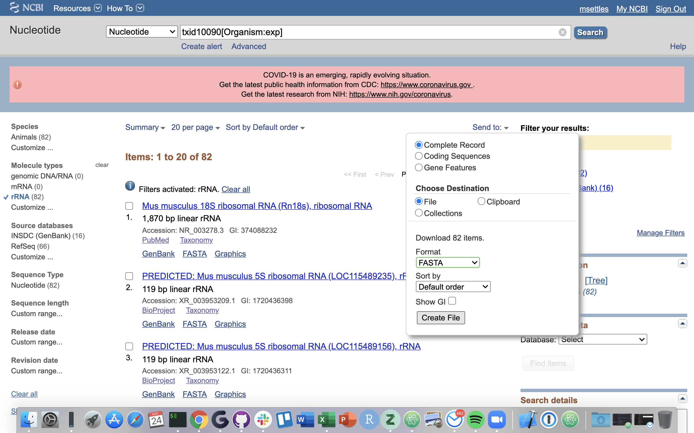

This assumes you've first complete this [page](project_setup_counting.md)

# A [HTStream](https://github.com/ibest/HTStream) workflow To Process single cell RNA libraries

Login to tadpole and navigate to your directory on the share space.

```bash
cd /share/workshop/adv_scrna/$USER
```

## Installing HTStream version 1.3.0-Beta (branch overlapper_readid_fixes)

### Prerequisites:
- Cmake 3.2 or greater.
- Boost 1.56 or greater including the following
    - libboost-dev
    - libboost-system-dev
    - libboost-program-options-dev
    - libboost-iostreams-dev
    - libboost-filesystem-dev

```bash
module load cmake
module load boost  
```

### Compiling HTStream from source

Downloading the current development version and branch 'overlapper_readid_fixes'. This branch has code within to pull and store the barcode and UMI. It will be integrated into the main branch in the coming weeks.
```bash
git clone https://github.com/ibest/HTStream.git
cd HTStream
git checkout overlapper_readid_fixes
git pull
```

Compiling the source code with cMake and make
```bash
mkdir build
cd build
cmake -DCMAKE_INCLUDE_PATH=/software/boost/1.67/lssc0-linux/include -DCMAKE_LIBRARY_PATH=/software/boost/1.67/lssc0-linux/lib -DCMAKE_INSTALL_PREFIX=/share/workshop/adv_scrna/$USER/HTStream -DBUILD_STATIC_BIN=ON ..
make
make test
make install
export PATH=/share/workshop/adv_scrna/$USER/HTStream/bin:$PATH
```

## Streamed preprocessing of sequence data

HTStream is a suite of preprocessing applications for high throughput sequencing data (ex. Illumina). A Fast C++ implementation, designed with discreet functionality that can be pipelined together using standard unix piping.

Benefits Include:
  * No intermediate files, reducing storage footprint.
  * Reduced I/O, files are only read in and written out once to disk.
  * Handles both single end and paired end reads at the same time.
  * Applications process reads at the same time allowing for process parallelization.
  * Built on top of mature C++ Boost libraries to reduce bugs and memory leaks.
  * Designed following the philosophy of [Program Design in the UNIX Environment](https://onlinelibrary.wiley.com/doi/abs/10.1002/j.1538-7305.1984.tb00055.x).
  * Works with native Unix/Linux applications such as grep/sed/awk etc.
  * Can build a custom preprocessing pipeline to fit the specific expectation of the data.
  * A single JSON output per sample detailing the preprocessing statistics from each application.

HTStream achieves these benefits by using a tab delimited intermediate format that allows for streaming from application to application. This streaming creates some awesome efficiencies when preprocessing HTS data and makes it fully interoperable with other standard Linux tools.

### Why preprocess reads

We have found that aggressively “cleaning” and preprocessing of reads can make a large difference to the speed and quality of mapping and assembly results. Preprocessing your reads means:

  * Removing bases of unwanted sequence (Ex. vectors, adapter, primer sequence, polyA tails).
  * Merge/join short overlapping paired-end reads.
  * Remove low quality bases or N characters.
  * Remove reads originating from PCR duplication.
  * Remove reads that are not of primary interest (contamination).
  * Remove too short reads.

Preprocessing also produces a number of statistics that are technical in nature that should be used to evaluate “experimental consistency”.

### Preprocessing statistics as QA/QC.

Beyond generating "better" data for downstream analysis, preprocessing statistics also give you an idea as to the original quality and complexity of the sample, library generation features, and sequencing quality.

This can help inform you of how you might change your procedures in the future, either sample preparation, or in library preparation.

We’ve found it best to perform __QA/QC__ on both the run as a whole (poor samples can negatively affect other samples) and on the samples themselves as they compare to other samples (**BE CONSISTENT**).

Reports such as Basespace for Illumina, are great ways to evaluate the run as a whole, the sequencing provider usually does this for you.  

PCA/MDS plots of the preprocessing summary are a great way to look for technical bias across your experiment. Poor quality samples often appear as outliers on the MDS plot and can ethically be removed due to identified technical issues. You should **NOT** see a trend on the MDS plot associated with any experimental factors. That scenario should raise concerns about technical sample processing bias.

### HTStream applications

HTStream includes the following applications:

hts_AdapterTrimmer: Identify and remove adapter sequences.  
hts_CutTrim: Discreet 5' and/or 3' basepair trimming.  
hts_LengthFilter: Remove reads outside of min and/or max length.  
hts_NTrimmer: Extract the longest subsequence with no Ns.    
hts_Overlapper: Overlap paired end reads, removing adapters when present.  
hts_PolyATTrim: Identify and remove polyA/T sequence.  
hts_Primers: Identify and optionally remove 5' and/or 3' primer sequence.  
hts_QWindowTrim: 5' and/or 3' quality score base trimming using windows.  
hts_SeqScreener: Identify and remove/keep/count contaminants (default phiX).  
hts_Stats: Compute read stats.  
hts_SuperDeduper: Identify and remove PCR duplicates.  

We hope in the long run to include any and all needed preprocessing routines.

**On your own**, spend a moment looking at the help documentation for each application.

## scRNAseq Workflow (10X Genomics)

A HTStream workflow for processing single cell 3' mRNA libraries.
This assumes read 1 begins with the cell barcodes (16bp) and UMIs (12bp) followed by a polyT, read 2 contains the transcript read, but may also contain artifacts, polyA,
that transcripts have been randomly fragmented upstream of the polyA(T).

Lets first make sure that we are in the correct directory.
```bash
cd /share/workshop/adv_scrna/$USER/scrnaseq_processing/
```

First we need a few prerequisites:

### extract_BC_UMI.py python script

The Python script [extract_BC-UMI.py](https://raw.githubusercontent.com/ucdavis-bioinformatics-training/2020-Advanced_Single_Cell_RNA_Seq/master/software_scripts/scripts/extract_BC-UMI.py) first 'extracts' the cell barcode and UMI from the specific read and stores it for safe keeping, then later you can 'insert' the barcode and UMI back to where it belongs in the read.

```bash
wget -O /share/workshop/adv_scrna/$USER/HTStream/bin/extract_BC-UMI.py https://raw.githubusercontent.com/ucdavis-bioinformatics-training/2020-Advanced_Single_Cell_RNA_Seq/master/software_scripts/scripts/extract_BC-UMI.py
chmod +x /share/workshop/adv_scrna/$USER/HTStream/bin/extract_BC-UMI.py
extract_BC-UMI.py -h
```
### Template Switching Oligo sequence

```bash
mkdir -p /share/workshop/adv_scrna/$USER/scrnaseq_processing/resources/
wget -O /share/workshop/adv_scrna/$USER/scrnaseq_processing/resources/screen.fa https://raw.githubusercontent.com/ucdavis-bioinformatics-training/2020-Advanced_Single_Cell_RNA_Seq/master/datasets/screen.fa
```

### Counting the number of rRNA reads in a sample

Ribosomal RNA can make up 90% or more of a typical _total RNA_ sample. Most library prep methods attempt to reduce the rRNA representation in a sample, oligoDt binds to polyA tails to enrich a sample for mRNA. The technique is not 100% efficient and so knowing the relative proportion of rRNA in each sample can be useful.

In HTStream, you can screen (count only) for rRNA in a sample to determine rRNA efficiency. Before we do so we need to find sequences of ribosomal RNA to screen against. For example, a mouse rRNA screening database can be generated using the following steps:

*1.) First, go to NCBI and in the Search dropdown select "Taxonomy" and search for "Mouse".*



*2.) Click on "Mus musculus".*



*3.) Click on "Mus musculus" again.*



*4.) Click on the "Subtree links" for Nucleotide*



*5.) Under Molecule Types, click on "rRNA" (left hand side).*



*6.) Click on "Send", choose "File", choose Format "FASTA", and click on "Create File".*





Save this file to your computer, and rename it to 'mouse_rrna.fasta'.

**OR**
```bash
wget -O /share/workshop/adv_scrna/$USER/scrnaseq_processing/resources/mouse_rrna.fasta https://raw.githubusercontent.com/ucdavis-bioinformatics-training/2020-Advanced_Single_Cell_RNA_Seq/master/datasets/mouse_rrna.fasta
```

### Workflow script


```bash
hts_Stats -L scRNA.log -N 'compute stats on original dataset' \
    -1 *_S*_R1_001.fastq.gz \
    -2 *_S*_R2_001.fastq.gz  | \
hts_SeqScreener -A scRNA.log -N 'screen for PhiX because I always do' \
    --check-read-2 | \
hts_Overlapper -A scRNA.log -N 'overlap reads' | \
extract_BC-UMI.py --extract --read 1 --length  28 | \
hts_PolyATTrim -A scRNA.log -N 'trim 3 prime plolyA' \
    --skip_polyA  \
    --no-right -x 100 | \
hts_NTrimmer -A scRNA.log -N 'Remove any N characters' | \
hts_QWindowTrim -A scRNA.log -N 'Quality window trim' | \
hts_LengthFilter -A scRNA.log -N 'Removed any read shorter than 50bp' \
    -m 50 -s | \
hts_SeqScreener -A scRNA.log -N 'Screen out any potential adapter dimers' \
    --check-read-2 \
    -s screen.fa | \
hts_SeqScreener -A scRNA.log -N 'count the number of rRNA reads'\
    -r \
    --check-read-2 \
    -s mouse_rrna.fasta | \
extract_BC-UMI.py --insert --read 1 | \
hts_Stats -A scRNA.log -N 'final stats' \
    -f processed_file -F"
```

### Workflow description

As with all our workflows, we run hts_Stats both as the first application and the last application to generate full library stats pre and post processing. After hts_Stats, hts_SeqScreener is run using the default screen of PhiX (better safe to just check and remove), we then run hts_SeqScreener again, this time using a multi-fasta file with ribosomal RNA sequences (see '[Counting the number of rRNA reads in a sample](#counting-the-number-of-rrna-reads-in-a-sample)') and the option '-r' to count but not remove any reads that match the screening file. So far each application run in the workflow so far removes entire reads and does not perform  any trimming. Next hts_Overlapper overlap and remove to remove adapter sequences. We then run the custom script extract_BC_UMI.py in mode --extract to save the barcode and UMI in the read id. The next series of applications then trims/cleans reads, hts_PolyATTrim to remove polyA(T) tails, hts_NTrimmer and hts_QWindowTrim to remove any 'N' bases and low quality respectively. Finally, we run hts_LengthFilter to remove any reads shorter than 50bp (-m 50) and produce reverse complement any reads 2 from discarded read 1 (-s). The custom script extract_BC_UMI.py is run 1 more time this time in --insert mode to put the BC|UMI back into read 1. The resulting fastq files will be exclusively paired-end reads remaining.

### Lets Execute the workflow

```bash
cd /share/workshop/adv_scrna/$USER/scrnaseq_processing/

wget https://raw.githubusercontent.com/ucdavis-bioinformatics-training/2020-Advanced_Single_Cell_RNA_Seq/master/software_scripts/scripts/scHTStream.sh

mkdir /share/workshop/adv_scrna/$USER/scrnaseq_processing/01-HTStream
mkdir /share/workshop/adv_scrna/$USER/scrnaseq_processing/01-HTStream/654_small

bash scHTStream.sh
```

When complete HTStream writes new "preprocessed" file to the out directory and a log.

```bash
less /share/workshop/adv_scrna/$USER/scrnaseq_processing/01-HTStream/654_small/654_small_scRNA.log
```
