Recreating (and maybe improving on) some of the figures generated with plot-bamstats application in R.

## Lets start by making sure packages and data can be loaded and read in.

First lets load knitr, tidyverse, reshape2 and gridExtra packages.


```r
library(knitr)
library(tidyverse)
```

```
## ── Attaching packages ────────────────────────── tidyverse 1.2.1 ──
```

```
## ✔ ggplot2 3.2.1     ✔ purrr   0.3.2
## ✔ tibble  2.1.3     ✔ dplyr   0.8.3
## ✔ tidyr   0.8.3     ✔ stringr 1.4.0
## ✔ readr   1.3.1     ✔ forcats 0.4.0
```

```
## ── Conflicts ───────────────────────────── tidyverse_conflicts() ──
## ✖ dplyr::filter() masks stats::filter()
## ✖ dplyr::lag()    masks stats::lag()
```

```r
library(reshape2)
```

```
## 
## Attaching package: 'reshape2'
```

```
## The following object is masked from 'package:tidyr':
## 
##     smiths
```

```r
library(gridExtra)
```

```
## 
## Attaching package: 'gridExtra'
```

```
## The following object is masked from 'package:dplyr':
## 
##     combine
```

This document assumes you have the file 'bwa_mem_Stats.log' in your current working directory, lets test to make sure it is.

```r
getwd()
```

```
## [1] "/Users/mattsettles/projects/src/github.com-ucdavis-bioinformatics-training/2019_August_UCD_mRNAseq_Workshop/intro2R"
```

```r
file.exists("Data_in_R_files/bwa_mem_Stats.log")
```

```
## [1] TRUE
```

If it returned TRUE, great! If not return to the Prepare data_in_R doc and follow the directions to get the file.

So lets read in the file and view the first few lines and get the length

```r
data <- readLines("Data_in_R_files/bwa_mem_Stats.log")
head(data)
```

```
## [1] "# This file was produced by samtools stats (1.6+htslib-1.6) and can be plotted using plot-bamstats"
## [2] "# This file contains statistics for all reads."                                                    
## [3] "# The command line was:  stats bwa_mem.sam"                                                        
## [4] "# CHK, Checksum\t[2]Read Names\t[3]Sequences\t[4]Qualities"                                        
## [5] "# CHK, CRC32 of reads which passed filtering followed by addition (32bit overflow)"                
## [6] "CHK\t1822d9ff\t21e43765\ta76bc679"
```

```r
tail(data)
```

```
## [1] "IC\t98\t0\t0\t1\t0"                                                                                                                                               
## [2] "# Coverage distribution. Use `grep ^COV | cut -f 2-` to extract this part."                                                                                       
## [3] "COV\t[1-1]\t1\t300"                                                                                                                                               
## [4] "# GC-depth. Use `grep ^GCD | cut -f 2-` to extract this part. The columns are: GC%, unique sequence percentiles, 10th, 25th, 50th, 75th and 90th depth percentile"
## [5] "GCD\t0.0\t66.667\t0.000\t0.000\t0.000\t0.000\t0.000"                                                                                                              
## [6] "GCD\t0.6\t100.000\t0.005\t0.005\t0.005\t0.005\t0.005"
```

```r
length(data)
```

```
## [1] 8692
```

There are many sections to the samtools stats output, each section begins with a two or three letter code.

* Summary Numbers -> SN
* First Fragment Qualitites -> FFQ
* Last Fragment Qualitites -> LFQ
* GC Content of first fragments -> GCF
* GC Content of last fragments -> GCL
* ACGT content per cycle -> GCC
* Insert sizes -> IS
* Read lengths -> RL
* Indel distribution -> ID
* Indels per cycle -> IC
* Coverage distribution -> COV
* Coverage distribution -> GCD

With the exception of Summary Numbers, most sections are tables of data, the file explains the format of the
data tables, open the log file (in Rstudio is fine) and search for the term 'grep'.

Lets take a quick look at the comments in the file

```r
grep("^# ",data, value=TRUE)
```

## Lets first parse out the different sections and save them into different variable (tables).

### Summary table
First lets extract the Summary numbers and create a summary table

* First extract the right rows, these begin with (^) SN.
* Then turn it into a table using the function separate (View the help of separate)
  * with 3 columns (ID, Name, and Value)
  * separate by the tab character "\t"
  * and remove the first column '[,-1]', the SN
* Print the table using kable from the knitr package (makes a pretty looking table)


```r
?separate
```


```r
sn <- grep("^SN",data, value=TRUE)
sn <- separate(data.frame(sn),col=1, into=c("ID", "Name","Value"), sep="\t")[,-1]
kable(sn, caption="Summary numbers")
```


Table: Summary numbers

Name                              Value        
--------------------------------  -------------
raw total sequences:              5964242      
filtered sequences:               0            
sequences:                        5964242      
is sorted:                        0            
1st fragments:                    2982121      
last fragments:                   2982121      
reads mapped:                     5953492      
reads mapped and paired:          5943876      
reads unmapped:                   10750        
reads properly paired:            5449340      
reads paired:                     5964242      
reads duplicated:                 0            
reads MQ0:                        519301       
reads QC failed:                  0            
non-primary alignments:           0            
total length:                     596424200    
bases mapped:                     595349200    
bases mapped (cigar):             568895918    
bases trimmed:                    0            
bases duplicated:                 0            
mismatches:                       2455843      
error rate:                       4.316858e-03 
average length:                   100          
maximum length:                   100          
average quality:                  38.8         
insert size average:              503.1        
insert size standard deviation:   1301.3       
inward oriented pairs:            2556576      
outward oriented pairs:           161541       
pairs with other orientation:     5914         
pairs on different chromosomes:   49491        


```r
?kable
```

**On your own**: While the Value column is numeric, by default it is being read in as characters. Lets use kable align parameter to left justify name and right justify value.

### Lets get the next section, read lengths

First lets extract the read length data and create a table

* First extract the right rows, these begin (^) with RL.
* Then turn it into a table using the function separate (View the help of separate)
  * with 6 columns (ID, insert size, pairs total, inward oriented pairs, outward oriented pairs, other pairs)
  * separate by the tab character "\t"
  * and remove the first column '[,-1]', the IS


```r
rl <- grep("^RL",data, value=TRUE)
rl <- separate(data.frame(rl),col=1, into=c("ID", "read_length", "count"), sep="\t", convert = TRUE)[,-1]
```

### Lets get the insert size of mapped pairs

First lets extract the insert sizes data and create a table

* First extract the right rows, these begin (^) with IS.
* Then turn it into a table using the function separate (View the help of separate)
  * with 6 columns (ID, insert size, pairs total, inward oriented pairs, outward oriented pairs, other pairs)
  * separate by the tab character "\t"
  * and remove the first column '[,-1]', the IS


```r
is <- grep("^IS",data, value=TRUE)
is <- separate(data.frame(is),col=1, into=c("ID", "insert size","all pairs", "inward", "outward", "other"), sep="\t", convert=TRUE)[,-1]
```

### Lets get the ACGT content per cycle

First lets extract the base composition of first and last pairs and create a table

* First extract the right rows, these begin (^) with GCC.
* Then turn it into a table using the function separate (View the help of separate)
  * with 6 columns (ID, insert size, pairs total, inward oriented pairs, outward oriented pairs, other pairs)
  * separate by the tab character "\t"
  * and remove the first column '[,-1]', the GCC


```r
actg <- grep("^GCC",data, value=TRUE)
actg <- separate(data.frame(actg),col=1, into=c("ID", "cycle", "A", "C", "G", "T", "N", "O"), sep="\t",  convert=TRUE)[,-1]
```

### Lets get the fragment qualities of mapped pairs

First lets extract the fragment qualities of first and last pairs and create a table

* First extract the right rows, these begin (^) with FFQ or LFQ.
* Then turn it into a table using the function separate (View the help of separate)
  * with 3 columns (Pair, Cycle, 1 ... 43)
  * separate by the tab character "\t"


```r
fq <- grep("^FFQ|^LFQ",data, value=TRUE)
fq <- separate(data.frame(fq),col=1, into=c("Pair", "Cycle", seq(41)), sep="\t", convert=TRUE)
```

```
## Warning: Expected 43 pieces. Additional pieces discarded in 202 rows [1, 2,
## 3, 4, 5, 6, 7, 8, 9, 10, 11, 12, 13, 14, 15, 16, 17, 18, 19, 20, ...].
```

We get a message here, saying data is missing. This is because there are no 38,39,40,41 quality scores (the typical range for Illumina qualities).

### Lets get the GC content of mapped pairs

First lets extract the GC content of first and last pairs and create a table

* First extract the right rows, these begin (^) with GCF or GCL.
* Then turn it into a table using the function separate (View the help of separate)
  * with 3 columns (Pair, GC, Count)
  * separate by the tab character "\t"


```r
gc <- grep("^GCF|^GCL",data, value=TRUE)
gc <- separate(data.frame(gc),col=1, into=c("Pair", "GC", "Count"), sep="\t", convert=TRUE)
```

### Lets get the Indel Distribution

First lets extract the indel distribution data and create a table

* First extract the right rows, these begin (^) with ID.
* Then turn it into a table using the function separate (View the help of separate)
  * with 4 columns (ID, length, insertion_count, deletion_count)
  * separate by the tab character "\t"
  * and remove the first column '[,-1]', the ID


```r
id <- grep("^ID",data, value=TRUE)
id <- separate(data.frame(id),col=1, into=c("ID", "length", "insertion_count", "deletion_count"), sep="\t", covert=TRUE)[,-1]
```

### Lets get the Indel per cycle

First lets extract the indel by cycle data and create a table

* First extract the right rows, these begin (^) with IC.
* Then turn it into a table using the function separate (View the help of separate)
  * with 6 columns (ID, cycle, ins_fwd, ins_rev, del_fwd, del_rev)
  * separate by the tab character "\t"
  * and remove the first column '[,-1]', the IC


```r
ic <- grep("^IC",data, value=TRUE)
ic <- separate(data.frame(ic),col=1, into=c("ID", "cycle", "ins_fwd", "ins_rev", "del_fwd", "del_rev"), sep="\t", convert=TRUE)[,-1]
```

### Lets get the coverage data and GC Coverage data

**On your own**: Use what you learned above to extract these 2 sections from the file.

Coverage data
* First extract the right rows, these begin (^) with IS.
* Then turn it into a table using the function separate (View the help of separate)
  * with 6 columns (ID, coverage_range, coverage, bases)
  * separate by the tab character "\t"
  * and remove the first column '[,-1]', the COV

GC Coverage data
* First extract the right rows, these begin (^) with GCD.
* Then turn it into a table using the function separate (View the help of separate)
  * with 8 columns (ID, GC, GC_percentile, gc.10, gc.25, gc.50, gc.75, gc.90)
  * separate by the tab character "\t"
  * and remove the first column '[,-1]', the GCD

### Some Summary stats with


```r
summarize(is,low=min(`insert size`), max=max(`insert size`), average=mean(`all pairs`), noutward=sum(outward), ninward=sum(inward))
```

```
##   low  max  average noutward ninward
## 1   0 8000 340.4613   161541 2556576
```

```r
new_is <- mutate(is,poutward=outward/`all pairs`, pinward=inward/`all pairs`)
```

**On your own** Tasks

Try using "distinct", on is (or new_is) on the outward and inward columns

## **On your own** Tasks

1. View the head/tail of some (or even all) of the objects.
2. Use dim to get an idea of the table dimentions.
3. Use summary to summarize to produce summary statistics (min, max, means, 1st and 3rd quartile boundaries) the columns.
4. Any other summaries?

So now we have new objects (data.frames) that hold the data we are interested in plotting

* Summary Numbers -> SN -> sn
* First Fragment Qualitites -> FFQ -> fq
* Last Fragment Qualitites -> LFQ -> fq
* GC Content of first fragments -> GCF -> gc
* GC Content of last fragments -> GCL -> gc
* ACGT content per cycle -> GCC -> actg
* Insert sizes -> IS -> is
* Read lengths -> RL -> rl
* Indel distribution -> ID -> id
* Indels per cycle -> IC -> ic
* Coverage distribution -> COV -> cov
* Coverage distribution -> GCD -> gccov


## Now lets go over some basics of ggplot2

ggplot2 uses a basic syntax framework (called a Grammar in ggplot2) for all plot types:

A basic ggplot2 plot consists of the following components:

* data in the form of a data frame
* aesthetics: How your data are represented
  * x, y, color, size, shape
* geometry: Geometries of the plotted objects
  * points, lines, bars, etc.
* Addition plotting componants
  * statistical transformations
  * scales
  * coordinate system
  * position adjustments
  * faceting

The basic idea: independently specify plot building blocks and combine them (using '+') to create just about any kind of graphical display you want.


    ggplot (data = <DATA> ) +
      <GEOM_FUNCTION> (mapping = aes( <MAPPINGS> ), stat = <STAT> , position = <POSITION> ) +
      <COORDINATE_FUNCTION> +
      <FACET_FUNCTION> +
      <SCALE_FUNCTION> +
      <THEME_FUNCTION>

### Our first plot, plotting the insert size of mapped fragments

We use the ggplot function and define the data as 'is' and x, y as as.numeric(get("insert size")), as.numeric(get("all pairs")), respectively. We use "get" because they have spaces in the names, and as.numeric because the data are characters (due to the manner in which we readin the data.


```r
g <- ggplot(data = is)
g + geom_line( aes(x=get("insert size"), y=get("all pairs")))
```

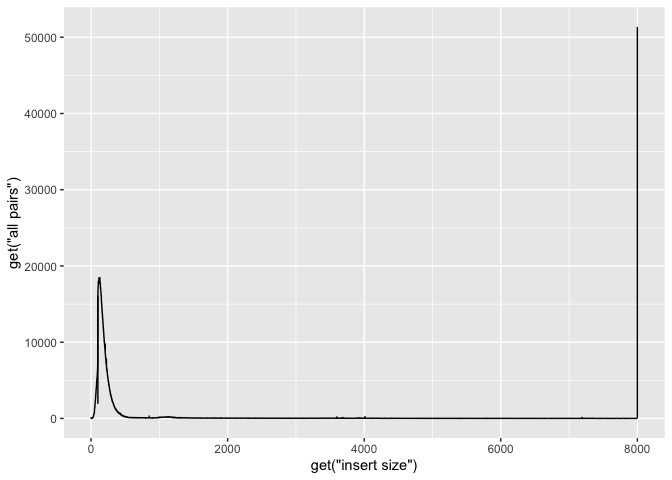<!-- -->


Ok, now lets add some labels to the plot


```r
g + geom_line( aes(x=get("insert size"), y=get("all pairs"))) +
  labs( x = "insert size", y = "all pairs", title ="Mapped insert sizes", subtitle = "All Pairs", caption = "all pairs insert size")
```

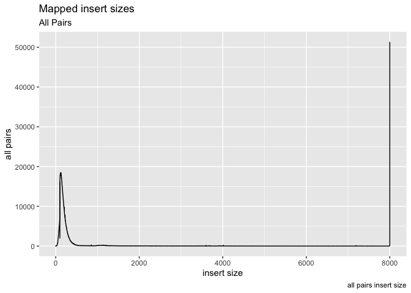<!-- -->

Ok, what about plotting multiple data objects on the same plot (multiple lines), in that case we can specifically set the y axis in geom_line and color, then call geom_lines twice (or more times).


```r
g <- ggplot(data = is, aes(x=get("insert size")))
g + geom_line(aes(y=get("inward")),color="blue") +  
    geom_line(aes(y=get("outward")),color="orange") +
    labs( x = "insert size", y = "all pairs", title ="Mapped insert sizes", subtitle = "All Pairs", caption = "all pairs insert size")
```

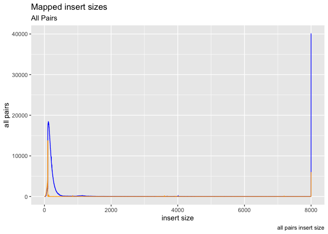<!-- -->

lets try adjusting the x/y limits to 0,600 and 0,20000 respectively.


```r
g + geom_line(aes(y=get("inward")),color="blue") +
  geom_line(aes(y=get("outward")),color="orange") +
  coord_cartesian(xlim=c(0,500), ylim=c(0,600000))
```

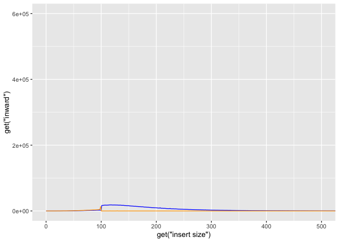<!-- -->

Ok so now put all these elements together into a single plot, save final plot as 'g'

** On your own**: Ok so put it all together, plot all four columns of the insert size data object, add in legends, reasonable coordinate limits

** On your own**: Play with ggplot2 themes (ex. theme_classic() )


```r
g <- ggplot(data = is, aes(x=get("insert size")))
g <- g + geom_line(aes(y=get("all pairs")), color="black") +  
    geom_line(aes(y=get("inward")),color="blue") +  
    geom_line(aes(y=get("outward")),color="orange") +
    geom_line(aes(y=get("other")), color="green")
g <- g +
    labs( x = "insert size", y = "all pairs", title ="Mapped insert sizes", subtitle = "All Pairs", caption = "all pairs insert size")
g <- g + coord_cartesian(xlim=c(0,500), ylim=c(0,600000))
g <- g + theme_light()
plot(g)
```

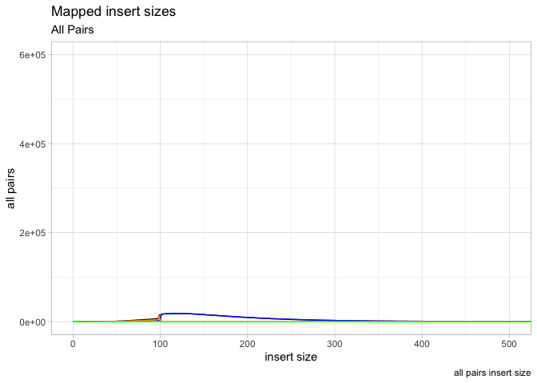<!-- -->

### Plotting GC content

In order to plot GC percentage we first need to convert the counts to proportions, to do so we can divide the counts by the sum of counts.


```r
head(gc)
```

```
##   Pair   GC Count
## 1  GCF 0.25    64
## 2  GCF 1.01   166
## 3  GCF 2.01   188
## 4  GCF 3.02   251
## 5  GCF 4.02   195
## 6  GCF 5.03   170
```

```r
h <- ggplot(gc, aes(as.numeric(GC), Count/sum(Count),color=Pair))
h <- h + geom_line()
h
```

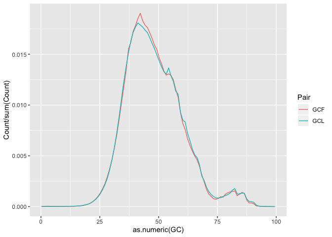<!-- -->

** On your own**: Finish the plot (add labels, etc.). Save the final graph object in h

### Plotting the base composition by cycle

Sometimes we may need to transform our data before plotting. The melt funciton from reshape2 takes data in wide format (data are in columns) and stacks a set of columns into a single column of data. In the ACTG object we can stack bases values by cycle.


```r
actgm <- melt(actg,id="cycle")
```

now head the new actgm object. What did melt do?


```r
ic <- ggplot(actgm, aes(as.numeric(cycle), as.numeric(value), by=variable, colour=variable))
i <- ic + geom_line() + coord_cartesian(ylim=c(0,100))
i
```

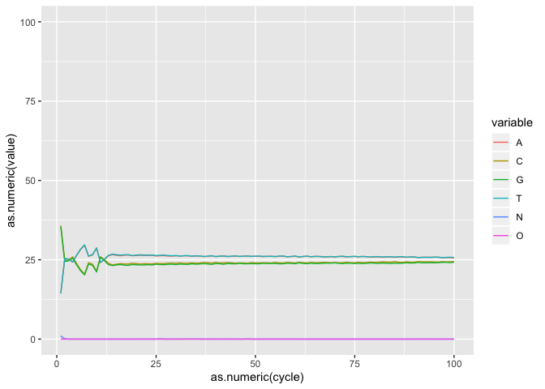<!-- -->

** On your own**: Using what you learned until now, finish the plot, save it as object i

### Lets now do a boxplot of basepair


```r
i2 <- ic + geom_boxplot()
i2
```

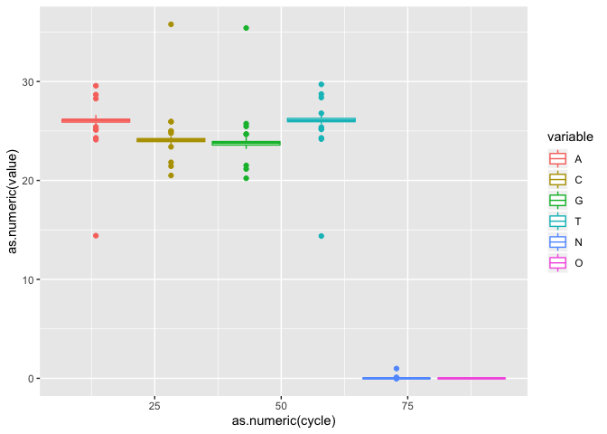<!-- -->

** On your own**: Try some other geometries (Ex. bin2d, col, count, which generate an 'interpretable' plot)

### Plotting a heatmap of qualities

First lets melt the quality scores


```r
fqm <- melt(fq,id=c("Pair","Cycle"))
```

Take a look at the new object


```r
j <- ggplot(fqm, aes(Cycle, variable))
j + geom_tile(aes(fill = as.numeric(value)))
```

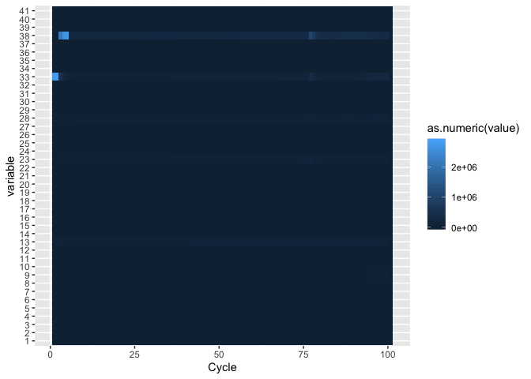<!-- -->

Now lets try changing the gradient colors and modify the legend, add labels. The ggplot2 'theme' function can be used to modify individual components of a theme.


```r
?theme
```


```r
j = j + geom_tile(aes(fill = as.numeric(value))) +
  scale_fill_gradient(low = "red", high = "green") +
  ylab("Cycle") +
  xlab("Quality") +
  theme(legend.title = element_text(size = 10),
        legend.text = element_text(size = 12),
        plot.title = element_text(size=16),
        axis.title=element_text(size=14,face="bold"),
        axis.text.x = element_text(angle = 90, hjust = 1)) +
  labs(fill = "Quality value")
j
```

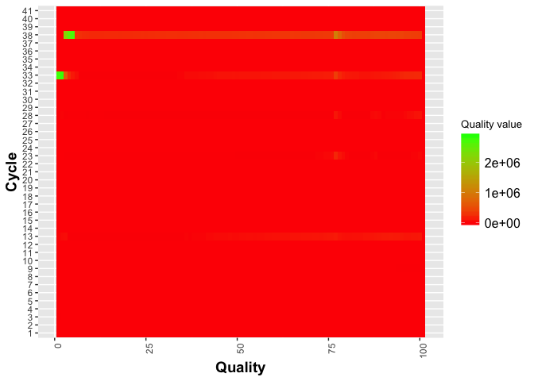<!-- -->

** On your own** Try modifying scale_fill_gradient to scale_fill_distiller.

** On your own** Play with parts of the plotting function, see how the change modifies the plot.

### Plotting indel lengths

** On your own**  Recreate the indel lengths plot


```r
k <- ggplot(id, aes(x=as.numeric(length)))
k <- k + geom_line(aes(y=as.numeric(insertion_count)), color = "red", size=1.5)
k <- k + geom_line(aes(y=as.numeric(deletion_count)), color = "black", size=1.5)
k
```

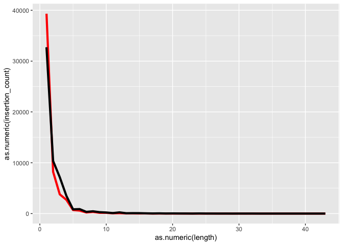<!-- -->

Lets try changing the Y axis to log scale

```r
k <- k + scale_y_log10()
k
```

<!-- -->

Tweek the grid elments using theme

```r
k <- k + theme(panel.grid.minor = element_blank(),
  panel.grid.major = element_line(color = "gray50", size = 0.5),
  panel.grid.major.x = element_blank())
k
```

```
## Warning: Transformation introduced infinite values in continuous y-axis
```

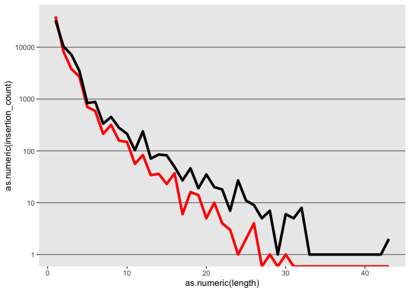<!-- -->

## update the axis labels

```r
k <- k + xlab("indel length") + ylab("indel count (log10)")
k
```

```
## Warning: Transformation introduced infinite values in continuous y-axis
```

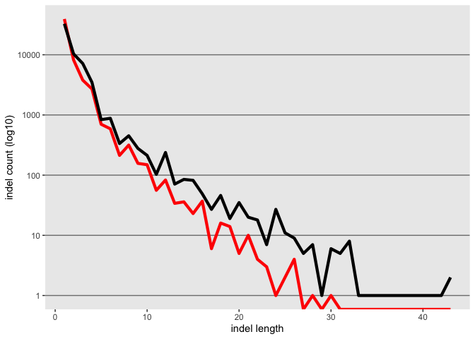<!-- -->

Now lets also plot the ratio of the 2, but first we need to create the object


```r
id$ratio <- as.numeric(id$insertion_count)/as.numeric(id$deletion_count)
l <- ggplot(id, aes(x=as.numeric(length)))
l <- l + geom_line(aes(y=as.numeric(ratio)), color = "green", size=1.0)
l
```

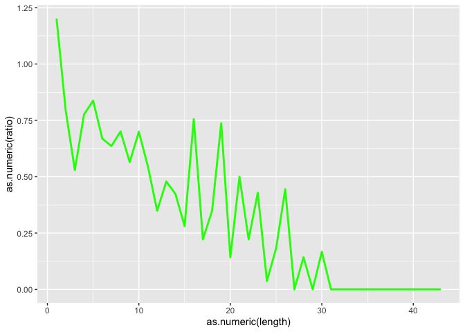<!-- -->
Tweek the grid

```r
l <- l + theme(panel.grid.minor = element_blank(),
  panel.grid.major = element_line(color = "gray50", size = 0.5),
  panel.grid.major.x = element_blank())
l
```

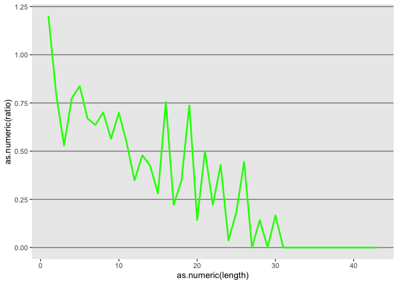<!-- -->
Update axis labels

```r
l <- l + xlab("indel length") + ylab("insertion/deletion ratio")
l
```

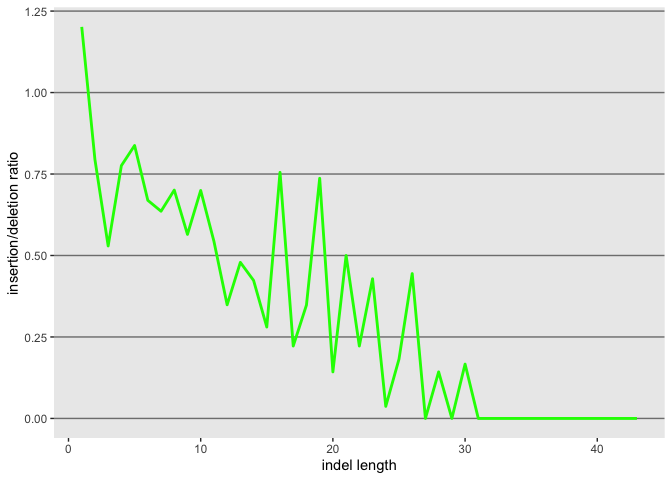<!-- -->

Now lets use gridExtra to plot both in the same plat

```r
grid.arrange(k, l, nrow = 1)
```

```
## Warning: Transformation introduced infinite values in continuous y-axis
```

<!-- -->

### Fancy Multiple plots in a grid
The gridExtra package is great for plotting multiple object in one plot.

<!-- -->


```r
full <- grid.arrange(
  g, h, i, i2,
  widths = c(2, 1, 1),
  layout_matrix = rbind(c(1, 2, NA),
                        c(3, 3, 4))
)
```

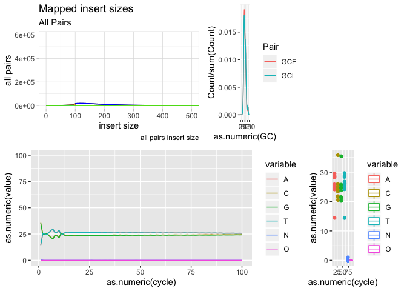<!-- -->

** on your own**: Play with th grid.arrange function, using the plots you've created to create you own final combined plot.

### Saving plots as png or pdf

This must be done outside of the Notebook as the notebook expects you to plot in the notebook only, so run on the Console.

Saving plots to pdf ** do on the console **

```r
ggsave("multi_plot.pdf",full,device="pdf",width=6,height=4, units="in", dpi=300)
```

Saving plots to png  ** do on the console **

```r
ggsave("multi_plot.png",full,device="png",width=6,height=4, units="in", dpi=300)
```

View the help documentation for ggsave, what other

With any remaining time (or homework), use the ggplot cheat sheet to further expand and modify the plots.

## ggplot2 book by its author, Hadley Wickham

[book in PDF form](http://moderngraphics11.pbworks.com/f/ggplot2-Book09hWickham.pdf)

[book on GitHub](https://github.com/hadley/ggplot2-book)

Its always good to end any Notebook with Session info, records all the packages loaded and their versions


```r
sessionInfo()
```

```
## R version 3.6.1 (2019-07-05)
## Platform: x86_64-apple-darwin15.6.0 (64-bit)
## Running under: macOS Mojave 10.14.6
## 
## Matrix products: default
## BLAS:   /Library/Frameworks/R.framework/Versions/3.6/Resources/lib/libRblas.0.dylib
## LAPACK: /Library/Frameworks/R.framework/Versions/3.6/Resources/lib/libRlapack.dylib
## 
## locale:
## [1] en_US.UTF-8/en_US.UTF-8/en_US.UTF-8/C/en_US.UTF-8/en_US.UTF-8
## 
## attached base packages:
## [1] stats     graphics  grDevices utils     datasets  methods   base     
## 
## other attached packages:
##  [1] gridExtra_2.3   reshape2_1.4.3  forcats_0.4.0   stringr_1.4.0  
##  [5] dplyr_0.8.3     purrr_0.3.2     readr_1.3.1     tidyr_0.8.3    
##  [9] tibble_2.1.3    ggplot2_3.2.1   tidyverse_1.2.1 knitr_1.24     
## 
## loaded via a namespace (and not attached):
##  [1] tidyselect_0.2.5 xfun_0.9         haven_2.1.1      lattice_0.20-38 
##  [5] colorspace_1.4-1 generics_0.0.2   vctrs_0.2.0      htmltools_0.3.6 
##  [9] yaml_2.2.0       rlang_0.4.0      pillar_1.4.2     glue_1.3.1      
## [13] withr_2.1.2      modelr_0.1.5     readxl_1.3.1     plyr_1.8.4      
## [17] munsell_0.5.0    gtable_0.3.0     cellranger_1.1.0 rvest_0.3.4     
## [21] evaluate_0.14    labeling_0.3     highr_0.8        broom_0.5.2     
## [25] Rcpp_1.0.2       scales_1.0.0     backports_1.1.4  jsonlite_1.6    
## [29] hms_0.5.1        digest_0.6.20    stringi_1.4.3    grid_3.6.1      
## [33] cli_1.1.0        tools_3.6.1      magrittr_1.5     lazyeval_0.2.2  
## [37] crayon_1.3.4     pkgconfig_2.0.2  zeallot_0.1.0    xml2_1.2.2      
## [41] lubridate_1.7.4  assertthat_0.2.1 rmarkdown_1.15   httr_1.4.1      
## [45] rstudioapi_0.10  R6_2.4.0         nlme_3.1-141     compiler_3.6.1
```
